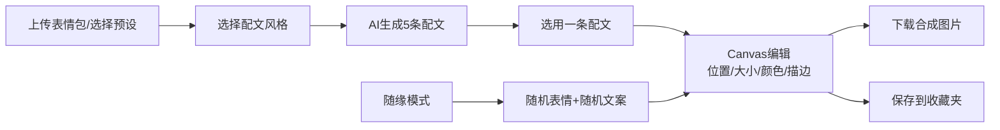

## 1. 产品概述
AI表情包生成器是一款在线工具，用户上传表情包图片后，AI自动识别面部表情区域并生成配套文字，支持自定义编辑后合成下载。
- 解决用户制作表情包的痛点，降低创作门槛，提供趣味化的配文建议
- 面向年轻用户群体，提供有趣、便捷的表情包制作体验

## 2. 核心功能

### 2.1 功能模块
1. **主页/编辑器页面**：图片上传、预设表情选择、文字风格选择、Canvas编辑区域
2. **收藏夹页面**：查看和管理已保存的表情包
3. **文字生成模块**：基于表情区域和风格生成5条配文
4. **图片合成模块**：Canvas编辑、文字样式调整、图片下载
5. **随缘模式**：随机表情+随机热门口水话组合

### 2.2 页面详情
| 页面名称 | 模块名称 | 功能描述 |
|-----------|-------------|---------------------|
| 主页 | 图片上传区 | 拖拽上传/点击上传表情包图片，支持预设表情选择 |
| 主页 | 风格选择器 | 阴阳怪气/职场自嘲/沙雕搞笑三种风格切换 |
| 主页 | 文字推荐区 | 展示5条AI生成配文，点击选用 |
| 主页 | Canvas编辑区 | 预览表情包，拖拽调整文字位置，调整大小和颜色 |
| 主页 | 工具栏 | 文字颜色选择、描边设置、字体大小调节 |
| 收藏夹 | 表情包列表 | 网格展示已保存的表情包，支持删除和导出 |
| 收藏夹 | 搜索过滤 | 按文字内容搜索历史表情包 |

## 3. 核心流程
用户上传表情包图片 → AI识别面部区域（模拟）→ 选择文字风格 → 生成5条配文 → 选择并编辑文字（位置/大小/颜色/描边）→ 合成图片下载 → 可选保存到收藏夹

## 4. 用户界面设计
### 4.1 设计风格
- **主色调**：活力橙 #FF6B35 + 趣味紫 #8B5CF6 撞色搭配
- **辅助色**：薄荷绿 #10B981、明黄 #FBBF24
- **按钮风格**：圆润胶囊按钮，带悬浮微动画
- **字体**：标题使用 ZCOOL KuaiLe（快乐体），正文使用 Noto Sans SC
- **布局风格**：卡片式布局，圆角设计，柔和阴影
- **视觉元素**：表情包emoji装饰，趣味微动效

### 4.2 页面设计概述
| 页面名称 | 模块名称 | UI Elements |
|-----------|-------------|-------------|
| 主页 | 上传区 | 拖拽区域，虚线边框，上传图标，预设表情缩略图 |
| 主页 | 文字推荐区 | 卡片式展示，hover高亮，点击动画 |
| 主页 | Canvas区 | 居中预览，控制手柄，网格背景 |
| 收藏夹 | 列表区 | 瀑布流网格，悬停显示操作按钮 |

### 4.3 响应式
- 桌面端：双栏布局，左侧编辑区，右侧预览区
- 平板端：单栏布局，上下排列
- 移动端：自适应单列，触摸优化拖拽操作
