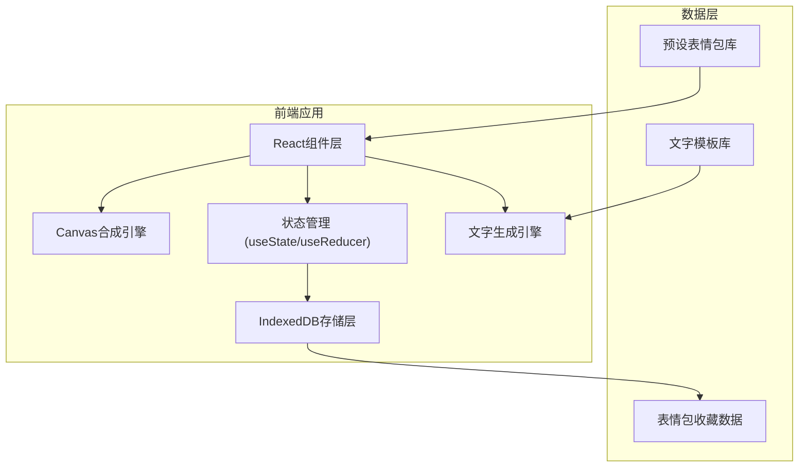
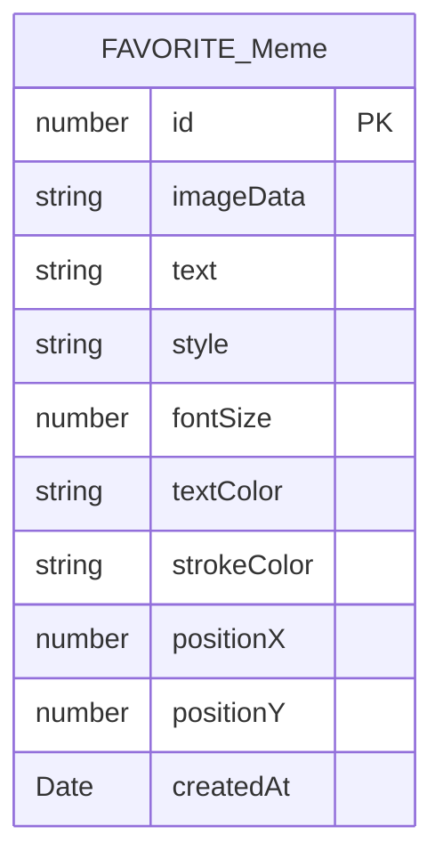

## 1. 架构设计



## 2. 技术描述
- **前端**: React@18 + TypeScript + Vite
- **样式**: TailwindCSS@3 + 自定义动画
- **图片处理**: HTML5 Canvas API
- **本地存储**: IndexedDB (idb库封装)
- **路由**: React Router DOM@6
- **初始化工具**: vite-init

## 3. 路由定义
| 路由 | 页面 | 用途 |
|-------|------|---------|
| / | 首页/编辑器 | 表情包制作主页面 |
| /favorites | 收藏夹 | 查看和管理已保存的表情包 |

## 4. 数据模型

### 4.1 数据实体定义



### 4.2 TypeScript 类型定义

```typescript
// 表情包文字风格
type TextStyle = 'sarcastic' | 'office' | 'funny';

// 文字样式
interface TextSettings {
  content: string;
  fontSize: number;
  color: string;
  strokeColor: string;
  strokeWidth: number;
  x: number;
  y: number;
}

// 表情包数据
interface Meme {
  id?: number;
  imageData: string;
  textSettings: TextSettings;
  style: TextStyle;
  createdAt?: Date;
}

// 预设表情
interface PresetEmoji {
  id: string;
  name: string;
  url: string;
  category: string;
}

// 文字模板
interface TextTemplate {
  id: string;
  content: string;
  style: TextStyle;
  tags: string[];
}
```

## 5. 核心模块说明

### 5.1 Canvas合成模块
- 使用 Canvas API 进行图片和文字合成
- 支持拖拽调整文字位置
- 支持文字颜色、描边、大小调整
- 导出为PNG/JPEG格式

### 5.2 文字生成模块
- 预设文字模板库（分三种风格）
- 基于表情分类随机匹配（模拟AI）
- 随缘模式随机抽取热门口水话

### 5.3 IndexedDB存储模块
- 使用 idb 库封装操作
- 存储表情包图片base64数据
- 存储文字样式和位置信息

## 6. 目录结构

```
src/
├── components/
│   ├── ImageUploader/      # 图片上传组件
│   ├── PresetEmojis/       # 预设表情选择
│   ├── TextGenerator/      # 文字生成和选择
│   ├── MemeCanvas/         # Canvas编辑器
│   ├── StyleToolbar/       # 样式工具栏
│   └── MemeCard/           # 表情包卡片
├── pages/
│   ├── Editor/             # 编辑器页面
│   └── Favorites/          # 收藏夹页面
├── store/
│   └── memeStore.ts        # 状态管理
├── db/
│   └── indexedDB.ts        # IndexedDB封装
├── data/
│   ├── presetEmojis.ts     # 预设表情数据
│   └── textTemplates.ts    # 文字模板库
├── utils/
│   ├── canvas.ts           # Canvas工具函数
│   └── textGenerator.ts    # 文字生成逻辑
├── types/
│   └── index.ts            # 类型定义
├── App.tsx
├── main.tsx
└── index.css
```
