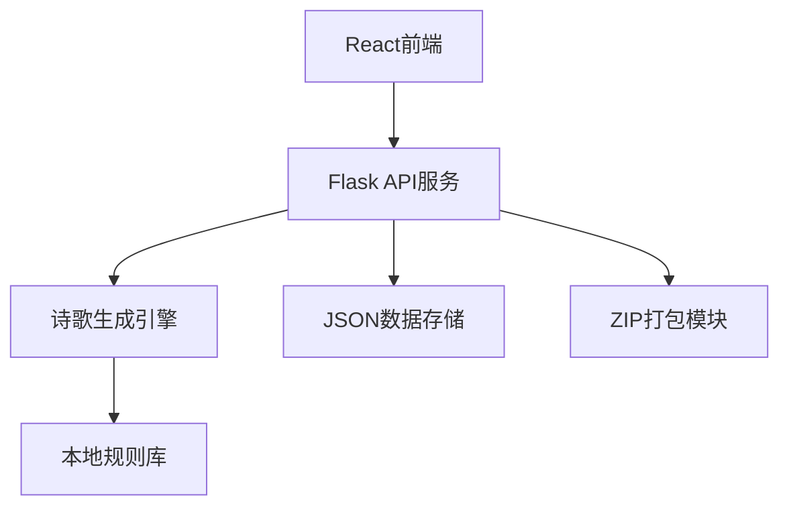

## 1. 架构设计



## 2. 技术描述
- **前端**: React@18 + TypeScript + TailwindCSS@3 + Vite
- **后端**: Flask@3 + Python@3.10
- **数据存储**: JSON文件持久化
- **依赖管理**: 前端 pnpm/npm，后端 pip/requirements.txt

## 3. 项目结构

```
project/
├── api/                    # Flask后端
│   ├── app.py             # 主应用入口
│   ├── requirements.txt   # Python依赖
│   ├── generators/        # 诗歌生成引擎
│   │   ├── __init__.py
│   │   ├── base.py        # 基础生成器
│   │   ├── folk.py        # 民谣风格
│   │   ├── ancient.py     # 古风
│   │   ├── cyberpunk.py   # 赛博朋克
│   │   └── rules/         # 本地规则库
│   ├── storage/           # 数据存储
│   │   ├── ratings.json   # 评价数据
│   │   └── temp/          # 临时文件
│   └── utils/             # 工具函数
│       └── zipper.py      # ZIP打包
├── src/                   # React前端
│   ├── components/        # 组件
│   │   ├── LyricInput.tsx
│   │   ├── StyleCard.tsx
│   │   ├── StarRating.tsx
│   │   └── BatchUpload.tsx
│   ├── hooks/             # 自定义Hooks
│   ├── pages/             # 页面
│   ├── utils/             # 工具函数
│   └── App.tsx
└── package.json
```

## 4. API 定义

### 4.1 生成诗歌
```typescript
POST /api/generate
Request:
{
  lyrics: string;
  lineIndex?: number; // 可选，指定行号
}

Response:
{
  success: boolean;
  data: {
    folk: string;
    ancient: string;
    cyberpunk: string;
    original: string;
  };
}
```

### 4.2 提交评价
```typescript
POST /api/rate
Request:
{
  style: 'folk' | 'ancient' | 'cyberpunk';
  original: string;
  result: string;
  rating: number; // 1-5
}

Response:
{
  success: boolean;
  message: string;
}
```

### 4.3 批量处理
```typescript
POST /api/batch
Content-Type: multipart/form-data
Request: file (text/plain)

Response:
{
  success: boolean;
  downloadUrl: string;
  results: Array<{
    line: string;
    folk: string;
    ancient: string;
    cyberpunk: string;
  }>;
}
```

### 4.4 下载批量结果
```typescript
GET /api/download/:filename
Response: ZIP file
```

## 5. 数据模型

### 5.1 评价数据 (ratings.json)
```json
{
  "ratings": [
    {
      "id": "uuid",
      "style": "folk",
      "original": "Hello darkness my old friend",
      "result": "吾友暗夜，久别重逢...",
      "rating": 5,
      "timestamp": "2024-01-01T00:00:00Z"
    }
  ]
}
```

## 6. 风格转换规则设计

### 6.1 民谣风格
- 关键词替换：you → 你我，love → 情缘，night → 夜晚
- 句式调整：增加重复性、排比结构
- 情感增强：加入自然意象（风、雨、月亮）

### 6.2 古风
- 词汇转换：使用文言文词汇
- 句式：四字/五字/七字句
- 意象：明月、清风、山水、红尘

### 6.3 赛博朋克
- 词汇：霓虹、数据流、芯片、全息
- 句式：碎片化、科技感
- 意象：赛博空间、虚拟现实、人工智能
