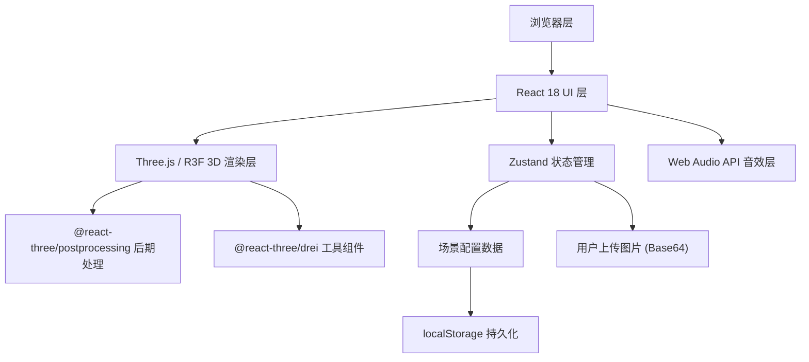
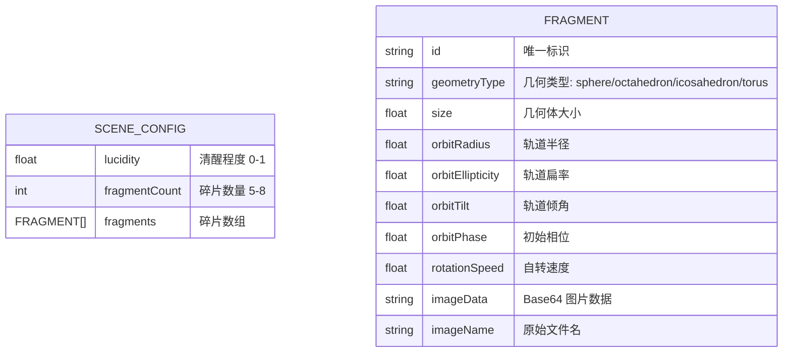

## 1. 架构设计



## 2. 技术说明

- **前端框架**：React@18 + TypeScript + Vite@5
- **3D 引擎**：three@0.160, @react-three/fiber@8, @react-three/drei@9, @react-three/postprocessing@2
- **状态管理**：zustand@4
- **样式方案**：tailwindcss@3
- **图标库**：lucide-react@0.300
- **音效**：Web Audio API 合成水滴声（无需外部音频文件）
- **数据持久化**：localStorage 存储配置，图片以 Base64 嵌入 JSON

## 3. 路由定义

| 路由 | 用途 |
|------|------|
| / | 主页，3D 梦境碎片场景 |

## 4. 数据模型

### 4.1 数据模型定义



### 4.2 类型定义

```typescript
type GeometryType = 'sphere' | 'octahedron' | 'icosahedron' | 'torus';

interface Fragment {
  id: string;
  geometryType: GeometryType;
  size: number;
  orbitRadius: number;
  orbitEllipticity: number;
  orbitTilt: number;
  orbitPhase: number;
  rotationSpeed: number;
  imageData: string;
  imageName: string;
}

interface SceneConfig {
  lucidity: number;
  fragmentCount: number;
  fragments: Fragment[];
}
```

## 5. 项目结构

```
src/
├── components/
│   ├── Scene.tsx          # 3D 场景主组件
│   ├── Fragment.tsx       # 单个碎片几何体组件
│   ├── Toolbar.tsx        # 顶部工具栏
│   ├── ImageViewer.tsx    # 放大图片查看器
│   └── Particles.tsx      # 星尘粒子背景
├── hooks/
│   ├── useAudio.ts        # 水滴音效 hook
│   └── useScreenshot.ts   # 截图功能 hook
├── store/
│   └── useSceneStore.ts   # Zustand 状态管理
├── utils/
│   ├── config.ts          # 配置生成与序列化
│   └── geometry.ts        # 几何相关工具函数
├── types/
│   └── index.ts           # TypeScript 类型定义
├── App.tsx
├── main.tsx
└── index.css
```
