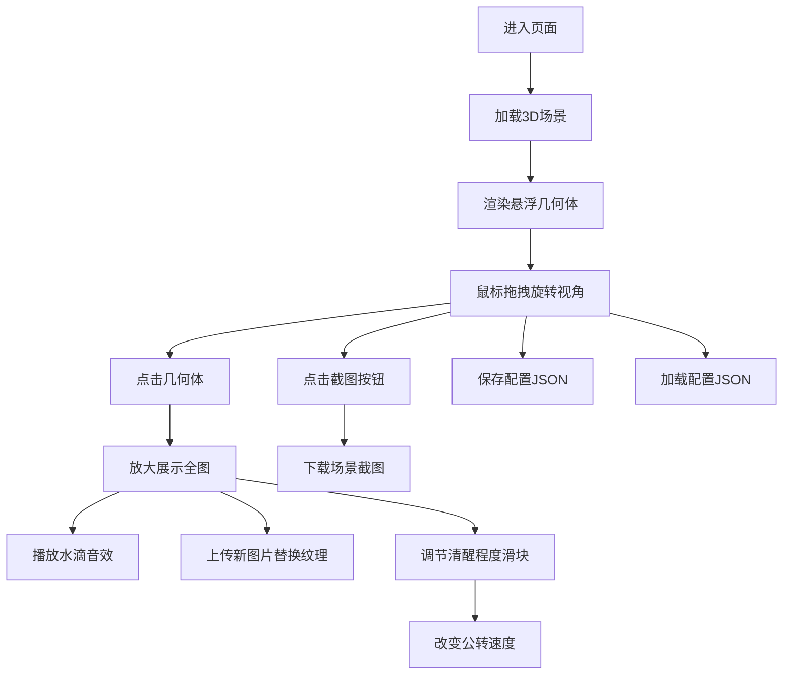

## 1. 产品概述

"梦境碎片"是一个基于 Three.js 的沉浸式 3D 图片展示应用，让用户将记忆碎片以半透明几何体的形式悬浮在梦幻空间中，通过诗意的交互体验重温美好瞬间。

- 核心价值：为用户提供一种超越传统相册的、富有艺术感的图片浏览体验
- 目标用户：追求独特视觉体验的个人用户、艺术创作者、设计师

## 2. 核心功能

### 2.1 用户角色
| 角色 | 注册方式 | 核心权限 |
|------|----------|----------|
| 访客用户 | 无需注册 | 上传图片、交互浏览、保存配置、截图分享 |

### 2.2 功能模块
1. **3D 梦境空间**：悬浮几何体、椭圆轨道公转、梦幻背景氛围
2. **图片管理**：上传图片（5-8张）、纹理映射、缩略图模糊、替换纹理
3. **交互体验**：点击放大展示、水滴音效、鼠标拖拽旋转视角
4. **速度控制**：清醒程度滑块，调节公转速度
5. **场景管理**：一键截图、配置JSON保存与加载

### 2.3 页面详情
| 页面名称 | 模块名称 | 功能描述 |
|----------|----------|----------|
| 主页面 | 3D场景渲染 | 全屏Three.js场景，悬浮几何体沿轨道公转 |
| 主页面 | 控制面板 | 顶部工具栏，包含上传、速度调节、截图、保存/加载按钮 |
| 主页面 | 放大展示层 | 点击几何体后显示高清全图，带渐变过渡动画 |

## 3. 核心流程

用户进入页面 → 场景自动加载（默认占位图或本地存储配置）→ 鼠标拖拽旋转视角观察几何体 → 点击感兴趣的几何体 → 几何体放大展示全图并播放水滴声 → 可上传新图片替换选中几何体的纹理 → 调节"清醒程度"控制公转速度 → 点击截图保存当前画面 → 保存配置JSON以便下次恢复。

## 4. 用户界面设计

### 4.1 设计风格
- **主色调**：深邃靛蓝（#0a0e27）→ 梦幻紫（#2d1b4e）渐变背景
- **点缀色**：柔和青色光晕（#00d4ff）、淡紫色辉光（#a855f7）
- **几何体**：玻璃拟态半透明材质，折射率1.2，带轻微色散
- **字体**：标题用 Cormorant Garamond（衬线，古典优雅），正文用 Inter
- **按钮**：极简玻璃态按钮，半透明毛玻璃效果，细边框
- **滑块**：自定义发光轨道，拇指为发光圆点

### 4.2 页面设计概述
| 页面名称 | 模块名称 | UI 元素 |
|----------|----------|----------|
| 主页面 | 3D场景 | 深空渐变背景、星尘粒子、半透明几何体、椭圆轨道辉光、柔和环境光 |
| 主页面 | 顶部工具栏 | 毛玻璃背景、图标+文字按钮、清醒程度滑块（带标签） |
| 主页面 | 放大展示层 | 居中高清图片、渐变遮罩、淡入淡出动画、点击任意处关闭 |

### 4.3 响应性
- 桌面端为主，全屏沉浸体验
- 移动端自适应，简化控件布局，支持触摸交互
- 工具栏在小屏幕转为底部抽屉式

### 4.4 3D 场景指引
- **环境**：深空渐变背景，添加体积雾和漂浮星尘粒子
- **光照**：两盏柔和的点光源（青色+紫色）+ 微弱环境光，营造梦幻氛围
- **相机**：PerspectiveCamera，初始距离15，支持OrbitControls拖拽旋转
- **几何体**：5-8个随机几何形状（球体、八面体、二十面体、圆环），大小0.8-1.5
- **材质**：MeshPhysicalMaterial，transmission 0.7，thickness 0.5，带模糊纹理
- **轨道**：每个几何体有独立椭圆轨道（半径3-8，扁率0.3-0.7，倾角随机）
- **后期处理**：Bloom泛光效果、轻微色差、胶片颗粒
- **动效**：几何体缓慢自转 + 沿椭圆公转，点击后缩放至2.5倍并暂停2秒
