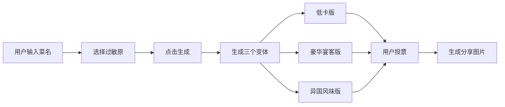

## 1. 产品概述

AI 菜谱变形记是一个创意菜谱生成工具，用户输入家常菜名后，AI 自动生成三种创意变体（低卡版、豪华宴客版、异国风味版），帮助用户发现菜肴的无限可能性。

- 核心价值：让家常菜变得有趣，满足不同场景（健康、宴请、尝鲜）的需求
- 目标用户：家庭主厨、美食爱好者、想尝试新菜品的普通人

## 2. 核心 Features

### 2.1 用户角色
| 角色 | 注册方式 | 核心权限 |
|------|----------|----------|
| 普通用户 | 无需注册，直接使用 | 生成菜谱变体、投票、设置过敏原、生成图片 |

### 2.2 功能模块
1. **首页**：菜谱输入区、过敏原选择、生成按钮
2. **结果展示区**：三个变体卡片展示（低卡版、豪华版、异国版）
3. **投票系统**：对每个变体进行"靠谱"投票
4. **图片生成**：一键生成带食材清单的分享图片

### 2.3 页面详情
| 页面名称 | 模块名称 | 功能描述 |
|----------|----------|----------|
| 首页 | 输入区域 | 菜名输入框、过敏原多选下拉、生成按钮 |
| 首页 | 变体卡片 | 三栏布局，每栏显示变体名称、食材变更说明、改动原因 |
| 首页 | 投票模块 | 每个卡片底部有👍靠谱/👎不靠谱按钮，显示投票数 |
| 首页 | 图片生成 | 每个卡片有"生成图片"按钮，点击后生成可下载的图片 |

## 3. 核心流程

用户输入菜名 → 选择过敏原（可选）→ 点击生成 → 显示三个变体 → 用户投票（可选）→ 生成图片分享（可选）

## 4. 界面设计

### 4.1 设计风格
- **主色调**：暖橙色系（#FF6B35），传递食物的温暖和活力
- **辅助色**：牛油果绿（#7CB342）代表健康低卡，金色（#D4AF37）代表豪华，宝蓝（#1E88E5）代表异国风情
- **按钮风格**：圆角胶囊形，带有微悬停动画效果
- **字体**：标题使用 Noto Serif SC（典雅），正文使用 Noto Sans SC（清晰易读）
- **布局风格**：卡片式布局，柔和阴影，微妙的食物图案纹理背景
- **图标风格**：食物相关的 emoji 和手绘风格图标

### 4.2 页面设计概览
| 页面名称 | 模块名称 | UI 元素 |
|----------|----------|---------|
| 首页 | Hero 区域 | 大标题、副标题、输入框居中，温暖渐变背景 |
| 首页 | 变体卡片 | 三色区分的卡片，错落有致的布局，悬停时有上浮效果 |
| 首页 | 投票按钮 | 大拇指图标，点击有弹跳动画，实时更新计数 |
| 首页 | 图片预览 | 模态框展示生成的图片，带有下载按钮 |

### 4.3 响应式设计
- 桌面端：三栏并排展示变体卡片
- 平板端：两栏布局，第三栏下移
- 移动端：单列垂直布局，优化触控区域

### 4.4 动效设计
- 页面加载：变体卡片依次滑入，带有交错延迟
- 悬停效果：卡片轻微上浮，阴影加深
- 投票反馈：图标缩放动画，数字递增效果
- 生成过程：加载动画采用烹饪相关的动效