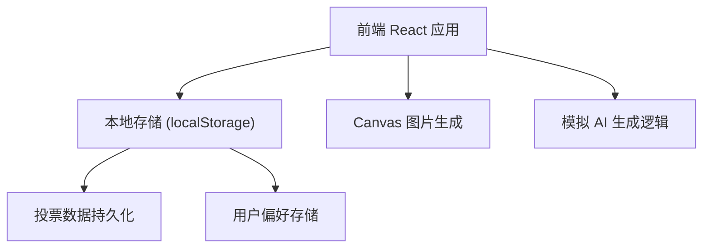

## 1. 架构设计



## 2. 技术选型

- **前端**：React@18 + TypeScript + Vite
- **样式**：TailwindCSS@3
- **图标**：Lucide React
- **数据存储**：localStorage（本地持久化）
- **图片生成**：HTML5 Canvas API

## 3. 路由定义

| 路由 | 用途 |
|------|------|
| / | 首页，包含所有功能 |

## 4. 数据模型

### 4.1 类型定义

```typescript
// 菜谱变体类型
interface RecipeVariant {
  id: string;
  type: 'low-calorie' | 'luxury' | 'exotic';
  name: string;
  originalDish: string;
  ingredientChanges: {
    original: string;
    replacement: string;
    reason: string;
  }[];
  fullIngredients: string[];
  description: string;
}

// 投票数据
interface VoteData {
  variantId: string;
  upvotes: number;
  downvotes: number;
  userVote: 'up' | 'down' | null;
}

// 用户偏好
interface UserPreferences {
  allergens: string[];
}

// 过敏原选项
const ALLERGENS = [
  '无麸质',
  '不含乳制品',
  '不含坚果',
  '素食',
  '纯素',
  '低钠',
  '清真',
  '犹太洁食'
];
```

### 4.2 数据存储结构

- `recipe_votes_{variantId}`: 存储每个变体的投票数据
- `user_preferences`: 存储用户的过敏原偏好
- `vote_history`: 存储用户的投票历史，防止重复投票

## 5. 核心模块设计

### 5.1 菜谱生成模块
- 输入：菜名 + 过敏原列表
- 输出：三个变体（低卡、豪华、异国）
- 逻辑：内置常见菜谱模板 + 智能替换规则

### 5.2 投票模块
- 每个变体独立计数
- 本地存储持久化
- 防止重复投票

### 5.3 图片生成模块
- 使用 Canvas 绘制带食材清单的图片
- 支持下载为 PNG
- 包含品牌水印和二维码占位

## 6. 组件结构

```
src/
├── components/
│   ├── Header.tsx           # 页头
│   ├── SearchInput.tsx      # 菜名输入
│   ├── AllergenSelector.tsx # 过敏原选择
│   ├── RecipeCard.tsx       # 菜谱卡片
│   ├── VoteButton.tsx       # 投票按钮
│   ├── ImageGenerator.tsx   # 图片生成
│   └── LoadingSpinner.tsx   # 加载动画
├── hooks/
│   ├── useRecipeGenerator.ts # 菜谱生成逻辑
│   ├── useVoting.ts          # 投票逻辑
│   └── useLocalStorage.ts    # 本地存储
├── data/
│   └── recipeTemplates.ts    # 菜谱模板数据
├── types/
│   └── index.ts              # 类型定义
├── App.tsx
└── main.tsx
```