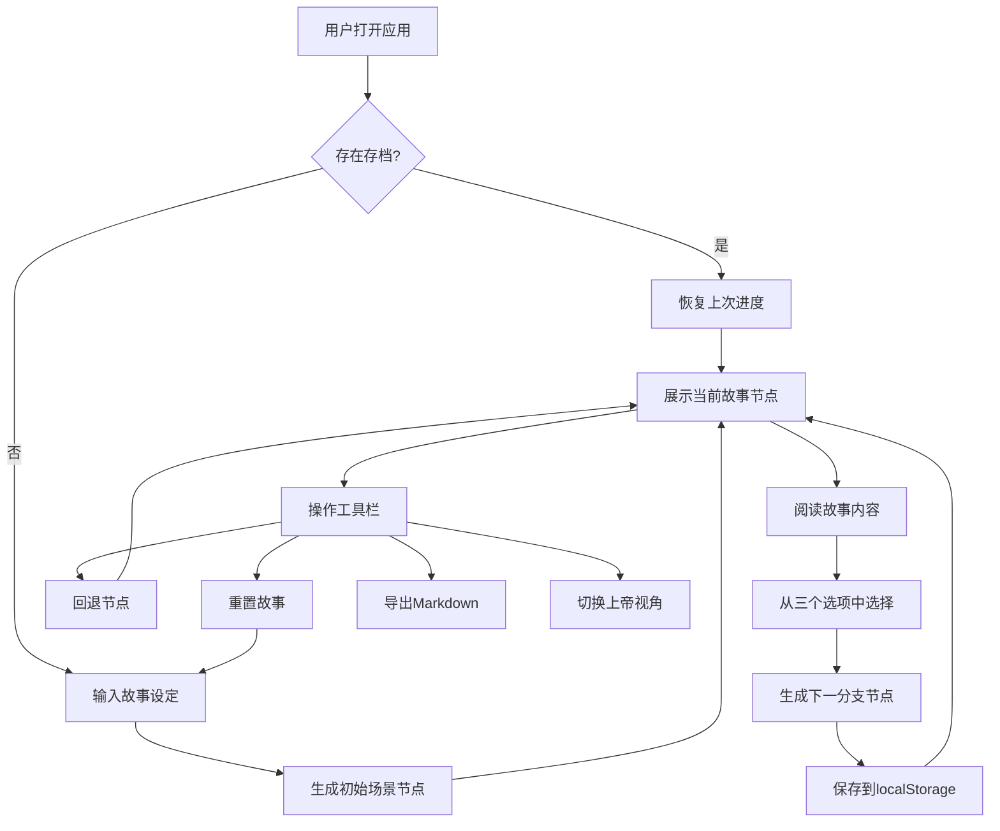

## 1. 产品概述

互动故事引擎是一款基于AI驱动的叙事体验应用，用户通过一句话设定故事背景、角色和初始场景，随后在每一轮从AI生成的三个选项中做出选择，推动故事向不同分支发展。产品采用本地逻辑模板保底与大模型增强结合的混合生成策略，确保故事连贯性与创意性的平衡。支持故事进度持久化、故事线导出、故事树可视化等高级功能，为用户提供沉浸式的交互式叙事体验。

## 2. 核心功能

### 2.1 功能模块
1. **故事初始化页面**：用户输入一句话生成故事起点
2. **故事阅读页面**：展示当前故事节点内容和三个选项
3. **上帝视角面板**：可视化展示已探索的故事树结构
4. **工具栏**：重置、回退、导出Markdown等操作按钮

### 2.2 页面详情

| 页面名称 | 模块名称 | 功能描述 |
|-----------|-------------|---------------------|
| 初始化页面 | 输入表单 | 用户输入一句话描述故事设定，支持示例提示 |
| 故事阅读页 | 节点展示 | 展示当前故事段落文字，打字机动画效果 |
| 故事阅读页 | 选项按钮 | 三个风格化选项按钮，悬停动效，点击进入下一分支 |
| 故事阅读页 | 路径指示器 | 显示当前故事深度和已走路径 |
| 上帝视角 | 故事树可视化 | 树形图展示所有已访问节点，高亮当前路径 |
| 工具栏 | 操作按钮 | 回退一步、重置故事、导出Markdown、切换上帝视角 |

## 3. 核心流程

用户打开应用 → 输入故事设定 → 生成初始场景 → 阅读故事内容 → 选择选项 → 生成下一节点 → 重复选择 → 可随时查看故事树、回退或导出 → 关闭页面后进度自动保存。

## 4. 用户界面设计

### 4.1 设计风格
- **主色调**：深靛蓝 `#1a1b3d` 作为背景，搭配琥珀金 `#d4a84b` 作为点缀
- **辅助色**：暗红 `#8b2635`、墨绿 `#2d4a3e`、羊皮纸米白 `#f5e6c8`
- **按钮风格**：做旧边框 + 渐变填充 + 悬停时微发光效果
- **字体**：标题使用 Cinzel（古典衬线），正文使用 Crimson Pro（优雅衬线），营造古书氛围
- **布局风格**：卡片式布局，边缘做旧纹理，轻微纸张纹理背景
- **装饰元素**：角花装饰、分隔线、羊皮纸纹理叠加

### 4.2 页面设计概述

| 页面名称 | 模块名称 | UI元素 |
|-----------|-------------|-------------|
| 初始化页 | Hero区域 | 大标题"编织你的命运"，副标题提示，中心输入框带发光效果 |
| 初始化页 | 输入表单 | 大尺寸textarea， placeholder示例，生成按钮带脉冲动画 |
| 故事阅读页 | 故事卡片 | 羊皮纸背景，内阴影，打字机文字逐字显示，角花装饰 |
| 故事阅读页 | 选项按钮组 | 三个等宽按钮，不同色彩标识，悬停上浮+发光，点击波纹效果 |
| 故事阅读页 | 顶部工具栏 | 半透明磨砂玻璃效果，图标按钮，状态指示器 |
| 上帝视角 | 故事树 | SVG绘制树形图，节点带光晕，连线动画，可点击跳转 |

### 4.3 响应式设计
- 桌面端优先设计，1200px以上最佳体验
- 平板端（768-1200px）：选项按钮改为垂直堆叠，故事卡片宽度自适应
- 移动端（<768px）：工具栏移至底部，字体大小适配，故事树切换为列表视图
- 触摸优化：按钮最小高度48px，增加点击反馈动画

### 4.4 动画与交互
- 页面加载：故事卡片从底部淡入上移，选项按钮依次延迟出现
- 文字显示：打字机效果逐字出现，光标闪烁
- 选项悬停：背景色渐变，边框发光，轻微上浮（translateY(-2px)）
- 节点切换：旧内容向左淡出，新内容从右滑入
- 故事树：节点连线动画绘制，当前节点呼吸光效
