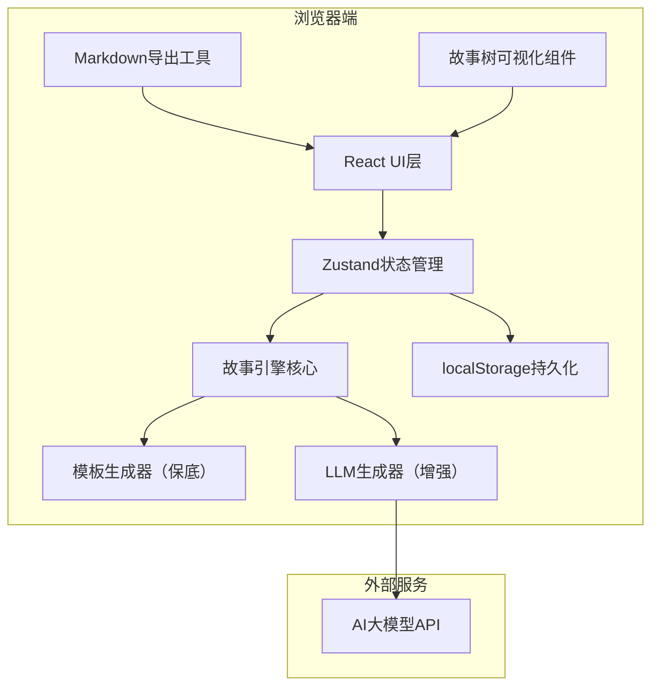
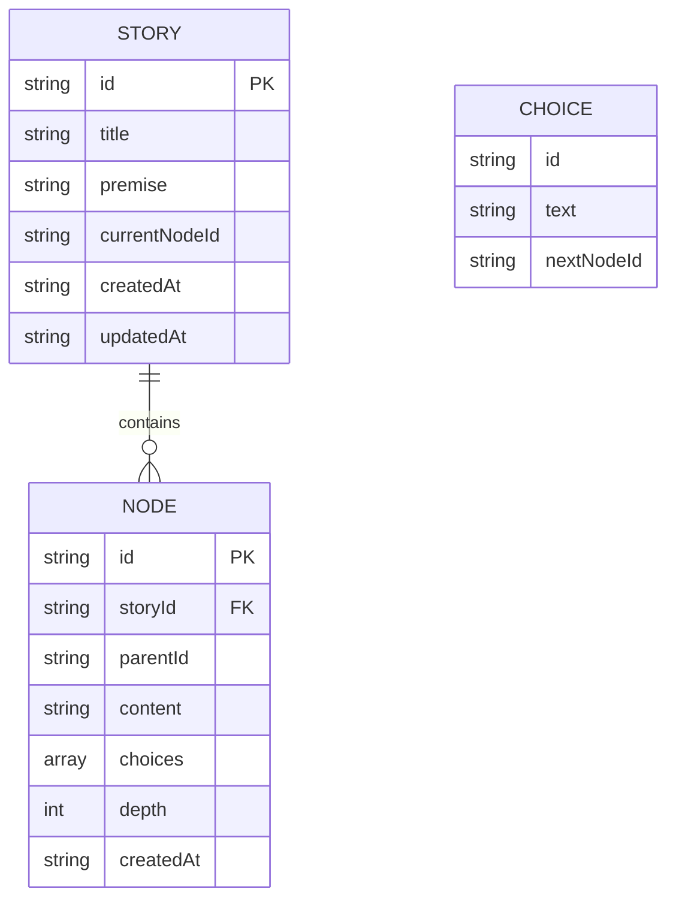

## 1. 架构设计



## 2. 技术描述

- **前端框架**：React@18 + TypeScript + Vite
- **状态管理**：Zustand（轻量、简单、支持中间件持久化）
- **样式方案**：TailwindCSS@3 + CSS变量 + 自定义动画
- **UI组件**：lucide-react 图标库
- **数据持久化**：浏览器localStorage
- **AI集成**：可配置的大模型API接口（默认使用OpenAI兼容格式）
- **构建工具**：Vite

## 3. 核心目录结构

```
src/
├── components/          # React组件
│   ├── StoryCard.tsx    # 故事内容展示卡片
│   ├── ChoiceButton.tsx # 选项按钮
│   ├── StoryTree.tsx    # 上帝视角故事树
│   ├── Toolbar.tsx      # 顶部工具栏
│   └── SetupForm.tsx    # 初始设置表单
├── hooks/               # 自定义hooks
│   └── useTypewriter.ts # 打字机效果hook
├── store/               # 状态管理
│   └── useStoryStore.ts # 故事状态store
├── engine/              # 故事引擎核心
│   ├── types.ts         # 类型定义
│   ├── template.ts      # 模板生成器（保底逻辑）
│   ├── llm.ts           # LLM生成器
│   └── generator.ts     # 混合生成策略
├── utils/               # 工具函数
│   ├── storage.ts       # localStorage封装
│   ├── export.ts        # Markdown导出
│   └── tree.ts          # 树结构操作
├── pages/
│   └── App.tsx          # 主应用页面
└── main.tsx             # 入口文件
```

## 4. 数据模型

### 4.1 数据结构定义



### 4.2 TypeScript类型定义

```typescript
interface StoryChoice {
  id: string;
  text: string;
  nextNodeId: string | null;
}

interface StoryNode {
  id: string;
  storyId: string;
  parentId: string | null;
  content: string;
  choices: StoryChoice[];
  depth: number;
  createdAt: number;
}

interface Story {
  id: string;
  title: string;
  premise: string;
  currentNodeId: string;
  nodeIds: string[];
  createdAt: number;
  updatedAt: number;
}

interface StoryState {
  story: Story | null;
  nodes: Record<string, StoryNode>;
  isGenerating: boolean;
  godMode: boolean;
  actions: {
    initStory: (premise: string) => Promise<void>;
    makeChoice: (choiceId: string) => Promise<void>;
    rollback: () => void;
    reset: () => void;
    toggleGodMode: () => void;
    exportMarkdown: () => string;
  };
}
```

## 5. 核心算法说明

### 5.1 混合生成策略
1. **优先使用LLM生成**：调用大模型生成故事内容和三个选项
2. **模板保底机制**：LLM调用失败或超时时，使用本地模板库生成
3. **模板库**：包含多种故事 archetype（英雄之旅、悬疑、奇幻等）的节点模板，根据上下文动态填充

### 5.2 故事树遍历
- 使用深度优先记录当前路径
- 支持回退到任意已访问节点
- 分支重复访问时直接读取缓存

### 5.3 localStorage持久化
- 自动保存每个新生成的节点
- 页面加载时自动恢复状态
- 使用版本号迁移机制兼容旧数据

## 6. 核心API（内部）

| 方法 | 用途 | 参数 | 返回值 |
|------|------|------|--------|
| `initStory(premise)` | 初始化新故事 | premise: string 故事设定 | Promise\<void\> |
| `generateNextNode(currentNode, choice)` | 生成下一节点 | currentNode, choice | Promise\<StoryNode\> |
| `rollback()` | 回退到上一节点 | - | void |
| `exportMarkdown()` | 导出故事线 | - | string |
| `getStoryTree()` | 获取故事树结构 | - | TreeNode |
