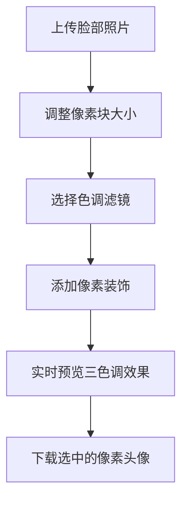
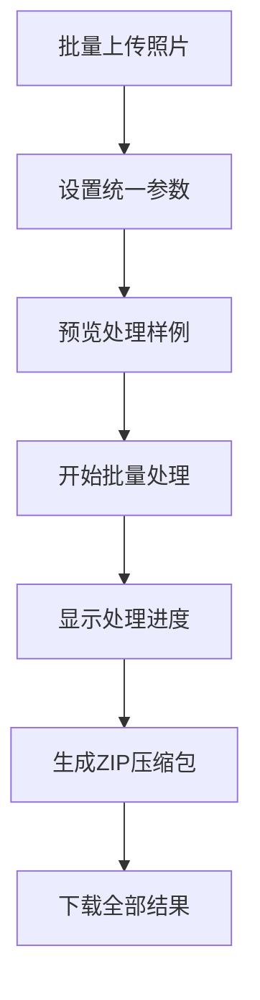
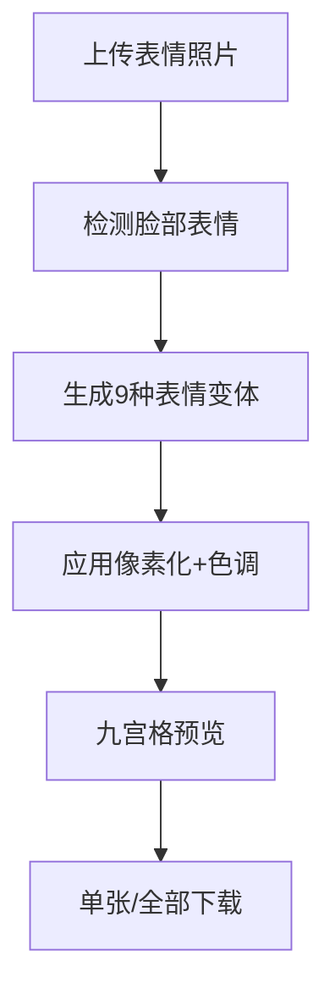

## 1. 产品概述

AI像素风头像生成工坊是一个在线像素艺术创作工具，用户可以上传脸部照片，通过像素化处理算法生成复古风格的像素头像。支持自定义像素块大小、多种色调滤镜、像素装饰叠加、批量处理等功能，并提供趣味表情包生成模式。

- **核心价值**：将普通照片快速转化为独特的像素艺术风格头像，降低像素艺术创作门槛
- **目标用户**：社交媒体用户、游戏玩家、像素艺术爱好者、设计师
- **市场定位**：轻量级、趣味化的在线像素艺术生成工具

## 2. 核心功能

### 2.1 用户角色
| 角色 | 注册方式 | 核心权限 |
|------|----------|----------|
| 普通用户 | 无需注册 | 使用全部功能，本地保存预设 |

### 2.2 功能模块

1. **单张头像处理**：图片上传、像素化处理、色调选择、装饰添加、结果下载
2. **批量处理工坊**：文件夹批量上传、参数统一设置、ZIP打包下载
3. **预设管理**：参数保存、预设加载、预设删除
4. **趣味表情包模式**：表情检测、九宫格表情包生成、批量导出

### 2.3 页面详情

| 页面名称 | 模块名称 | 功能描述 |
|---------|---------|---------|
| 主工作区 | 图片上传区 | 拖拽/点击上传脸部照片，实时预览原图 |
| 主工作区 | 像素控制面板 | 滑块调节像素块大小(4-32px)，实时预览效果 |
| 主工作区 | 色调选择器 | 三种预设色调（复古绿、暖棕、赛博紫）+ 原色 |
| 主工作区 | 装饰工具栏 | 像素眼镜、胡子、帽子等装饰的添加、拖拽、缩放、删除 |
| 主工作区 | 预览与下载区 | 三色调并排预览，单张下载按钮 |
| 批量处理 | 批量上传区 | 文件夹选择/多文件上传，文件列表管理 |
| 批量处理 | 参数配置区 | 统一设置像素大小和色调，预览处理效果 |
| 批量处理 | 打包下载 | 生成ZIP压缩包，显示处理进度 |
| 预设管理 | 预设列表 | 展示已保存的预设参数（像素大小+色调） |
| 预设管理 | 预设操作 | 保存当前参数、应用预设、删除预设 |
| 趣味模式 | 表情包生成 | 自动检测表情，生成9种变体像素表情包 |
| 趣味模式 | 表情包预览 | 九宫格展示，支持单张/全部下载 |

## 3. 核心流程

### 3.1 单张头像处理流程
用户上传照片 → 调整像素块大小 → 选择色调滤镜 → 添加像素装饰 → 实时预览效果 → 下载最终结果

### 3.2 批量处理流程
用户选择文件夹 → 配置统一参数 → 预览样例效果 → 开始批量处理 → 生成ZIP包 → 下载全部结果

### 3.3 表情包生成流程
上传照片 → 表情区域检测 → 生成9种表情变体 → 应用像素化处理 → 九宫格展示 → 打包下载

## 4. 用户界面设计

### 4.1 设计风格
- **整体风格**：复古像素游戏风格，致敬8-bit游戏时代
- **主色调**：深灰背景 (#1a1a2e) + 霓虹紫点缀 (#a855f7) + 像素绿高亮 (#22c55e)
- **辅助色**：复古绿 (#4ade80)、暖棕 (#d97706)、赛博紫 (#c084fc)
- **按钮风格**：像素化边框，按压时有8-bit凹陷效果，霓虹发光悬停
- **字体**：像素风格等宽字体 "Press Start 2P" 作为标题，"VT323" 作为正文字体
- **布局风格**：卡片式布局，像素边框，网格系统对齐
- **图标风格**：纯像素绘制图标，8-bit风格emoji

### 4.2 页面设计概述

| 页面名称 | 模块名称 | UI元素 |
|---------|---------|--------|
| 主工作区 | 顶部导航 | 像素风Logo，模式切换标签（单张/批量/趣味），预设按钮 |
| 主工作区 | 上传区 | 虚线像素边框，拖拽高亮动画，像素化上传图标 |
| 主工作区 | 控制面板 | 带刻度的像素滑块，色调选择胶囊按钮，装饰选择器网格 |
| 主工作区 | 预览区 | 三张并排像素画框，悬停放大效果，下载按钮覆盖层 |
| 主工作区 | 装饰层 | 可拖拽的像素装饰，选中状态像素高亮框 |
| 批量处理 | 文件列表 | 像素风格文件项，缩略图预览，删除按钮 |
| 批量处理 | 进度条 | 像素化进度条，8-bit加载动画 |
| 趣味模式 | 九宫格 | 3x3网格布局，每格独立表情标签 |

### 4.3 响应式设计
- **桌面端优先**：主工作区采用三栏布局（左侧控制面板 + 中间预览区 + 右侧装饰面板）
- **平板端**：改为上下布局，控制面板在上，预览区在下
- **移动端**：单列流式布局，折叠控制面板为可展开抽屉
- **触摸优化**：增大滑块和按钮触控区域，支持双指缩放装饰

### 4.4 动效设计
- **页面加载**：像素逐行扫描入场动画
- **图片上传**：像素化溶解过渡效果
- **参数调整**：实时像素化重绘动画
- **装饰添加**：8-bit弹跳出现动画
- **下载按钮**：霓虹脉冲发光效果
- **进度条**：像素块逐格填充动画

## 5. 非功能需求

### 5.1 性能要求
- 单张图片处理时间 < 500ms（像素化+色调+装饰渲染）
- 批量处理100张图片 < 30秒
- 页面首屏加载 < 2秒
- 实时预览帧率 > 30fps

### 5.2 兼容性要求
- 支持 Chrome 90+、Firefox 88+、Safari 14+、Edge 90+
- 支持 iOS Safari 14+、Android Chrome 90+
- 所有处理在浏览器端完成，无需后端服务

### 5.3 安全要求
- 所有图片处理在本地完成，不上传至服务器
- 不存储任何用户图片数据
- 预设数据保存在 localStorage，不涉及敏感信息
