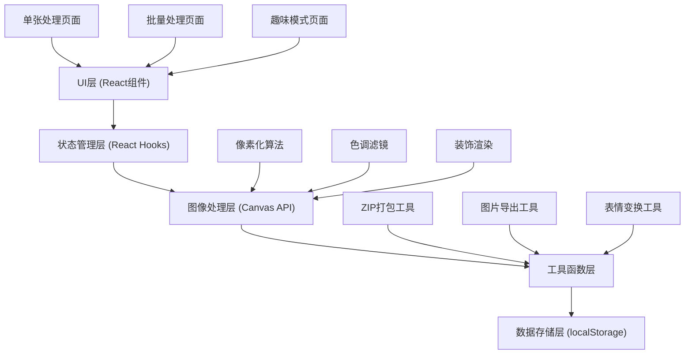

## 1. 架构设计

本项目为纯前端应用，所有图像处理在浏览器端完成，无需后端服务。采用分层架构设计，确保代码可维护性和扩展性。



## 2. 技术描述

- **前端框架**：React@18 + TypeScript
- **构建工具**：Vite@5
- **样式方案**：TailwindCSS@3 + CSS Variables
- **图像处理**：HTML5 Canvas API（原生，无需额外库）
- **ZIP打包**：JSZip@3
- **状态管理**：React Hooks (useState, useReducer, useContext)
- **数据持久化**：localStorage
- **图标**：自定义像素SVG图标

### 核心库版本
```json
{
  "react": "^18.2.0",
  "react-dom": "^18.2.0",
  "typescript": "^5.2.0",
  "vite": "^5.0.0",
  "tailwindcss": "^3.3.5",
  "jszip": "^3.10.1"
}
```

## 3. 目录结构

```
src/
├── components/          # React组件
│   ├── layout/         # 布局组件
│   │   ├── Header.tsx
│   │   └── TabNavigation.tsx
│   ├── upload/         # 上传相关组件
│   │   ├── ImageUploader.tsx
│   │   └── BatchUploader.tsx
│   ├── control/        # 控制面板组件
│   │   ├── PixelSlider.tsx
│   │   ├── ToneSelector.tsx
│   │   └── DecorationPanel.tsx
│   ├── preview/        # 预览组件
│   │   ├── PixelPreview.tsx
│   │   ├── BatchPreview.tsx
│   │   └── MemeGrid.tsx
│   └── common/         # 通用组件
│       ├── PixelButton.tsx
│       ├── PresetModal.tsx
│       └── ProgressBar.tsx
├── hooks/              # 自定义Hooks
│   ├── usePixelate.ts
│   ├── useImageProcessor.ts
│   ├── usePresets.ts
│   └── useBatchProcessor.ts
├── utils/              # 工具函数
│   ├── pixelate.ts     # 像素化核心算法
│   ├── filters.ts      # 色调滤镜
│   ├── decorations.ts  # 装饰数据与渲染
│   ├── memeGenerator.ts # 表情包生成
│   ├── zipPacker.ts    # ZIP打包
│   └── imageExport.ts  # 图片导出
├── types/              # TypeScript类型定义
│   └── index.ts
├── contexts/           # React Context
│   └── AppContext.tsx
├── App.tsx             # 主应用组件
├── main.tsx            # 入口文件
└── index.css           # 全局样式
```

## 4. 核心数据类型定义

```typescript
// 色调类型
type ToneType = 'original' | 'retro-green' | 'warm-brown' | 'cyber-purple';

// 像素化参数
interface PixelSettings {
  blockSize: number;      // 像素块大小 4-32
  tone: ToneType;         // 色调
  brightness: number;     // 亮度 -50 ~ 50
  contrast: number;       // 对比度 -50 ~ 50
}

// 预设数据
interface Preset {
  id: string;
  name: string;
  settings: PixelSettings;
  createdAt: number;
}

// 装饰元素
interface Decoration {
  id: string;
  type: 'glasses' | 'mustache' | 'hat' | 'earring' | 'mask';
  name: string;
  pixels: number[][];     // 像素矩阵，0=透明, 1=主色, 2=次色
  colors: string[];       // 颜色配置
  defaultScale: number;
  defaultX: number;       // 默认位置百分比
  defaultY: number;
}

// 已放置的装饰实例
interface PlacedDecoration {
  id: string;
  decorationId: string;
  x: number;              // 位置百分比 0-100
  y: number;
  scale: number;          // 缩放比例 0.5-2
  rotation: number;       // 旋转角度
  layer: number;          // 层级
}

// 处理中的图片
interface ProcessedImage {
  id: string;
  originalFile: File;
  originalUrl: string;
  processedCanvases: Record<ToneType, HTMLCanvasElement | null>;
  decorations: PlacedDecoration[];
  settings: PixelSettings;
}

// 表情包单元格
interface MemeCell {
  id: string;
  name: string;
  emoji: string;
  transform: {
    eyeScale: number;
    mouthCurve: number;
    browAngle: number;
    colorShift: string;
  };
}
```

## 5. 核心算法说明

### 5.1 像素化算法
```typescript
function pixelateImage(
  ctx: CanvasRenderingContext2D,
  image: HTMLImageElement,
  blockSize: number,
  width: number,
  height: number
): void {
  // 1. 缩小图像到像素网格尺寸
  const smallWidth = Math.floor(width / blockSize);
  const smallHeight = Math.floor(height / blockSize);
  
  // 2. 创建临时画布进行缩小
  const tempCanvas = document.createElement('canvas');
  tempCanvas.width = smallWidth;
  tempCanvas.height = smallHeight;
  const tempCtx = tempCanvas.getContext('2d')!;
  
  // 3. 禁用图像平滑，实现硬边像素效果
  tempCtx.imageSmoothingEnabled = false;
  ctx.imageSmoothingEnabled = false;
  
  // 4. 缩小绘制
  tempCtx.drawImage(image, 0, 0, smallWidth, smallHeight);
  
  // 5. 放大绘制回原尺寸（像素化效果）
  ctx.drawImage(
    tempCanvas,
    0, 0, smallWidth, smallHeight,
    0, 0, width, height
  );
}
```

### 5.2 色调滤镜算法
```typescript
function applyToneFilter(
  ctx: CanvasRenderingContext2D,
  width: number,
  height: number,
  tone: ToneType
): void {
  const imageData = ctx.getImageData(0, 0, width, height);
  const data = imageData.data;
  
  const toneMatrix = {
    'retro-green': [0.3, 0.7, 0.2,  0, 0.2, 0.6, 0.3,  0, 0.1, 0.3, 0.4,  0],
    'warm-brown':  [0.6, 0.3, 0.1,  0, 0.4, 0.4, 0.2,  0, 0.2, 0.3, 0.3,  0],
    'cyber-purple':[0.4, 0.2, 0.6,  0, 0.3, 0.3, 0.5,  0, 0.2, 0.4, 0.6,  0],
    'original':    [1, 0, 0, 0,  0, 1, 0, 0,  0, 0, 1, 0]
  };
  
  const matrix = toneMatrix[tone];
  
  for (let i = 0; i < data.length; i += 4) {
    const r = data[i];
    const g = data[i + 1];
    const b = data[i + 2];
    
    data[i]     = Math.min(255, r * matrix[0] + g * matrix[1] + b * matrix[2]);
    data[i + 1] = Math.min(255, r * matrix[4] + g * matrix[5] + b * matrix[6]);
    data[i + 2] = Math.min(255, r * matrix[8] + g * matrix[9] + b * matrix[10]);
  }
  
  ctx.putImageData(imageData, 0, 0);
}
```

### 5.3 表情包变换算法
使用几何变换和颜色调整生成表情变体，包括：
- 眼睛缩放 (eyeScale)
- 嘴巴弯曲 (mouthCurve)
- 眉毛角度 (browAngle)
- 颜色偏移 (colorShift)

## 6. 核心模块设计

### 6.1 图像处理Hook (useImageProcessor.ts)
```typescript
function useImageProcessor() {
  const processImage = async (
    imageFile: File,
    settings: PixelSettings,
    decorations: PlacedDecoration[]
  ): Promise<Record<ToneType, string>> => {
    // 加载图片
    // 应用像素化
    // 应用各色调滤镜
    // 渲染装饰
    // 返回各色调的dataURL
  };
  
  const exportImage = (canvas: HTMLCanvasElement, filename: string): void => {
    // 导出PNG
  };
  
  return { processImage, exportImage };
}
```

### 6.2 批量处理Hook (useBatchProcessor.ts)
```typescript
function useBatchProcessor() {
  const processBatch = async (
    files: File[],
    settings: PixelSettings,
    onProgress: (current: number, total: number) => void
  ): Promise<Blob> => {
    // 遍历处理每张图片
    // 调用JSZip打包
    // 返回ZIP Blob
  };
  
  return { processBatch };
}
```

### 6.3 预设管理Hook (usePresets.ts)
```typescript
function usePresets() {
  const presets = useLocalStorage<Preset[]>('pixel-presets', []);
  
  const savePreset = (name: string, settings: PixelSettings) => {
    // 添加到presets数组
    // 保存到localStorage
  };
  
  const deletePreset = (id: string) => {
    // 从数组中移除
  };
  
  const applyPreset = (preset: Preset): PixelSettings => {
    return preset.settings;
  };
  
  return { presets, savePreset, deletePreset, applyPreset };
}
```

## 7. 装饰数据定义

内置像素装饰使用二维数组定义，每个数字代表颜色索引：

```typescript
// 像素眼镜装饰示例
const glassesDecoration: Decoration = {
  id: 'glasses-001',
  type: 'glasses',
  name: '经典黑框眼镜',
  pixels: [
    [1,1,1,1,0,0,0,1,1,1,1],
    [1,0,0,0,1,1,1,0,0,0,1],
    [1,0,2,2,0,0,0,2,2,0,1],
    [1,0,2,2,0,0,0,2,2,0,1],
    [1,0,0,0,1,1,1,0,0,0,1],
    [1,1,1,1,0,0,0,1,1,1,1],
  ],
  colors: ['#000000', '#333333', '#ffffff'],
  defaultScale: 1,
  defaultX: 50,
  defaultY: 40
};
```

## 8. 性能优化策略

1. **Canvas分层渲染**：原图、像素化、装饰分别在不同Canvas渲染，减少重绘区域
2. **防抖处理**：滑块调整使用防抖，避免频繁重绘
3. **Web Worker**：批量处理使用Web Worker，避免阻塞主线程
4. **离屏Canvas**：图像处理使用OffscreenCanvas，提升性能
5. **缓存机制**：已处理的图片缓存到内存，重复参数调整时复用

## 9. 表情包九宫格配置

```typescript
const memeTemplates: MemeCell[] = [
  { id: 'happy',    name: '开心',  emoji: '😄', transform: { eyeScale: 1.2, mouthCurve: 0.8, browAngle: 10, colorShift: 'warm' } },
  { id: 'angry',    name: '生气',  emoji: '😠', transform: { eyeScale: 1.3, mouthCurve: -0.5, browAngle: -20, colorShift: 'red' } },
  { id: 'sad',      name: '伤心',  emoji: '😢', transform: { eyeScale: 0.9, mouthCurve: -0.3, browAngle: 15, colorShift: 'blue' } },
  { id: 'surprised',name: '惊讶',  emoji: '😮', transform: { eyeScale: 1.5, mouthCurve: 0, browAngle: -10, colorShift: 'yellow' } },
  { id: 'cool',     name: '酷',    emoji: '😎', transform: { eyeScale: 1, mouthCurve: 0.2, browAngle: 0, colorShift: 'cyber' } },
  { id: 'love',     name: '爱心',  emoji: '😍', transform: { eyeScale: 1.1, mouthCurve: 0.6, browAngle: 5, colorShift: 'pink' } },
  { id: 'laugh',    name: '大笑',  emoji: '😂', transform: { eyeScale: 1.2, mouthCurve: 1, browAngle: 5, colorShift: 'green' } },
  { id: 'think',    name: '思考',  emoji: '🤔', transform: { eyeScale: 0.95, mouthCurve: -0.1, browAngle: -5, colorShift: 'brown' } },
  { id: 'wink',     name: '眨眼',  emoji: '😉', transform: { eyeScale: 0.7, mouthCurve: 0.4, browAngle: 0, colorShift: 'purple' } },
];
```
