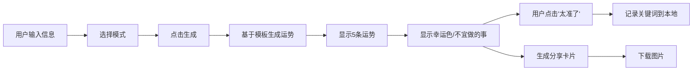

## 1. 产品概述
"AI算命机"是一款趣味性Web小工具，用户输入出生月份和幸运数字，系统基于模板和随机词库生成神秘专业的运势文案。支持学习用户偏好、生成朋友圈卡片、以及搞笑"反向毒奶"模式。

## 2. 核心功能

### 2.1 用户角色
| 角色 | 注册方式 | 核心权限 |
|------|----------|----------|
| 普通用户 | 无需注册 | 使用所有功能，本地存储偏好 |

### 2.2 功能模块
1. **首页**：用户输入区、运势生成区、结果展示区
2. **运势卡片生成**：生成可分享的朋友圈图片卡片
3. **偏好学习系统**：记录用户"太准了"的关键词，提高复用概率

### 2.3 页面详情
| 页面名称 | 模块名称 | 功能描述 |
|----------|----------|----------|
| 首页 | 用户输入区 | 出生月份选择、幸运数字输入、模式切换（正常/反向毒奶） |
| 首页 | 运势生成区 | 生成按钮、加载动画、五条运势结果展示 |
| 首页 | 运势交互区 | "太准了"按钮、今日幸运色、不宜做的事 |
| 首页 | 卡片生成区 | 生成朋友圈分享卡片、图片下载功能 |

## 3. 核心流程

用户输入出生月份和幸运数字 → 选择模式（正常/反向毒奶）→ 点击生成按钮 → 系统基于模板+随机词库生成五条运势 → 显示今日幸运色和不宜做的事 → 用户可点击"太准了"记录关键词 → 生成并下载朋友圈分享卡片

## 4. 用户界面设计

### 4.1 设计风格
- **主色调**：深紫色 (#4A148C) + 金色 (#FFD700) + 神秘黑色 (#1A1A2E)
- **按钮风格**：圆角渐变按钮，带发光效果
- **字体**：标题使用特殊装饰字体，正文使用清晰易读字体
- **布局风格**：卡片式布局，神秘星空背景，带粒子动效
- **图标风格**：占星相关图标（星星、月亮、水晶球）

### 4.2 页面设计概述
| 页面名称 | 模块名称 | UI元素 |
|----------|----------|--------|
| 首页 | Hero区域 | 神秘星空背景、发光标题、水晶球动效 |
| 首页 | 输入区域 | 月份下拉选择器、数字输入框、模式切换开关 |
| 首页 | 结果区域 | 渐变色卡片、悬停动画、"太准了"按钮 |
| 首页 | 卡片预览 | 模拟手机屏幕效果、分享按钮、下载按钮 |

### 4.3 响应式
- Desktop-first设计，移动端自适应
- 卡片在移动端垂直堆叠
- 触摸优化：按钮尺寸适合手指点击

