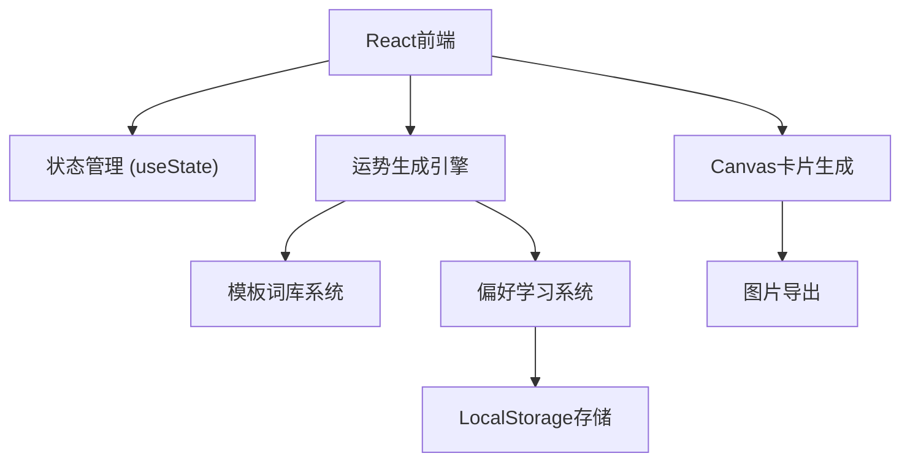

## 1. 架构设计



## 2. 技术描述

- **前端**：React@18 + TypeScript + Vite
- **样式**：TailwindCSS@3
- **图标**：Lucide React
- **图片生成**：HTML5 Canvas API
- **数据存储**：LocalStorage（用户偏好关键词）
- **初始化工具**：Vite

## 3. 路由定义

| 路由 | 用途 |
|------|------|
| / | 首页（唯一页面，单页应用） |

## 4. 数据模型

### 4.1 数据结构定义

```typescript
// 运势条目
interface Fortune {
  id: string;
  content: string;
  keywords: string[];
  isLiked: boolean;
}

// 用户偏好
interface UserPreferences {
  likedKeywords: { [keyword: string]: number };
  totalGenerations: number;
}

// 生成配置
interface GenerationConfig {
  birthMonth: number;
  luckyNumber: number;
  mode: 'normal' | 'reverse';
}

// 今日额外信息
interface DailyInfo {
  luckyColor: {
    name: string;
    hex: string;
  };
  avoidDoing: string;
}
```

### 4.2 词库数据结构

```typescript
// 模板结构
interface FortuneTemplate {
  templates: string[];
  subjects: string[];
  actions: string[];
  outcomes: string[];
  mysticalWords: string[];
}

// 反向毒奶模板
interface ReverseTemplate {
  templates: string[];
  badEvents: string[];
  funnyOutcomes: string[];
}
```

## 5. 核心模块

### 5.1 运势生成引擎
- 输入：出生月份、幸运数字、模式
- 输出：5条运势文案
- 算法：模板替换 + 加权随机选择（基于用户偏好）

### 5.2 偏好学习系统
- 记录用户标记"太准了"的关键词
- 使用词频加权，提高高权重词的出现概率
- LocalStorage持久化存储

### 5.3 Canvas卡片生成
- 绘制星空背景
- 渲染运势文本
- 添加装饰元素
- 导出为PNG图片

