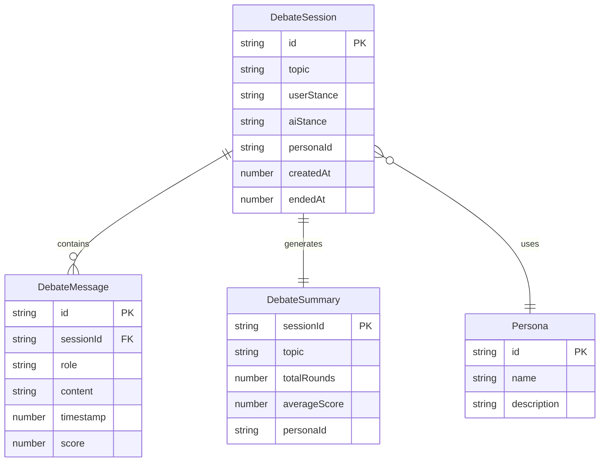

## 1. 架构设计

```mermaid
graph TB
    subgraph "前端层"
        "A[React 单页应用]"
        "A1[辩题选择组件]"
        "A2[人设切换组件]"
        "A3[对话区组件]"
        "A4[评分组件]"
        "A5[控制栏组件]"
        "A6[导出组件]"
    end
    subgraph "业务逻辑层"
        "B1[辩论状态管理 Zustand]"
        "B2[AI回应生成引擎]"
        "B3[评分策略引擎]"
        "B4[人设模板系统]"
    end
    subgraph "数据层"
        "C1[localStorage 持久化]"
        "C2[JSON导出模块]"
    end
    "A1" --> "B1"
    "A2" --> "B4"
    "A3" --> "B1"
    "A4" --> "B3"
    "A5" --> "B1"
    "A6" --> "C2"
    "B2" --> "B4"
    "B3" --> "B2"
    "B1" --> "C1"
```

## 2. 技术说明

- 前端：React@18 + TailwindCSS@3 + Vite
- 初始化工具：Vite
- 后端：无（纯前端应用，AI回应通过本地模板引擎生成）
- 数据库：无（使用localStorage存储辩论记录）
- 状态管理：Zustand

## 3. 路由定义

| 路由 | 用途 |
|------|------|
| / | 辩论主页，包含辩题选择、对话区、控制栏 |
| /record/:id | 辩论记录详情页，查看历史辩论摘要和导出 |

## 4. API定义

无后端API。AI回应生成完全在客户端完成，基于预设的句式模板+人设模板+关键词匹配策略。

核心数据类型定义：

```typescript
interface DebateMessage {
  id: string
  role: 'ai' | 'user'
  content: string
  timestamp: number
  score?: number
}

interface Persona {
  id: 'toxic' | 'pedantic' | 'passionate'
  name: string
  description: string
  templates: string[]
  connectors: string[]
  vocabulary: string[]
}

interface DebateSession {
  id: string
  topic: string
  userStance: string
  aiStance: string
  persona: Persona['id']
  messages: DebateMessage[]
  averageScore: number
  createdAt: number
  endedAt?: number
  summary?: DebateSummary
}

interface DebateSummary {
  topic: string
  userStance: string
  aiStance: string
  totalRounds: number
  keyArguments: { user: string[]; ai: string[] }
  averageScore: number
  persona: string
  duration: number
}

interface ScoreStrategy {
  avgScore: number
  preferTemplates: 'logical' | 'emotional' | 'aggressive'
}
```

## 5. 服务器架构图

不适用（纯前端应用）

## 6. 数据模型

### 6.1 数据模型定义



### 6.2 AI回应生成策略

**关键词匹配 → 模板选择 → 人设渲染 → 输出**

1. 从用户输入中提取关键词（分词+匹配）
2. 根据评分历史确定策略倾向：高分→强化当前句式，低分→切换句式类型
3. 从人设模板库中选择匹配模板
4. 填入关键词和连接词，生成最终回应

**评分影响策略：**
- 平均分 ≥ 4：倾向"逻辑型"模板（因果、对比、递进）
- 平均分 2-3：倾向"情感型"模板（反问、感叹、类比）
- 平均分 ≤ 1：倾向"激进型"模板（否定、质疑、讽刺）

### 6.3 数据持久化

使用 localStorage 存储辩论会话列表，key 为 `debate_sessions`，值为 DebateSession 数组的 JSON 字符串。
