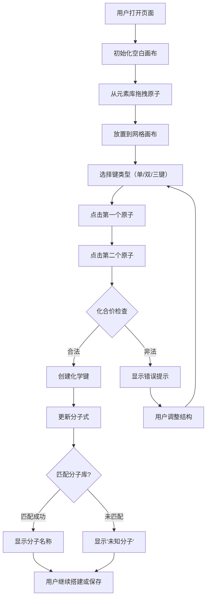
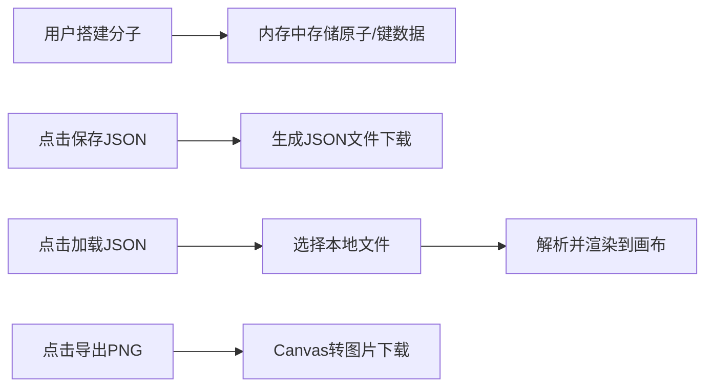

# 化学分子搭建游戏 - 产品需求文档 (PRD)

## 1. 产品概述

一款基于 HTML/CSS/原生 JavaScript 的交互式化学分子搭建教育游戏，用户可以从元素库中拖拽原子到网格画布上，通过化学键工具连接原子构建分子结构。系统实时验证化合价规则，支持分子识别、数据导入导出和预设挑战模式。

- **目标用户**：化学学习者、学生、教师、对分子结构感兴趣的科普爱好者
- **产品价值**：提供直观的分子可视化搭建体验，帮助用户理解化学价键理论，学习常见分子结构

## 2. 核心功能

### 2.1 功能模块

| 模块名称 | 核心功能 | 描述 |
|---------|---------|------|
| 元素库 | 原子拖拽 | 提供H、O、C、N等常见元素，支持拖拽到画布 |
| 网格画布 | 原子放置 | 可交互的网格区域，用于放置和排列原子 |
| 化学键工具 | 键创建 | 点击两个原子创建单键/双键/三键，支持循环切换 |
| 化合价验证 | 规则检查 | 实时检查每个原子的键数是否符合化合价规则 |
| 分子式显示 | 化学式计算 | 自动计算并显示当前分子的化学式 |
| 分子识别 | 库匹配 | 与本地分子库比对，识别已知分子并显示名称 |
| 数据管理 | 导入导出 | 支持保存为JSON、从JSON加载、导出PNG图片 |
| 挑战模式 | 预设任务 | 提供多个分子搭建挑战，高亮目标结构 |
| 统计面板 | 数据展示 | 显示当前原子数量、键数量等统计信息 |
| 重置功能 | 画布清空 | 一键清空画布，重新开始 |

### 2.2 页面结构

本产品为**单页面应用 (SPA)**，所有功能集成在一个页面中：

| 区域 | 组件 | 功能描述 |
|------|------|----------|
| 顶部标题栏 | 游戏标题、分子式显示、分子名称 | 显示当前分子的化学式和识别结果 |
| 左侧元素库 | 元素周期表缩略、可拖拽原子 | H、O、C、N、S、P、Cl等常见元素 |
| 中央画布区 | 网格画布、原子、化学键 | 核心搭建区域，支持拖拽放置和点击连接 |
| 右侧工具栏 | 键类型选择、操作按钮 | 单键/双键/三键切换、重置、保存、加载、导出 |
| 底部信息栏 | 统计信息、挑战模式 | 原子/键数量统计，挑战任务提示 |

## 3. 核心流程

### 3.1 分子搭建主流程



### 3.2 数据导入导出流程



## 4. 用户界面设计

### 4.1 设计风格

**美学方向**: 科技感化学实验室风格 + 现代UI精致感

- **主色调**:
  - 背景: 深邃科技蓝渐变 (#0F172A → #1E293B)
  - 强调色: 青蓝色 (#06B6D4) 用于选中状态和交互
  - 原子色: 使用标准CPK配色（H:白色, C:黑色, O:红色, N:蓝色, S:黄色, Cl:绿色）
  - 文字: 浅灰蓝 (#E2E8F0) 保证可读性
- **字体选择**:
  - 标题字体: 'Orbitron' (Google Fonts, 科技感字体)
  - 正文字体: 'Rajdhani' (Google Fonts, 清晰现代)
  - 分子式: 'Courier New' (等宽字体, 下标支持)
- **按钮样式**: 圆角玻璃拟态效果 + hover发光动画 + 点击反馈
- **布局风格**: 三栏式布局，中央画布焦点，侧边栏半透明玻璃效果
- **图标风格**: 简洁线性图标 + 化学元素符号
- **动画效果**:
  - 原子拖拽时的悬浮效果
  - 化学键创建的连线动画
  - 分子识别成功的发光脉冲
  - 错误提示的抖动动画

### 4.2 页面布局设计

| 区域 | 布局方式 | UI 元素详情 |
|------|---------|------------|
| 顶部栏 | 全宽 flex 布局 | 标题"🔬 分子搭建实验室"、分子式显示区、分子名称标签 |
| 左侧元素库 | 固定宽度侧边栏 | 元素卡片网格（H、C、N、O、S、P、F、Cl、Br、I）、每个卡片显示元素符号和原子量 |
| 中央画布 | flex-grow 居中区域 | Canvas网格背景（10x10网格）、原子球体（彩色圆形带符号）、化学键（线条，粗细表示键级） |
| 右侧工具栏 | 固定宽度侧边栏 | 🔗 键类型选择器（单键/双键/三键按钮）、🔄 重置按钮、💾 保存JSON、📂 加载JSON、🖼️ 导出PNG、📋 统计面板 |
| 底部挑战区 | 全宽横幅 | 🎯 当前挑战："搭建水分子" + 提示文字 + 跳过按钮 |

### 4.3 响应式设计策略

- **桌面端 (>1024px)**: 三栏布局 - 左侧元素库 + 中央画布 + 右侧工具栏
- **平板端 (768-1024px)**: 双列布局 - 上下堆叠的侧边栏 + 中央画布
- **移动端 (<768px)**: 垂直堆叠 - 顶部元素库 + 中央画布 + 底部工具栏，触摸友好尺寸

### 4.4 特殊交互细节

- **CPK原子配色**: H=白色, C=黑色/深灰, O=红色, N=蓝色, S=黄色, Cl=绿色, F=浅绿, Br=深红, I=深紫
- **化学键表示**: 单键=1条线, 双键=2条平行线, 三键=3条平行线
- **化合价规则**: H=1, O=2, N=3, C=4, S=2/4/6, P=3/5, 卤素=1
- **预设挑战列表**:
  - 🎯 挑战1: 搭建水分子 (H₂O)
  - 🎯 挑战2: 搭建二氧化碳 (CO₂)
  - 🎯 挑战3: 搭建甲烷 (CH₄)
  - 🎯 挑战4: 搭建氨分子 (NH₃)
  - 🎯 挑战5: 搭建乙醇 (C₂H₅OH)
  - 🎯 挑战6: 搭建乙酸 (CH₃COOH)
- **分子库包含**: H₂O, CO₂, CH₄, NH₃, O₂, N₂, H₂, C₂H₅OH, CH₃COOH, C₆H₆ (苯), C₆H₁₂O₆ (葡萄糖简化版)

## 5. 数据模型

### 5.1 原子对象 (Atom)

```typescript
interface Atom {
  id: string;           // 唯一标识
  element: string;      // 元素符号 (H, C, O, N, etc.)
  x: number;            // 网格X坐标
  y: number;            // 网格Y坐标
  bonds: string[];      // 连接的键ID列表
}
```

### 5.2 化学键对象 (Bond)

```typescript
interface Bond {
  id: string;           // 唯一标识
  atom1Id: string;      // 第一个原子ID
  atom2Id: string;      // 第二个原子ID
  type: 1 | 2 | 3;      // 键类型: 1=单键, 2=双键, 3=三键
}
```

### 5.3 分子结构数据 (MoleculeData)

```typescript
interface MoleculeData {
  version: string;
  createdAt: number;
  atoms: Atom[];
  bonds: Bond[];
}
```

### 5.4 元素定义 (ElementDefinition)

```typescript
interface ElementDefinition {
  symbol: string;
  name: string;        // 中文名称
  valence: number[];   // 可能的化合价
  color: string;       // CPK颜色
  radius: number;      // 显示半径
}
```

### 5.5 已知分子库 (KnownMolecule)

```typescript
interface KnownMolecule {
  formula: string;      // 分子式, 如 "H2O"
  name: string;         // 中文名称, 如 "水"
  englishName: string;  // 英文名称
  description: string;  // 简单描述
  structure?: {         // 可选的标准结构用于精确匹配
    atoms: Atom[];
    bonds: Bond[];
  };
}
```

## 6. 技术约束

- **纯前端实现**: 无需后端服务器，所有功能在浏览器端完成
- **技术栈**: 原生 HTML5 + CSS3 + JavaScript (ES6+)
- **画布技术**: HTML5 Canvas 用于高性能渲染原子和化学键
- **兼容性要求**: 支持 Chrome/Firefox/Safari/Edge 最新两个版本
- **性能指标**: 支持至少 50 个原子同时渲染，帧率稳定 60fps
- **外部资源**: 通过 CDN 引入 Google Fonts，无其他外部依赖
