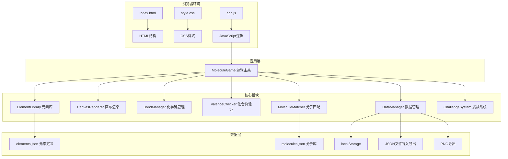
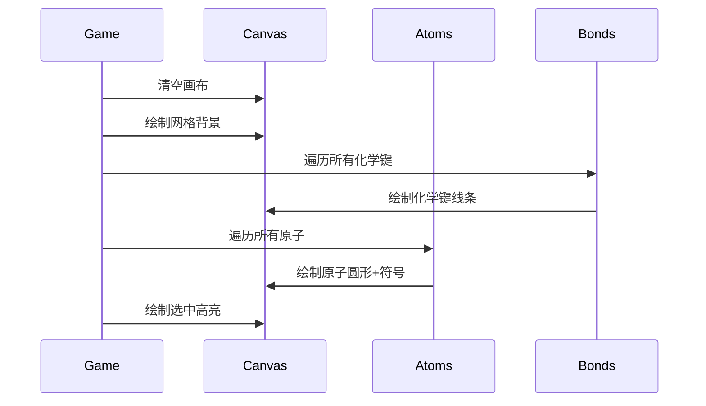

# 化学分子搭建游戏 - 技术架构文档

## 1. 架构设计



## 2. 技术描述

- **前端技术栈**: 原生 HTML5 + CSS3 + JavaScript (ES6+)
- **初始化方式**: 直接创建HTML/CSS/JS文件，无需构建工具
- **画布渲染**: HTML5 Canvas API 进行原子和化学键的高性能渲染
- **数据存储**: 本地 JSON 文件 + localStorage（可选）
- **外部依赖**: Google Fonts (Orbitron, Rajdhani)

## 3. 文件结构

| 文件路径 | 用途说明 |
|----------|----------|
| `/index.html` | 主页面HTML结构 |
| `/css/style.css` | 全局样式和布局 |
| `/js/app.js` | 游戏主逻辑和类定义 |
| `/data/elements.json` | 元素属性定义（CPK颜色、化合价等） |
| `/data/molecules.json` | 已知分子库数据 |

## 4. 核心类设计

### 4.1 MoleculeGame (主类)

```javascript
class MoleculeGame {
  constructor(canvasId) {
    this.canvas = document.getElementById(canvasId);
    this.ctx = this.canvas.getContext('2d');
    this.atoms = [];      // Atom对象数组
    this.bonds = [];       // Bond对象数组
    this.selectedAtom = null; // 当前选中的原子（用于创建键
    this.bondType = 1;     // 当前键类型 1/2/3
    this.isDragging = false;
    this.draggedAtom = null;
    this.dragOffset = { x: 0, y: 0 };
  }
  
  init() {}                    // 初始化游戏
  render() {}                  // 渲染整个画布
  addAtom(element, x, y) {}       // 添加原子
  removeAtom(atomId) {}          // 删除原子
  addBond(atom1, atom2, type) {} // 添加化学键
  removeBond(bondId) {}        // 删除化学键
  resetCanvas() {}             // 重置画布
  getFormula() {}               // 获取分子式
  checkMoleculeMatch() {}           // 检查分子匹配
}
```

### 4.2 Atom (数据结构定义

```javascript
// 原子类
class Atom {
  constructor(id, element, x, y) {
    this.id = id;
    this.element = element;  // 元素符号
    this.x = x;       // 画布坐标
    this.y = y;
    this.bonds = [];  // 连接的键ID
  }
  
  getBondCount() {}    // 计算总键数（考虑双键/三键
}

// 化学键类
class Bond {
  constructor(id, atom1Id, atom2Id, type) {
    this.id = id;
    this.atom1Id = atom1Id;
    this.atom2Id = atom2Id;
    this.type = type;  // 1, 2, 3
  }
}
```

### 4.3 工具类

```javascript
// 化合价检查器
class ValenceChecker {
  static checkAtom(atom, allBonds) {} // 检查原子化合价是否合法
  static getValence(element) {}       // 获取元素的可能化合价
}

// 分子式生成器
class FormulaGenerator {
  static generate(atoms) {}       // 生成分子式字符串
  static formatFormula(formula) {} // 格式化显示（下标）
}

// 分子匹配器
class MoleculeMatcher {
  constructor(moleculeLibrary) {}
  match(atoms, bonds) {} // 匹配已知分子
}

// 数据导入导出
class DataManager {
  static exportToJSON(atoms, bonds) {} // 导出为JSON
  static loadFromJSON(jsonData) {}    // 从JSON加载
  static exportToPNG(canvas) {}        // 导出为图片
}
```

## 5. 事件处理机制

```mermaid
flowchart LR
    A["鼠标事件"] --> B{"事件类型判断
    B -->|mousedown| C{"点击元素库?"}
    C -->|是| D["开始拖拽原子"]
    C -->|否| E{"点击原子?"}
    E -->|是| F{"已选中原子?
    F -->|否| G["选中第一个原子"]
    F -->|是| H["尝试创建化学键"]
    E -->|否| I["取消选中"]
    B -->|mousemove| J{"拖拽中?"}
    J -->|是| K["更新原子位置"]
    B -->|mouseup| L["结束拖拽/操作"]
```

## 6. 渲染流程



## 7. 性能优化策略

1. **requestAnimationFrame
2. 按需重绘（仅在状态变化时重绘
3. 离屏Canvas缓存静态元素（网格背景
4. 原子位置变化时重绘
```
