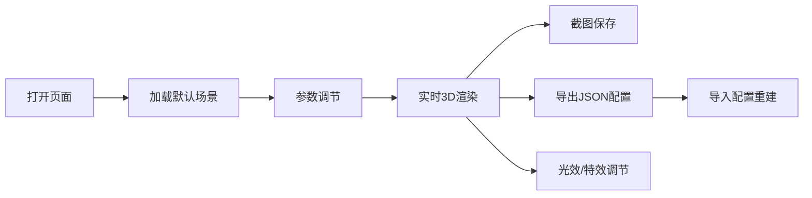

## 1. 产品概述

3D交互式宝塔生成器，用户可通过参数实时生成中国风多层宝塔，支持3D场景交互、参数配置导入导出、截图保存等功能。
- 核心目的：提供直观的3D参数化建模体验，让用户自由设计个性化宝塔
- 目标用户：3D设计爱好者、教育工作者、游戏开发者

## 2. 核心功能

### 2.1 用户角色
无需用户登录，所有用户均可使用全部功能

### 2.2 功能模块
1. **3D场景主界面**：宝塔渲染、环境展示、相机交互
2. **参数控制面板**：宝塔参数调节、效果开关、光效控制
3. **信息展示区**：宝塔高度、层数实时显示
4. **操作工具栏**：截图、导入导出、重置功能

### 2.3 页面详情
| 页面名称 | 模块名称 | 功能描述 |
|---------|---------|----------|
| 主页面 | 3D场景 | Three.js渲染宝塔、地面、草地、树木，OrbitControls交互 |
| 主页面 | 参数面板 | 层数(3-9层)、屋檐翘起角度、塔身颜色(红/棕/灰)、塔尖样式 |
| 主页面 | 光效控制 | 阳光方向调节、阴影开关、萤火虫粒子特效开关 |
| 主页面 | 辅助功能 | 地面网格开关、一键截图、JSON参数导入导出 |

## 3. 核心流程

用户打开页面 → 查看默认宝塔 → 调节参数实时预览效果 → 开启/关闭特效 → 截图保存或导出配置 → 导入配置重建宝塔

## 4. 用户界面设计

### 4.1 设计风格
- **主色调**：深灰蓝色背景 (#1a1a2e)，金色装饰 (#d4af37)，中国风配色
- **按钮样式**：圆角设计，悬停时有金色光晕效果
- **字体**：标题使用 Noto Serif SC（宋体风格），正文使用 PingFang SC
- **布局风格**：左侧固定参数面板，右侧全屏3D场景，半透明玻璃拟态效果
- **图标风格**：简洁线性图标配合emoji增强视觉表现

### 4.2 页面设计概述
| 页面名称 | 模块名称 | UI元素 |
|---------|---------|--------|
| 主页面 | 3D场景 | 全屏Canvas，草地环境，低多边形树木，动态光照 |
| 主页面 | 参数面板 | 左侧固定宽度，折叠/展开动画，分组显示，滑块控件 |
| 主页面 | 信息栏 | 右上角半透明卡片，实时显示宝塔参数 |
| 主页面 | 工具栏 | 底部横向排列，图标按钮，工具提示 |

### 4.3 响应性
- Desktop优先设计（1920×1080为基准）
- 平板适配：参数面板可切换为底部抽屉
- 移动端：参数面板全屏展开，简化控制

### 4.4 3D场景指导
- **环境**：晴朗天空盒，绿色草地，低多边形松树，营造宁静自然氛围
- **光照**：主方向光模拟阳光，环境光补充，实时阴影投射
- **相机**：OrbitControls，限制俯仰角，自动阻尼效果
- **交互**：拖拽旋转、滚轮缩放、右键平移
- **动画**：萤火虫粒子环绕漂浮，云层缓慢移动，阳光角度平滑过渡
- **后处理**：轻微泛光效果，增强画面质感
- **性能**：实例化渲染树木，粒子系统优化
