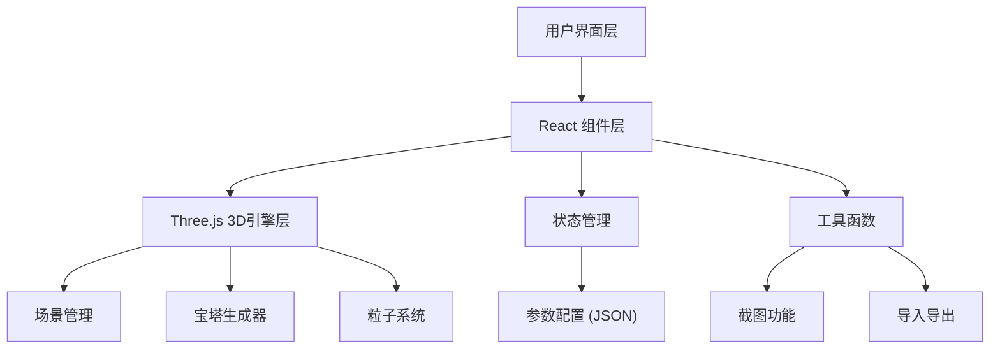

## 1. 架构设计



## 2. 技术描述

- **前端框架**: React@18 + TypeScript + Vite
- **3D引擎**: Three.js + @react-three/fiber + @react-three/drei + @react-three/postprocessing
- **样式方案**: TailwindCSS@3
- **状态管理**: Zustand (轻量级状态管理)
- **无后端**：纯前端应用，所有功能在浏览器端实现

## 3. 目录结构

```
src/
├── components/
│   ├── Scene.tsx           # 3D场景主组件
│   ├── ControlPanel.tsx    # 参数控制面板
│   ├── InfoBar.tsx         # 信息展示栏
│   ├── ToolBar.tsx         # 操作工具栏
│   └── ui/                 # 基础UI组件
├── store/
│   └── usePagodaStore.ts   # 宝塔参数状态管理
├── three/
│   ├── Pagoda.tsx          # 宝塔3D组件
│   ├── Ground.tsx          # 地面组件
│   ├── Trees.tsx           # 树木组件
│   ├── Fireflies.tsx       # 萤火虫粒子
│   └── Lighting.tsx        # 光照系统
├── utils/
│   ├── screenshot.ts       # 截图工具
│   └── config.ts           # 配置导入导出
├── types/
│   └── index.ts            # 类型定义
├── App.tsx
├── main.tsx
└── index.css
```

## 4. 核心数据结构

### 4.1 宝塔配置类型

```typescript
interface PagodaConfig {
  // 宝塔结构参数
  floors: number;           // 层数: 3-9
  roofAngle: number;        // 屋檐翘起角度: 0-45度
  bodyColor: 'red' | 'brown' | 'gray';  // 塔身颜色
  spireType: 'sharp' | 'round' | 'pearl';  // 塔尖样式
  
  // 光效参数
  sunPosition: { x: number; y: number; z: number };  // 阳光位置
  shadowsEnabled: boolean;   // 阴影开关
  gridHelper: boolean;       // 网格辅助线
  
  // 特效参数
  firefliesEnabled: boolean;  // 萤火虫特效
}
```

### 4.2 默认配置

```typescript
const defaultConfig: PagodaConfig = {
  floors: 5,
  roofAngle: 15,
  bodyColor: 'red',
  spireType: 'sharp',
  sunPosition: { x: 50, y: 50, z: 30 },
  shadowsEnabled: true,
  gridHelper: false,
  firefliesEnabled: true,
};
```

## 5. 关键技术实现

### 5.1 宝塔生成算法
- 塔身：圆柱几何体，逐层缩小半径
- 屋檐：环形几何体，根据角度计算顶点偏移
- 塔尖：根据类型生成圆锥、半球或球体
- 使用 `@react-three/drei` 的实例化优化性能

### 5.2 粒子系统
- 使用 Three.js Points 实现萤火虫效果
- 自定义 ShaderMaterial 实现发光效果
- 使用 simplex-noise 实现自然漂浮动画

### 5.3 截图功能
- 使用 `html2canvas` 或 Three.js renderer.domElement.toDataURL()
- 支持下载为 PNG 格式

### 5.4 导入导出
- JSON 序列化/反序列化配置
- 文件 API 实现本地文件读写
