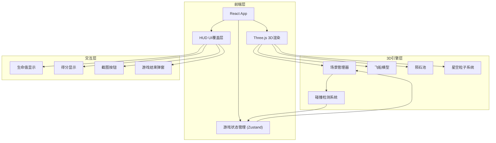

## 1. 架构设计



## 2. 技术说明

- **前端**：React@18 + TypeScript + Tailwind CSS + Vite
- **3D引擎**：Three.js + @react-three/fiber + @react-three/drei + @react-three/postprocessing
- **状态管理**：Zustand
- **初始化工具**：vite-init（react-ts模板）
- **后端**：无
- **数据库**：无

## 3. 路由定义

| 路由 | 用途 |
|------|------|
| / | 游戏主页面（唯一页面） |

## 4. 项目结构

```
src/
├── components/
│   ├── Game.tsx              # 主游戏组件，组合3D场景和HUD
│   ├── SpaceScene.tsx        # Three.js 3D场景容器
│   ├── Spaceship.tsx         # 飞船模型（几何体组合）
│   ├── Asteroid.tsx          # 单个陨石组件
│   ├── AsteroidField.tsx     # 陨石场管理（生成、回收、难度控制）
│   ├── Starfield.tsx         # 星空粒子系统
│   ├── HUD.tsx               # 抬头显示界面
│   └── GameOverModal.tsx     # 游戏结束弹窗
├── hooks/
│   └── useGameState.ts       # 游戏状态Hook
├── store/
│   └── gameStore.ts          # Zustand游戏状态管理
├── utils/
│   └── collision.ts          # 碰撞检测工具
├── App.tsx
└── main.tsx
```

## 5. 核心数据流

1. **Zustand Store** 管理游戏状态（生命值、得分、游戏状态、难度等级）
2. **useFrame** 钩子在每帧更新陨石位置、检测碰撞、更新分数
3. **陨石对象池**：预创建陨石对象，通过visible属性控制显示/隐藏，避免频繁创建销毁
4. **截图功能**：调用 Three.js renderer.domElement.toDataURL() 保存为PNG

## 6. 碰撞检测方案

- 使用 **球体包围盒**（Bounding Sphere）进行碰撞检测
- 飞船碰撞半径约为2个单位
- 陨石碰撞半径根据其大小动态计算
- 每帧在 useFrame 中检测所有活跃陨石与飞船的距离
- 距离小于两者碰撞半径之和 → 判定为碰撞

## 7. 难度递增实现

- 根据 Store 中的得分计算当前难度等级
- 使用 useEffect 监听得分变化，更新生成间隔和数量参数
- AsteroidField 组件根据难度参数调整生成频率和速度

## 8. 截图实现

- 获取 Three.js Canvas 的 renderer
- 调用 `renderer.render(scene, camera)` 确保最新帧
- 使用 `canvas.toDataURL('image/png')` 获取图片数据
- 创建临时 `<a>` 标签触发下载
