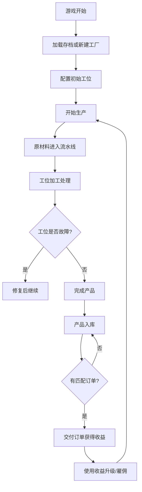

## 1. 产品概述

车间生产模拟游戏是一款基于HTML、CSS和原生JavaScript的模拟经营类网页游戏。玩家管理一个流水线工厂，通过合理配置工位、雇佣员工、完成订单来获取收益。

- 游戏目标：让玩家体验工厂管理的乐趣，学习资源优化和流程管理
- 目标用户：喜欢模拟经营类游戏的玩家，对工业生产流程感兴趣的用户

## 2. 核心功能

### 2.1 用户角色

| 角色 | 注册方式 | 核心权限 |
|------|----------|----------|
| 玩家 | 本地存档 | 管理工厂、配置工位、雇佣员工、完成订单 |

### 2.2 功能模块

1. **主游戏界面**：流水线可视化、实时状态面板、控制按钮
2. **工位管理**：工位配置、升级系统、故障处理
3. **订单系统**：随机订单生成、订单追踪、奖励机制
4. **员工系统**：员工雇佣、技能分配、效率影响
5. **统计面板**：生产速率曲线、库存显示、财务报表
6. **存档系统**：多存档管理、localStorage持久化

### 2.3 页面详情

| 页面名称 | 模块名称 | 功能描述 |
|----------|----------|----------|
| 主游戏界面 | 流水线可视化 | 实时显示原材料流动、工位状态、产品产出 |
| 主游戏界面 | 状态面板 | 显示生产速率、库存量、总收入、当前时间 |
| 主游戏界面 | 控制面板 | 暂停/继续、快进速度调节、存档按钮 |
| 工位管理面板 | 工位列表 | 显示所有工位状态、处理时间、故障率 |
| 工位管理面板 | 升级系统 | 购买升级缩短处理时间或降低故障率 |
| 订单面板 | 订单列表 | 显示当前订单、进度、剩余时间、奖励 |
| 员工面板 | 员工列表 | 显示已雇佣员工、技能属性、分配工位 |
| 员工面板 | 雇佣市场 | 显示可雇佣员工、技能等级、薪资要求 |
| 统计面板 | 效率图表 | 每小时生产效率曲线图 |
| 存档面板 | 存档列表 | 显示所有存档、支持加载/删除/新建存档 |

## 3. 核心流程

## 4. 用户界面设计

### 4.1 设计风格

- **主色调**：深蓝色(#1a365d)代表工业稳重感，搭配橙色(#ed8936)作为强调色
- **辅助色**：绿色(#48bb78)表示正常运行，红色(#f56565)表示故障，黄色(#ecc94b)表示警告
- **按钮风格**：3D立体按钮，圆角4px，悬浮时有上浮效果
- **字体**：使用 'JetBrains Mono' 作为数字显示，'Noto Sans SC' 作为中文显示
- **布局风格**：面板式布局，左侧流水线可视化，右侧多个功能面板
- **图标风格**：使用Font Awesome图标，统一线性风格
- **背景**：深色工业风格，带有细微网格纹理

### 4.2 页面设计概述

| 页面名称 | 模块名称 | UI元素 |
|----------|----------|--------|
| 主游戏界面 | 流水线可视化 | 传送带动画、工位状态灯、产品移动效果 |
| 主游戏界面 | 状态面板 | 数字仪表显示、实时更新动画、进度条 |
| 工位管理面板 | 工位卡片 | 状态指示器、处理时间进度条、升级按钮 |
| 订单面板 | 订单卡片 | 倒计时进度条、产品需求列表、奖励显示 |
| 员工面板 | 员工卡片 | 头像、技能雷达图、工资显示 |
| 统计面板 | 效率图表 | Canvas绘制曲线图、时间轴刻度、数据点提示 |

### 4.3 响应式

- 桌面端优先设计，适配1280px及以上分辨率
- 平板端采用折叠面板设计
- 移动端简化界面，保留核心功能

### 4.4 动画效果

- 传送带循环滚动动画
- 产品沿路径移动的位移动画
- 工位工作时的脉冲效果
- 故障时的红色闪烁警告
- 订单完成时的金币飞出动画
- 面板切换的滑入滑出效果
