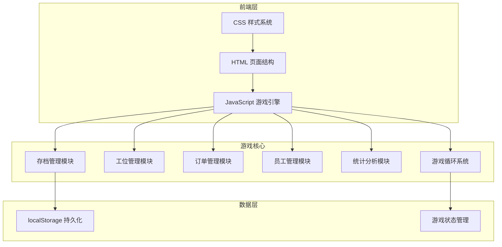

## 1. 架构设计



## 2. 技术描述

- **前端技术栈**：原生 HTML5 + CSS3 + JavaScript ES6+
- **UI组件**：Font Awesome 6 图标库
- **数据可视化**：Canvas API 绘制生产效率曲线图
- **数据存储**：localStorage 本地存储
- **动画实现**：CSS3 动画 + requestAnimationFrame

## 3. 文件结构

| 文件路径 | 用途 |
|----------|------|
| `/index.html` | 主页面入口 |
| `/css/style.css` | 主样式文件 |
| `/js/game.js` | 游戏核心引擎 |
| `/js/station.js` | 工位管理模块 |
| `/js/order.js` | 订单管理模块 |
| `/js/employee.js` | 员工管理模块 |
| `/js/stats.js` | 统计分析模块 |
| `/js/save.js` | 存档管理模块 |
| `/js/ui.js` | UI交互模块 |

## 4. 数据模型

### 4.1 游戏状态数据结构

```javascript
const GameState = {
  id: string,           // 存档ID
  name: string,         // 工厂名称
  timestamp: number,    // 保存时间
  gameTime: number,     // 游戏内时间(秒)
  money: number,        // 当前资金
  totalIncome: number,  // 总收入
  speed: number,        // 游戏速度(1, 2, 4, 8)
  isPaused: boolean,    // 是否暂停
  stations: Station[],  // 工位列表
  orders: Order[],      // 当前订单
  employees: Employee[],// 员工列表
  inventory: Object,    // 库存量 {productId: count}
  hourlyStats: Stats[]  // 每小时统计数据
}
```

### 4.2 工位数据结构

```javascript
const Station = {
  id: string,
  name: string,
  type: string,         // 工位类型: cutter, assembler, painter, packer
  processTime: number,  // 处理时间(秒)
  baseProcessTime: number,
  failureRate: number,  // 故障率 0-1
  baseFailureRate: number,
  level: number,        // 等级
  isWorking: boolean,
  isBroken: boolean,
  progress: number,     // 当前进度 0-100
  assignedEmployee: string | null,  // 分配的员工ID
  currentItem: Item | null
}
```

### 4.3 订单数据结构

```javascript
const Order = {
  id: string,
  products: [{productId: string, count: number}],
  reward: number,
  bonus: number,        // 按时完成奖励
  deadline: number,     // 截止时间(游戏时间)
  createdAt: number,
  status: 'pending' | 'in_progress' | 'completed' | 'failed'
}
```

### 4.4 员工数据结构

```javascript
const Employee = {
  id: string,
  name: string,
  avatar: string,
  skills: {
    speed: number,      // 速度加成 0-100
    reliability: number,// 可靠性加成 0-100
    quality: number     // 质量加成 0-100
  },
  salary: number,       // 每小时工资
  assignedStation: string | null
}
```

## 5. 核心算法

### 5.1 游戏循环

```
每帧更新 (约60fps):
  1. 计算时间增量 deltaTime * speed
  2. 更新所有工位进度
  3. 检查工位故障
  4. 检查订单超时
  5. 更新统计数据
  6. 渲染UI
```

### 5.2 工位效率计算

```
实际处理时间 = 基础处理时间 / (1 + (员工速度加成/200) + (等级 * 0.1))
实际故障率 = 基础故障率 * (1 - (员工可靠性加成/200)) * (1 - (等级 * 0.05))
```

### 5.3 生产效率统计

```
每小时记录:
  - 生产产品数量
  - 工位平均利用率
  - 订单完成数量
  - 故障次数
```

## 6. 存档系统设计

- 存档前缀: `factory_game_`
- 存档列表索引: `factory_game_saves`
- 单存档大小限制: ~500KB
- 支持最多10个存档槽位
- 自动保存间隔: 30秒
