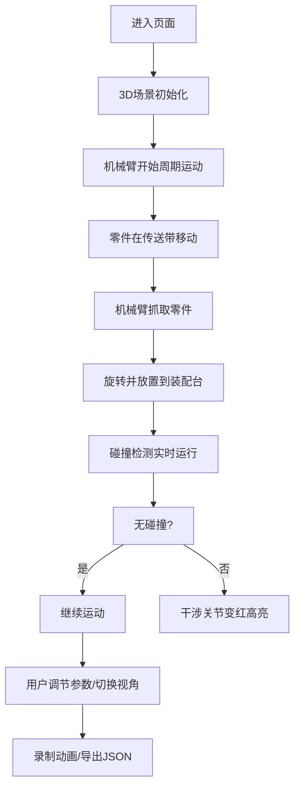

## 1. 产品概述
基于Three.js的3D工业自动化装配线仿真系统，模拟多机械臂协同作业场景。
- 面向工业工程师、自动化专业学生和3D可视化爱好者，提供直观的机械臂运动仿真和交互体验
- 产品价值：通过可视化仿真帮助理解机械臂运动学、碰撞检测和自动化装配流程

## 2. 核心功能

### 2.1 功能模块
1. **3D场景主界面**：机械臂装配线场景、传送带、装配台、零件模型
2. **机械臂控制面板**：速度滑块、幅度滑块、独立控制每个机械臂
3. **零件管理面板**：零件类型切换、零件流动动画
4. **碰撞检测模块**：实时干涉检测、高亮显示
5. **相机控制模块**：自由视角、附着视角切换
6. **动画录制模块**：录制、回放、JSON导出
7. **数据显示面板**：关节角度、周期计数实时显示

### 2.2 页面详情

| 页面名称 | 模块名称 | 功能描述 |
|-----------|-------------|---------------------|
| 主场景页面 | 3D视口 | 渲染机械臂装配线场景，支持鼠标交互旋转/缩放 |
| 主场景页面 | 左侧控制面板 | 机械臂速度/幅度滑块控制、零件切换 |
| 主场景页面 | 右侧数据面板 | 关节角度、周期计数、碰撞状态显示 |
| 主场景页面 | 顶部工具栏 | 相机模式切换、录制控制、导出按钮 |
| 主场景页面 | 碰撞指示器 | 实时显示碰撞状态，干涉关节红色高亮 |

## 3. 核心流程

用户进入页面 → 3D场景加载完成 → 机械臂开始自动周期性运动 → 用户通过滑块调节参数 → 观察零件从传送带到装配台的流动 → 切换相机模式观察细节 → 录制动画并导出 → 查看实时数据

## 4. 用户界面设计

### 4.1 设计风格
- **工业科技风**：深色背景配合霓虹色高亮，营造工业自动化控制氛围
- **主色调**：深灰蓝 (#0a0e17) 作为背景，机械灰 (#2a3444) 作为结构色
- **强调色**：青色 (#00d4ff) 用于正常状态，红色 (#ff3366) 用于碰撞警告，绿色 (#00ff88) 用于成功状态
- **字体**：使用JetBrains Mono作为数字显示字体，搭配Space Grotesk作为界面字体
- **按钮风格**：扁平化设计，细边框，hover时有发光效果
- **面板风格**：半透明玻璃质感，带有细微边框和阴影

### 4.2 页面设计概述

| 页面名称 | 模块名称 | UI元素 |
|-----------|-------------|-------------|
| 主场景页面 | 3D视口 | 全屏Three.js画布，网格地面，工业灯光 |
| 主场景页面 | 左侧控制面板 | 折叠式面板，每组机械臂对应滑块组，带标签和数值显示 |
| 主场景页面 | 右侧数据面板 | 表格布局，实时更新的数值，状态指示灯 |
| 主场景页面 | 顶部工具栏 | 图标按钮组，录制状态指示器，导出下拉菜单 |
| 主场景页面 | 碰撞指示器 | 浮动警告图标，红色脉冲动画 |

### 4.3 响应性
- Desktop-first设计，针对大尺寸显示器优化
- 控制面板支持折叠，在小屏幕上可隐藏以获得更大视口
- 触摸设备支持双指缩放和单指旋转

### 4.4 3D场景指导
- **环境**：工业厂房风格，网格地面，远处有模糊的工业设备背景
- **灯光**：主光源为冷白色平行光，辅以环境光和红色/青色点光源营造氛围
- **相机**：默认使用PerspectiveCamera，初始位置在场景斜上方45度
- **构图**：三个机械臂沿传送带排列，传送带从左向右流动，装配台在右侧
- **动画**：机械臂关节采用平滑插值动画，零件移动有缓动效果
- **后期处理**：轻微的泛光效果（Bloom），增强科技感
- **性能**：使用InstancedMesh处理重复零件，限制多边形数量保证60fps
