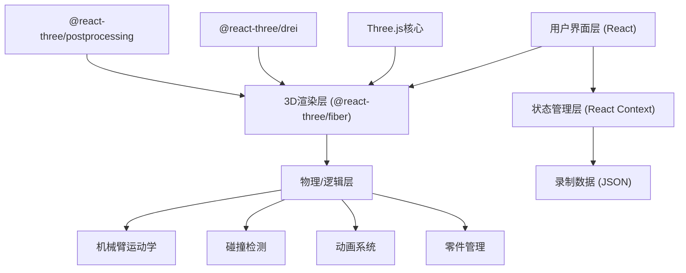

## 1. 架构设计



## 2. 技术描述

- **前端框架**: React@18 + TypeScript + Vite@5
- **样式方案**: TailwindCSS@3 + CSS Variables
- **3D引擎**: three@0.160 + @react-three/fiber@8 + @react-three/drei@9
- **后期处理**: @react-three/postprocessing@2
- **状态管理**: React Context + useReducer
- **数学计算**: three.js内置数学库
- **数据格式**: JSON用于动画导出

### 核心依赖说明
- `@react-three/fiber`: React的Three.js渲染器，提供声明式3D场景构建
- `@react-three/drei`: 常用Three.js组件库（相机控制、环境、辅助对象等）
- `@react-three/postprocessing`: 后期处理效果（Bloom等）

## 3. 目录结构

```
src/
├── components/
│   ├── scene/
│   │   ├── RoboticArm.tsx        # 单个机械臂组件
│   │   ├── ConveyorBelt.tsx      # 传送带组件
│   │   ├── AssemblyTable.tsx     # 装配台组件
│   │   ├── Part.tsx              # 零件组件
│   │   ├── Floor.tsx             # 地面场景
│   │   └── Scene.tsx             # 主场景容器
│   ├── controls/
│   │   ├── ArmControlPanel.tsx   # 机械臂控制面板
│   │   ├── PartSelector.tsx      # 零件选择器
│   │   └── Toolbar.tsx           # 顶部工具栏
│   ├── ui/
│   │   ├── Slider.tsx            # 自定义滑块
│   │   ├── DataPanel.tsx         # 数据显示面板
│   │   └── CollisionAlert.tsx    # 碰撞警告组件
│   └── camera/
│       └── CameraController.tsx  # 相机控制器
├── hooks/
│   ├── useArmAnimation.ts        # 机械臂动画Hook
│   ├── useCollisionDetection.ts  # 碰撞检测Hook
│   ├── useRecording.ts           # 录制Hook
│   └── usePartFlow.ts            # 零件流动Hook
├── context/
│   ├── ArmContext.tsx            # 机械臂状态Context
│   ├── SceneContext.tsx          # 场景状态Context
│   └── RecordingContext.tsx      # 录制状态Context
├── types/
│   ├── arm.ts                    # 机械臂类型定义
│   ├── part.ts                   # 零件类型定义
│   └── recording.ts              # 录制数据类型
├── utils/
│   ├── kinematics.ts             # 运动学计算
│   ├── collision.ts              # 碰撞检测算法
│   └── export.ts                 # JSON导出工具
├── App.tsx
├── main.tsx
└── index.css
```

## 4. 核心数据模型

### 4.1 机械臂状态

```typescript
interface ArmJoint {
  angle: number;
  minAngle: number;
  maxAngle: number;
  length: number;
}

interface RoboticArmState {
  id: string;
  name: string;
  position: [number, number, number];
  joints: ArmJoint[];
  speed: number;      // 0.1 - 3.0
  amplitude: number;  // 0.1 - 1.0
  cycleCount: number;
  isColliding: boolean;
  collidingJoints: number[];
}
```

### 4.2 零件状态

```typescript
type PartType = 'cube' | 'cylinder' | 'sphere' | 'gear';

interface PartState {
  id: string;
  type: PartType;
  position: [number, number, number];
  rotation: [number, number, number];
  isOnBelt: boolean;
  isBeingCarried: boolean;
  carrierArmId: string | null;
  isAssembled: boolean;
}
```

### 4.3 录制数据

```typescript
interface RecordingFrame {
  timestamp: number;
  arms: {
    armId: string;
    jointAngles: number[];
    position: [number, number, number];
  }[];
  parts: {
    partId: string;
    position: [number, number, number];
    rotation: [number, number, number];
  }[];
}

interface RecordingData {
  version: string;
  duration: number;
  fps: number;
  startTime: number;
  frames: RecordingFrame[];
}
```

## 5. 关键技术实现

### 5.1 机械臂层级结构
使用Three.js的Object3D层级结构构建机械臂，每个关节作为下一个关节的父对象。

### 5.2 碰撞检测
- 对每个关节段创建包围盒（Box3）或包围球（Sphere）
- 每帧检测不同机械臂关节间的相交
- 使用空间划分优化检测性能

### 5.3 相机附着模式
- 获取末端执行器（End Effector）的世界坐标和旋转
- 使用lerp平滑过渡相机位置和朝向
- 保留用户可调节的偏移量

### 5.4 动画录制
- 每帧记录所有机械臂的关节角度和零件位置
- 使用requestAnimationFrame时间戳保证精度
- 导出时压缩数据，使用delta时间减少存储

### 5.5 性能优化
- 使用InstancedMesh渲染重复零件
- 碰撞检测帧率独立于渲染帧率（30fps检测 vs 60fps渲染）
- 对象池复用零件对象
