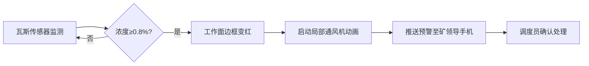
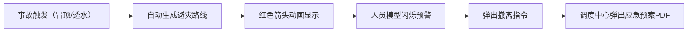

# 3D智慧矿山综合管控与应急调度可视化平台 - 产品需求文档

## 1. 产品概述

3D智慧矿山综合管控平台是一套基于WebGL/Three.js的矿山可视化管理系统，通过3D建模实时展示井下生产状态，实现采掘面监控、运输调度、人员定位、应急联动等核心功能，为矿山安全生产提供智能化决策支持。

- 核心目标：提升矿山安全生产管理水平，实现实时监控、智能预警、应急响应一体化
- 目标用户：矿山管理人员、调度中心操作员、安全监察人员

## 2. 核心功能

### 2.1 用户角色

| 角色 | 登录方式 | 核心权限 |
|------|----------|----------|
| 调度员 | 账号密码 | 实时监控、应急指挥、数据导出 |
| 矿长 | 账号密码 | 全局查看、预警接收、报表审批 |
| 安全员 | 账号密码 | 安全监控、隐患排查 |

### 2.2 功能模块

1. **3D矿山场景**：井口、主副井、运输大巷、采掘工作面、机电硐室、调度中心
2. **采掘面监控**：进尺、瓦斯浓度、粉尘浓度、温度实时显示，7天瓦斯曲线，支护记录
3. **瓦斯预警系统**：0.8%浓度阈值报警，自动启动局部通风机，移动端预警推送
4. **井下运输系统**：矿车编号、载重、位置显示，任务自动分配，最优路线规划，交叉口排队
5. **人员定位系统**：姓名、工种、井下时长显示，危险区域报警，撤离指令
6. **应急联动系统**：冒顶/透水自动生成避灾路线，应急预案弹出
7. **设备管理系统**：采煤机运行时长监控，检修提醒，工单生成
8. **报表系统**：按班次导出生产日报Excel

### 2.3 页面详情

| 页面名称 | 模块名称 | 功能描述 |
|----------|----------|----------|
| 主监控页面 | 3D场景视图 | 全矿井3D可视化展示，场景漫游，视角切换 |
| 主监控页面 | 采掘面面板 | 实时数据显示，点击查看详情，预警高亮 |
| 主监控页面 | 运输系统面板 | 矿车状态监控，路线可视化，任务分配 |
| 主监控页面 | 人员定位面板 | 矿工位置追踪，危险区域报警 |
| 主监控页面 | 应急指挥面板 | 避灾路线展示，应急预案管理 |
| 主监控页面 | 设备管理面板 | 设备状态监控，工单管理 |
| 报表页面 | 生产日报 | 数据统计，Excel导出 |

## 3. 核心流程

### 3.1 瓦斯预警流程

### 3.2 应急响应流程

## 4. 用户界面设计

### 4.1 设计风格

- **主色调**：深蓝色（#0A1628）作为背景，科技蓝（#00D4FF）作为主色，警示红（#FF3B3B）作为预警色
- **按钮样式**：圆角矩形，发光边框效果，悬浮动画
- **字体**：使用 JetBrains Mono 作为数字显示，思源黑体作为中文显示
- **布局风格**：暗黑科技风，左侧功能面板，右侧3D场景，底部状态栏
- **图标风格**：线性图标，发光效果

### 4.2 页面设计概述

| 页面名称 | 模块名称 | UI元素 |
|----------|----------|--------|
| 主监控页面 | 3D场景 | 第一人称/第三人称视角切换，场景缩放旋转，建筑模型发光效果 |
| 主监控页面 | 数据面板 | 半透明玻璃态效果，实时数据滚动更新，预警闪烁动画 |
| 主监控页面 | 预警弹窗 | 红色渐变背景，倒计时效果，声音提示 |
| 报表页面 | 日报表 | 表格布局，条件格式化，导出按钮 |

### 4.3 响应式

- 桌面端优先设计（1920×1080）
- 支持平板适配，面板可折叠
- 触摸屏操作优化

### 4.4 3D场景设计

- **环境**：暗色调地下矿洞环境，点光源模拟矿灯效果，雾气增强深度感
- **光照**：主光源+补光+环境光，巷道壁使用漫反射材质
- **相机**：默认俯视视角，支持自由漫游、节点视角切换
- **交互**：鼠标悬停高亮，点击弹出详情，双击聚焦
- **动画**：矿车平滑移动，风流粒子效果，预警脉冲动画
- **后期**：Bloom发光效果，轻微色差增强科技感

