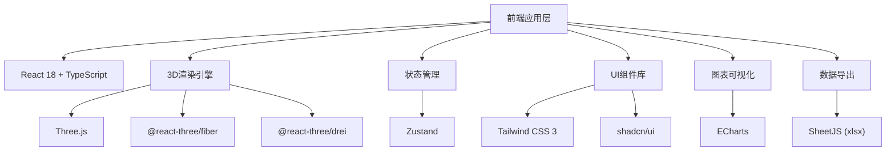

# 3D智慧矿山综合管控平台 - 技术架构文档

## 1. 架构设计



## 2. 技术栈说明

### 2.1 核心技术

| 类别 | 技术选型 | 版本 | 说明 |
|------|----------|------|------|
| 前端框架 | React | 18.x | 组件化开发，函数式组件+Hooks |
| 开发语言 | TypeScript | 5.x | 类型安全，提升代码质量 |
| 构建工具 | Vite | 5.x | 快速开发，热更新 |
| 3D引擎 | Three.js | 0.160.x | WebGL 3D渲染 |
| React绑定 | @react-three/fiber | 8.x | React声明式Three.js |
| 3D工具库 | @react-three/drei | 9.x | 常用3D组件集合 |
| 样式方案 | Tailwind CSS | 3.x | 原子化CSS |
| UI组件 | shadcn/ui | 最新 | 高质量组件 |
| 状态管理 | Zustand | 4.x | 轻量级状态管理 |
| 图表库 | ECharts | 5.x | 数据可视化图表 |
| Excel导出 | xlsx | 0.18.x | Excel文件生成 |

### 2.2 项目初始化

使用 Vite + React + TypeScript 模板初始化：

```bash
npm create vite@latest mine-control -- --template react-ts
cd mine-control
npm install three @react-three/fiber @react-three/drei
npm install zustand echarts xlsx
npm install -D tailwindcss postcss autoprefixer
npx tailwindcss init -p
```

## 3. 路由定义

| 路由 | 页面 | 功能说明 |
|------|------|----------|
| / | 监控大屏 | 3D矿山主场景，实时监控面板 |
| /dashboard | 数据看板 | 综合数据统计与分析 |
| /report | 报表中心 | 生产日报、历史数据查询 |
| /setting | 系统设置 | 参数配置、阈值设置 |

## 4. 核心数据模型

### 4.1 采掘工作面数据模型

```typescript
interface WorkFace {
  id: string;
  name: string;
  position: { x: number; y: number; z: number };
  progress: number; // 当前进尺 (米)
  gasConcentration: number; // 瓦斯浓度 (%)
  dustConcentration: number; // 粉尘浓度 (mg/m³)
  temperature: number; // 温度 (°C)
  isWarning: boolean;
  gasHistory: { date: string; value: number }[]; // 近7天瓦斯数据
  supportRecords: SupportRecord[]; // 支护记录
}

interface SupportRecord {
  id: string;
  date: string;
  type: string;
  quantity: number;
  operator: string;
}
```

### 4.2 矿车数据模型

```typescript
interface MineCart {
  id: string;
  number: string;
  position: { x: number; y: number; z: number };
  load: number; // 载重 (吨)
  maxLoad: number;
  status: 'idle' | 'transporting' | 'loading' | 'unloading';
  currentTask: TransportTask | null;
  route: { x: number; y: number; z: number }[];
}

interface TransportTask {
  id: string;
  from: string;
  to: string;
  plannedLoad: number;
  priority: number;
}
```

### 4.3 人员定位数据模型

```typescript
interface Worker {
  id: string;
  name: string;
  position: { x: number; y: number; z: number };
  jobType: string; // 工种
  workDuration: number; // 累计井下时长 (小时)
  isInDangerZone: boolean;
  status: 'normal' | 'warning' | 'evacuating';
}
```

### 4.4 设备数据模型

```typescript
interface Equipment {
  id: string;
  name: string;
  type: 'shearer' | 'conveyor' | 'ventilator' | 'pump';
  runHours: number; // 累计运行时长
  status: 'running' | 'stopped' | 'maintenance';
  lastMaintenance: string;
  nextMaintenanceDue: number;
  maintenanceWarning: boolean;
}

interface WorkOrder {
  id: string;
  equipmentId: string;
  equipmentName: string;
  type: 'routine' | 'emergency';
  description: string;
  status: 'pending' | 'in_progress' | 'completed';
  createdAt: string;
}
```

## 5. 目录结构

```
src/
├── components/
│   ├── ui/                    # shadcn/ui 组件
│   ├── three/                 # 3D组件
│   │   ├── MineScene.tsx      # 主场景
│   │   ├── WorkFace.tsx       # 采掘面
│   │   ├── MineCart.tsx       # 矿车
│   │   ├── Worker.tsx         # 人员
│   │   ├── Tunnel.tsx         # 巷道
│   │   └── Ventilation.tsx    # 通风效果
│   ├── panels/                # 控制面板
│   │   ├── WorkFacePanel.tsx
│   │   ├── TransportPanel.tsx
│   │   ├── WorkerPanel.tsx
│   │   └── EmergencyPanel.tsx
│   └── charts/                # 图表组件
├── store/
│   ├── useMineStore.ts        # 矿山状态
│   ├── useAlertStore.ts       # 预警状态
│   └── useReportStore.ts      # 报表状态
├── data/
│   ├── mockData.ts            # Mock数据
│   └── constants.ts           # 常量配置
├── utils/
│   ├── exportExcel.ts         # Excel导出
│   └── pathfinding.ts         # 路径规划
├── pages/
│   ├── MonitorPage.tsx
│   ├── DashboardPage.tsx
│   └── ReportPage.tsx
└── App.tsx
```

## 6. 关键算法

### 6.1 路径规划算法

使用 A* 算法进行矿车路径规划：

```typescript
function findPath(
  start: Point, 
  end: Point, 
  grid: Grid,
  obstacles: Point[]
): Point[] {
  // A* 算法实现
  // f(n) = g(n) + h(n)
  // g(n): 起点到当前点的实际代价
  // h(n): 当前点到终点的启发式估计 (曼哈顿距离)
}
```

### 6.2 交叉口调度算法

```typescript
function scheduleIntersection(
  carts: MineCart[],
  intersection: Point
): MineCart[] {
  // 基于优先级和到达时间的排队算法
  // 1. 计算各车辆到达交叉口时间
  // 2. 按优先级排序
  // 3. 生成排队序列
}
```

## 7. 性能优化策略

1. **3D场景优化**：
   - 使用 InstancedMesh 批量渲染相似物体
   - LOD (Level of Detail) 技术
   - 视锥体剔除
   - 合理设置像素比

2. **状态管理优化**：
   - Zustand 选择器模式避免不必要重渲染
   - 数据更新防抖

3. **动画优化**：
   - 使用 requestAnimationFrame
   - 合理控制动画帧率

