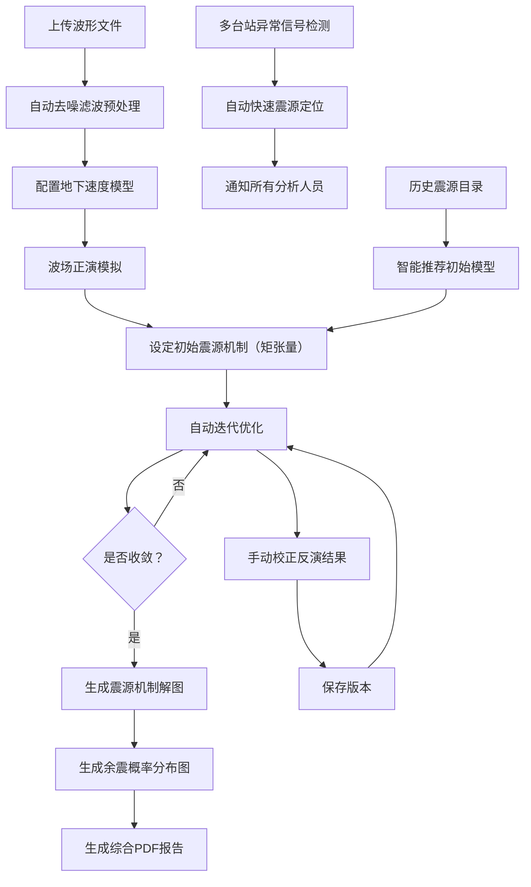

## 1. 产品概述

地震波传播模拟与震源反演平台——面向地震学研究人员的专业工具，集成波形预处理、波场正演模拟、震源参数反演、智能推荐与异常检测于一体，实现从原始台站数据到震源机制解的完整工作流自动化。
- 解决传统地震分析流程中工具分散、手动迭代低效的问题，目标用户为地震监测机构与科研人员
- 通过智能化推荐与自动迭代优化，将震源反演时间从数小时缩短至分钟级，显著提升地震应急响应能力

## 2. 核心功能

### 2.1 用户角色

| 角色 | 注册方式 | 核心权限 |
|------|----------|----------|
| 地震分析人员 | 机构邀请码注册 | 上传波形、执行模拟与反演、查看报告、接收告警通知 |
| 系统管理员 | 后台分配 | 管理用户、配置速度模型、维护历史震源目录 |

### 2.2 功能模块

1. **控制台首页**：实时监测概览、最近事件列表、异常信号告警、快捷操作入口
2. **波形预处理**：上传波形文件、去噪滤波、频谱分析、数据质量评估
3. **波场正演模拟**：速度模型配置、波场传播动画、快照导出
4. **震源反演**：矩张量设定、迭代优化、残差监控、手动校正与版本管理
5. **结果可视化**：震源机制解图（海滩球图）、余震概率分布、深度剖面
6. **智能推荐与目录**：历史震源目录、初始模型推荐、目录查询与导出
7. **告警与通知**：多台站异常检测、快速定位触发、通知推送
8. **报告生成**：综合PDF报告（波形拟合图、深度剖面、能量释放曲线）

### 2.3 页面详情

| 页面名称 | 模块名称 | 功能描述 |
|----------|----------|----------|
| 控制台首页 | 实时监测面板 | 显示全局地震事件热力图、最近24小时事件列表、活跃台站状态、异常信号计数 |
| 控制台首页 | 快捷操作栏 | 快速上传波形、新建模拟任务、查看告警 |
| 波形预处理页 | 文件上传区 | 支持SAC/MSEED/SEED格式拖拽上传，多文件批量处理 |
| 波形预处理页 | 预处理控制面板 | 去噪（带通/高通/低通滤波）、去均值、仪器响应校正、频谱分析图 |
| 波形预处理页 | 数据质量评估 | 信噪比指标、数据完整性、频带范围可视化 |
| 波场正演页 | 速度模型编辑器 | 层状速度模型可视化编辑、模型导入/导出 |
| 波场正演页 | 波场动画播放器 | 波传播快照动画（Canvas渲染）、时间步进控制、快照截图导出 |
| 震源反演页 | 矩张量配置面板 | 六分量矩张量输入、预设机制选择（走滑/逆冲/正断） |
| 震源反演页 | 迭代优化监控 | 实时残差曲线、参数收敛图、当前/最优解对比 |
| 震源反演页 | 手动校正与版本 | 手动调整反演参数、保存版本历史、版本对比与回滚 |
| 结果可视化页 | 震源机制解图 | 海滩球图（投影方式可选）、P/T轴标注、矩张量分量显示 |
| 结果可视化页 | 余震概率分布 | 空间概率热力图、时间衰减曲线、危险区域标注 |
| 结果可视化页 | 深度剖面图 | 震源深度剖面、速度模型叠加显示 |
| 目录与推荐页 | 历史震源目录 | 表格展示历史事件（时间/位置/震级/机制）、地图标记 |
| 目录与推荐页 | 智能推荐引擎 | 基于位置与震级自动推荐初始模型参数、推荐理由展示 |
| 目录与推荐页 | 查询与导出 | 按时间/经纬度/震级筛选、CSV/PDF导出 |
| 告警通知页 | 异常信号面板 | 多台站异常信号实时列表、信号特征摘要 |
| 告警通知页 | 快速定位结果 | 自动定位结果展示、定位误差椭圆、关联台站 |
| 告警通知页 | 通知记录 | 通知发送记录、接收人状态、确认回执 |
| 报告生成页 | 报告配置 | 选择内容模块、格式选项、封面信息填写 |
| 报告生成页 | 报告预览 | PDF预览（波形拟合图、深度剖面、能量释放曲线） |
| 报告生成页 | 报告下载 | 生成PDF并下载 |

## 3. 核心流程

用户从上传波形文件开始，系统自动完成预处理，用户配置速度模型后启动正演模拟，设定初始震源机制后启动反演迭代，收敛后查看结果并生成报告。当系统检测到多台站异常信号时，自动触发快速定位并推送通知。

## 4. 用户界面设计

### 4.1 设计风格

- **主色调**：深蓝黑（#0a0e1a）为底色，搭配青色（#00e5c7）和琥珀色（#f59e0b）作为功能色
- **辅助色**：深灰蓝（#1a1f35）用于卡片/面板背景，红色（#ef4444）用于告警/异常
- **按钮风格**：圆角微凸（rounded-lg + shadow），主按钮用青色渐变，次按钮半透明描边
- **字体**：标题用 JetBrains Mono（科技感等宽字体），正文用 Noto Sans SC（中文清晰可读）
- **布局风格**：左侧固定导航 + 右侧内容区，卡片式面板布局，数据密集区域使用紧凑网格
- **图标风格**：Lucide 线性图标，16-20px尺寸，与文字等高对齐
- **动效**：波场动画使用Canvas粒子效果，页面切换淡入，数据加载脉冲动画，告警闪烁

### 4.2 页面设计概览

| 页面名称 | 模块名称 | UI元素 |
|----------|----------|--------|
| 控制台首页 | 实时监测面板 | 深色地图背景（简化的世界地图SVG），事件热力叠加层，侧边统计卡片（毛玻璃效果），底部事件滚动列表 |
| 波形预处理页 | 文件上传区 | 虚线拖拽区（渐变边框），上传进度环形指示器，文件列表卡片（波形缩略图+状态标签） |
| 波形预处理页 | 预处理控制面板 | 滑块式滤波参数控制，实时频谱图（Canvas），波形对比图（原始/处理后叠加显示） |
| 波场正演页 | 波场动画播放器 | 大尺寸Canvas画布（深色背景+彩色波场），底部时间轴滑块，播放/暂停/步进按钮，右侧速度模型层状图 |
| 震源反演页 | 迭代优化监控 | 双栏布局：左侧参数面板（矩张量六分量输入+预设按钮），右侧收敛曲线图+残差图（实时更新） |
| 震源反演页 | 手动校正与版本 | 滑块微调参数，版本时间线（垂直），版本对比差异高亮 |
| 结果可视化页 | 震源机制解图 | Canvas绘制海滩球图，P/T轴射线标注，下方矩张量分量数值表格 |
| 结果可视化页 | 余震概率分布 | 地图热力图（渐变色0-1概率），时间衰减曲线，概率等值线 |
| 目录与推荐页 | 历史震源目录 | 可排序表格（交替行色），地图标记点，筛选侧边栏 |
| 目录与推荐页 | 智能推荐 | 推荐卡片（相似度评分+匹配理由），一键应用按钮 |
| 告警通知页 | 异常信号面板 | 红色脉冲边框告警卡片，信号波形缩略图，定位结果地图小窗 |
| 报告生成页 | 报告预览 | A4比例预览区，模块勾选侧栏，波形拟合图+深度剖面+能量曲线组合展示 |

### 4.3 响应式设计

- 桌面端优先（1920×1080基准），内容区最小宽度1280px
- 平板端（768-1280px）侧边导航折叠为图标模式
- 移动端（<768px）导航切换为底部标签栏，图表简化显示

### 4.4 3D场景指引

- 波场传播使用2D Canvas渲染（俯视切面），配合等值线着色
- 速度模型使用水平层状切面可视化，非3D场景
- 海滩球图使用Canvas 2D投影渲染（等面积投影）
