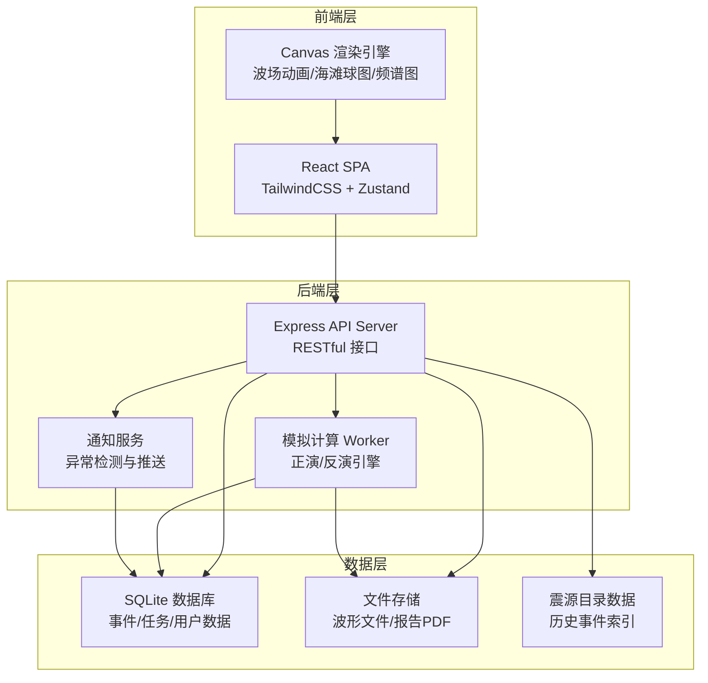
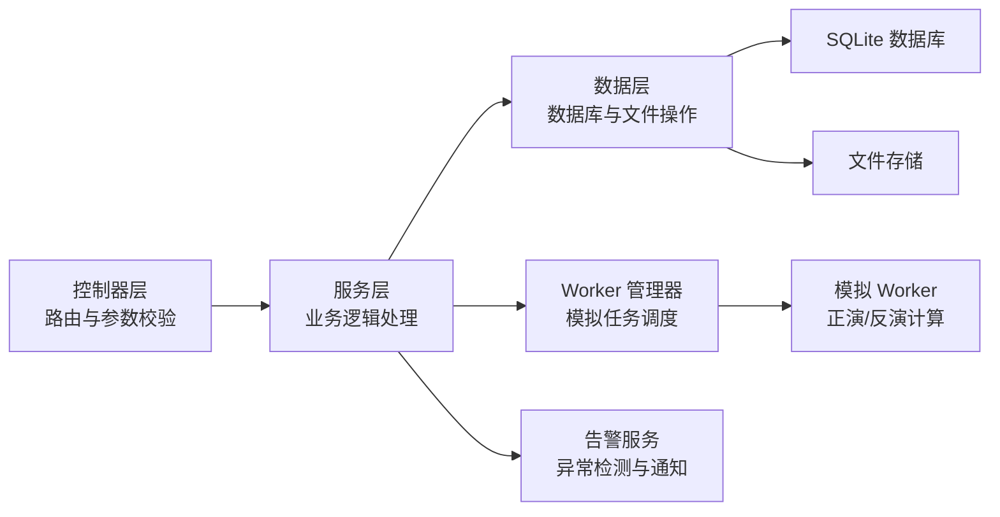
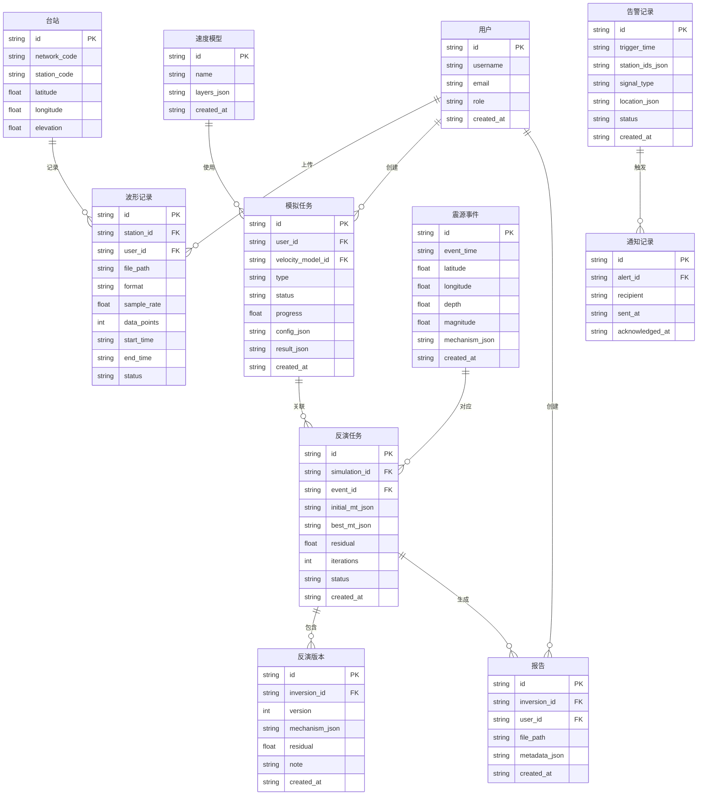

## 1. 架构设计



## 2. 技术说明

- **前端**：React@18 + TypeScript + TailwindCSS@3 + Vite + Zustand（状态管理）
- **初始化工具**：vite-init
- **后端**：Express@4 + TypeScript（ESM格式）
- **数据库**：SQLite（通过better-sqlite3），适合单机部署
- **Canvas渲染**：原生Canvas API + 自定义渲染管线（波场、海滩球图、频谱图）
- **PDF生成**：jsPDF（前端生成，无需后端参与）
- **图表**：Chart.js（残差曲线、能量释放曲线等）

## 3. 路由定义

| 路由 | 用途 |
|------|------|
| `/` | 控制台首页——实时监测概览 |
| `/preprocess` | 波形预处理——上传、去噪、滤波 |
| `/forward` | 波场正演模拟——速度模型配置、波场动画 |
| `/inversion` | 震源反演——矩张量设定、迭代优化、手动校正 |
| `/results/:id` | 结果可视化——震源机制解图、余震概率分布 |
| `/catalog` | 目录与推荐——历史震源目录、智能推荐、查询导出 |
| `/alerts` | 告警通知——异常信号、快速定位、通知记录 |
| `/report` | 报告生成——配置、预览、下载 |

## 4. API定义

### 4.1 波形相关

```typescript
// POST /api/waveforms/upload
interface UploadWaveformRequest {
  file: File; // SAC/MSEED/SEED格式
  stationId: string;
}
interface UploadWaveformResponse {
  waveformId: string;
  stationInfo: { network: string; station: string; channel: string; };
  metadata: { startTime: string; endTime: string; sampleRate: number; dataPoints: number; };
}

// POST /api/waveforms/:id/preprocess
interface PreprocessRequest {
  operations: Array<{
    type: 'bandpass' | 'highpass' | 'lowpass' | 'demean' | 'detrend' | 'remove_response';
    params: Record<string, number>;
  }>;
}
interface PreprocessResponse {
  processedWaveformId: string;
  snr: number;
  qualityMetrics: { completeness: number; frequencyRange: [number, number]; };
}

// GET /api/waveforms/:id/data
interface WaveformDataResponse {
  time: number[];
  amplitude: number[];
  processed: { time: number[]; amplitude: number[]; } | null;
}
```

### 4.2 正演模拟相关

```typescript
// POST /api/simulations/forward
interface ForwardSimulationRequest {
  velocityModel: {
    layers: Array<{ depth: number; vp: number; vs: number; density: number; }>;
  };
  source: { latitude: number; longitude: number; depth: number; };
  gridConfig: { nx: number; nz: number; dx: number; dz: number; };
  timeConfig: { totalTime: number; dt: number; snapshotInterval: number; };
}
interface ForwardSimulationResponse {
  simulationId: string;
  status: 'running' | 'completed' | 'failed';
  snapshots: Array<{ time: number; dataUrl: string; }>;
}

// GET /api/simulations/:id/status
interface SimulationStatusResponse {
  status: 'queued' | 'running' | 'completed' | 'failed';
  progress: number;
  currentStep: number;
  totalSteps: number;
}
```

### 4.3 震源反演相关

```typescript
// POST /api/inversions/start
interface StartInversionRequest {
  waveformIds: string[];
  velocityModelId: string;
  initialMechanism: {
    mt: [number, number, number, number, number, number]; // Mrr Mtt Mpp Mrt Mrp Mtp
  };
  optimization: { maxIterations: number; convergenceThreshold: number; };
}
interface StartInversionResponse {
  inversionId: string;
  status: 'running';
}

// GET /api/inversions/:id/status
interface InversionStatusResponse {
  status: 'running' | 'converged' | 'failed';
  currentIteration: number;
  residual: number;
  bestMechanism: { mt: number[]; strike: number; dip: number; rake: number; depth: number; };
  convergenceHistory: Array<{ iteration: number; residual: number; }>;
}

// POST /api/inversions/:id/manual-correction
interface ManualCorrectionRequest {
  mechanism: { mt: number[]; };
  note: string;
}
interface ManualCorrectionResponse {
  versionId: string;
  version: number;
  timestamp: string;
}

// GET /api/inversions/:id/versions
interface InversionVersionsResponse {
  versions: Array<{
    versionId: string; version: number; timestamp: string;
    mechanism: { mt: number[]; }; residual: number; note: string;
  }>;
}
```

### 4.4 目录与推荐相关

```typescript
// GET /api/catalog
interface CatalogQuery {
  startTime?: string; endTime?: string;
  minLat?: number; maxLat?: number; minLon?: number; maxLon?: number;
  minMag?: number; maxMag?: number;
  page?: number; pageSize?: number;
}
interface CatalogResponse {
  total: number;
  events: Array<{
    eventId: string; time: string; latitude: number; longitude: number;
    depth: number; magnitude: number; mechanism: { strike: number; dip: number; rake: number; } | null;
  }>;
}

// POST /api/catalog/recommend
interface RecommendRequest {
  latitude: number; longitude: number; depth: number; magnitude: number;
}
interface RecommendResponse {
  recommendations: Array<{
    eventId: string; similarity: number; reason: string;
    initialModel: { mt: number[]; velocityModelId: string; };
  }>;
}

// GET /api/catalog/export
interface ExportRequest {
  format: 'csv' | 'pdf';
  query: CatalogQuery;
}
```

### 4.5 告警与通知相关

```typescript
// GET /api/alerts
interface AlertsResponse {
  alerts: Array<{
    alertId: string; triggerTime: string;
    stations: string[]; signalType: string;
    location: { latitude: number; longitude: number; depth: number; } | null;
    errorEllipse: { semiMajor: number; semiMinor: number; azimuth: number; } | null;
    status: 'pending' | 'located' | 'acknowledged';
  }>;
}

// POST /api/alerts/:id/acknowledge
interface AcknowledgeResponse { success: boolean; }

// GET /api/alerts/notifications
interface NotificationsResponse {
  notifications: Array<{
    notificationId: string; alertId: string;
    recipient: string; sentAt: string; acknowledgedAt: string | null;
  }>;
}
```

### 4.6 报告相关

```typescript
// POST /api/reports/generate
interface GenerateReportRequest {
  inversionId: string;
  sections: ('waveform_fit' | 'depth_profile' | 'energy_curve' | 'mechanism' | 'aftershock')[];
  metadata: { title: string; author: string; institution: string; };
}
interface GenerateReportResponse {
  reportId: string; downloadUrl: string; generatedAt: string;
}
```

## 5. 服务器架构图



## 6. 数据模型

### 6.1 数据模型定义



### 6.2 数据定义语言

```sql
CREATE TABLE users (
  id TEXT PRIMARY KEY DEFAULT (lower(hex(randomblob(16)))),
  username TEXT NOT NULL UNIQUE,
  email TEXT NOT NULL UNIQUE,
  password_hash TEXT NOT NULL,
  role TEXT NOT NULL DEFAULT 'analyst' CHECK (role IN ('analyst', 'admin')),
  created_at TEXT NOT NULL DEFAULT (datetime('now'))
);

CREATE TABLE stations (
  id TEXT PRIMARY KEY DEFAULT (lower(hex(randomblob(16)))),
  network_code TEXT NOT NULL,
  station_code TEXT NOT NULL,
  latitude REAL NOT NULL,
  longitude REAL NOT NULL,
  elevation REAL NOT NULL DEFAULT 0,
  UNIQUE(network_code, station_code)
);

CREATE TABLE waveforms (
  id TEXT PRIMARY KEY DEFAULT (lower(hex(randomblob(16)))),
  station_id TEXT NOT NULL REFERENCES stations(id),
  user_id TEXT NOT NULL REFERENCES users(id),
  file_path TEXT NOT NULL,
  format TEXT NOT NULL CHECK (format IN ('sac', 'mseed', 'seed')),
  sample_rate REAL NOT NULL,
  data_points INTEGER NOT NULL,
  start_time TEXT NOT NULL,
  end_time TEXT NOT NULL,
  status TEXT NOT NULL DEFAULT 'uploaded' CHECK (status IN ('uploaded', 'processing', 'processed', 'failed')),
  created_at TEXT NOT NULL DEFAULT (datetime('now'))
);

CREATE TABLE velocity_models (
  id TEXT PRIMARY KEY DEFAULT (lower(hex(randomblob(16)))),
  name TEXT NOT NULL,
  layers_json TEXT NOT NULL,
  created_at TEXT NOT NULL DEFAULT (datetime('now'))
);

CREATE TABLE simulations (
  id TEXT PRIMARY KEY DEFAULT (lower(hex(randomblob(16)))),
  user_id TEXT NOT NULL REFERENCES users(id),
  velocity_model_id TEXT NOT NULL REFERENCES velocity_models(id),
  type TEXT NOT NULL CHECK (type IN ('forward', 'inversion')),
  status TEXT NOT NULL DEFAULT 'queued' CHECK (status IN ('queued', 'running', 'completed', 'failed')),
  progress REAL NOT NULL DEFAULT 0,
  config_json TEXT NOT NULL,
  result_json TEXT,
  created_at TEXT NOT NULL DEFAULT (datetime('now'))
);

CREATE TABLE seismic_events (
  id TEXT PRIMARY KEY DEFAULT (lower(hex(randomblob(16)))),
  event_time TEXT NOT NULL,
  latitude REAL NOT NULL,
  longitude REAL NOT NULL,
  depth REAL NOT NULL,
  magnitude REAL NOT NULL,
  mechanism_json TEXT,
  created_at TEXT NOT NULL DEFAULT (datetime('now'))
);

CREATE TABLE inversions (
  id TEXT PRIMARY KEY DEFAULT (lower(hex(randomblob(16)))),
  simulation_id TEXT NOT NULL REFERENCES simulations(id),
  event_id TEXT REFERENCES seismic_events(id),
  initial_mt_json TEXT NOT NULL,
  best_mt_json TEXT,
  residual REAL,
  iterations INTEGER NOT NULL DEFAULT 0,
  status TEXT NOT NULL DEFAULT 'running' CHECK (status IN ('running', 'converged', 'failed')),
  created_at TEXT NOT NULL DEFAULT (datetime('now'))
);

CREATE TABLE inversion_versions (
  id TEXT PRIMARY KEY DEFAULT (lower(hex(randomblob(16)))),
  inversion_id TEXT NOT NULL REFERENCES inversions(id),
  version INTEGER NOT NULL,
  mechanism_json TEXT NOT NULL,
  residual REAL NOT NULL,
  note TEXT NOT NULL DEFAULT '',
  created_at TEXT NOT NULL DEFAULT (datetime('now')),
  UNIQUE(inversion_id, version)
);

CREATE TABLE alerts (
  id TEXT PRIMARY KEY DEFAULT (lower(hex(randomblob(16)))),
  trigger_time TEXT NOT NULL,
  station_ids_json TEXT NOT NULL,
  signal_type TEXT NOT NULL,
  location_json TEXT,
  error_ellipse_json TEXT,
  status TEXT NOT NULL DEFAULT 'pending' CHECK (status IN ('pending', 'located', 'acknowledged')),
  created_at TEXT NOT NULL DEFAULT (datetime('now'))
);

CREATE TABLE notifications (
  id TEXT PRIMARY KEY DEFAULT (lower(hex(randomblob(16)))),
  alert_id TEXT NOT NULL REFERENCES alerts(id),
  recipient TEXT NOT NULL,
  sent_at TEXT NOT NULL DEFAULT (datetime('now')),
  acknowledged_at TEXT
);

CREATE TABLE reports (
  id TEXT PRIMARY KEY DEFAULT (lower(hex(randomblob(16)))),
  inversion_id TEXT NOT NULL REFERENCES inversions(id),
  user_id TEXT NOT NULL REFERENCES users(id),
  file_path TEXT NOT NULL,
  metadata_json TEXT NOT NULL,
  created_at TEXT NOT NULL DEFAULT (datetime('now'))
);

CREATE INDEX idx_waveforms_station ON waveforms(station_id);
CREATE INDEX idx_waveforms_status ON waveforms(status);
CREATE INDEX idx_simulations_status ON simulations(status);
CREATE INDEX idx_events_time ON seismic_events(event_time);
CREATE INDEX idx_events_location ON seismic_events(latitude, longitude);
CREATE INDEX idx_events_magnitude ON seismic_events(magnitude);
CREATE INDEX idx_alerts_status ON alerts(status);
CREATE INDEX idx_alerts_time ON alerts(trigger_time);
CREATE INDEX idx_inversions_simulation ON inversions(simulation_id);
```
