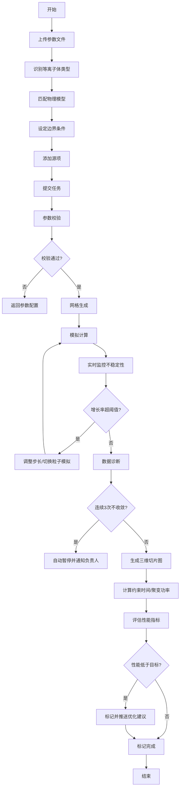
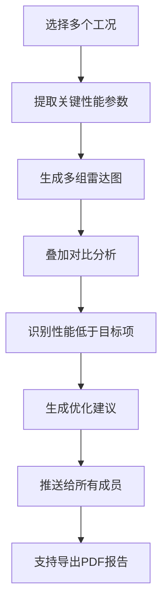

## 1. 产品概述

等离子体物理模拟与实时诊断平台是面向核聚变研究和等离子体物理领域的专业计算平台。平台提供参数上传、智能建模、实时模拟、性能诊断和多工况对比的全流程解决方案，帮助科研人员高效完成等离子体约束特性分析和聚变性能评估。

- 核心价值：将复杂的等离子体物理模型封装为易用的计算服务，自动化完成参数校验、网格生成、数值计算和结果分析，大幅提升模拟效率
- 目标用户：核聚变研究人员、等离子体物理学者、能源工程技术人员
- 市场定位：专业科研级数值模拟平台，支持托克马克、仿星器等多种等离子体装置的模拟分析

## 2. 核心 Features

### 2.1 用户角色
| 角色 | 注册方式 | 核心权限 |
|------|----------|----------|
| 平台管理员 | 系统分配 | 用户管理、系统配置、全局数据统计 |
| 项目负责人 | 邮箱注册 | 创建模拟任务、查看所有工况、管理团队成员 |
| 普通成员 | 邮件邀请 | 上传参数、运行模拟、查看结果、接收通知 |

### 2.2 功能模块
1. **仪表盘**：任务概览、实时监控面板、系统通知
2. **模拟任务管理**：文件上传、参数配置、边界条件设定、源项添加
3. **实时计算监控**：状态流转显示、不稳定性增长率监控、步长调整日志
4. **三维可视化**：密度/温度分布切片图、等值面渲染、矢量场显示
5. **性能诊断**：约束时间计算、聚变功率评估、关键参数分析
6. **多工况对比**：雷达图对比、性能差异分析、优化建议推送
7. **查询与报告**：条件筛选、综合报告PDF导出、模拟历史记录

### 2.3 页面详情
| 页面名称 | 模块名称 | 功能描述 |
|-----------|-------------|---------------------|
| 登录页 | 身份认证 | 邮箱/密码登录、密码重置、SSO集成 |
| 仪表盘 | 任务概览 | 运行中任务数、完成率统计、最近通知、快捷操作 |
| 模拟任务列表 | 任务管理 | 任务筛选、状态标签、批量操作、新建任务入口 |
| 新建任务页 | 参数配置 | 文件拖拽上传、等离子体类型识别、模型匹配、边界条件编辑器、源项配置 |
| 模拟详情页 | 实时监控 | 状态流转进度条、不稳定性增长率曲线、步长调整记录、计算日志 |
| 结果可视化页 | 三维展示 | 切片图交互、等值面控制、时间序列播放、参数映射 |
| 性能诊断页 | 数据分析 | 约束时间/聚变功率计算、参数对比表格、性能指标雷达图 |
| 多工况对比页 | 对比分析 | 工况选择、多雷达图叠加、性能排序、优化建议面板 |
| 通知中心 | 消息管理 | 性能预警、不收敛通知、优化建议、已读/未读标记 |
| 查询与报告页 | 报告导出 | 多条件筛选、任务查询、PDF报告生成与下载 |

## 3. 核心流程

### 3.1 模拟任务创建与执行流程
用户上传等离子体参数文件，系统自动识别等离子体类型并匹配物理模型，用户手动调整边界条件和源项，提交后任务进入"参数校验-网格生成-模拟计算-数据诊断-完成"的状态流转。计算过程中实时监控不稳定性增长率，超过阈值自动调整步长或切换粒子模拟模式。完成后自动生成三维可视化结果并计算关键性能参数。

### 3.2 多工况对比流程
用户选择多个已完成的模拟工况，系统生成性能雷达图进行多维度对比，自动标记性能低于目标的工况并推送优化建议给所有成员。

## 4. 用户界面设计

### 4.1 设计风格
- **设计方向**：科技感/未来主义深色主题，契合等离子体物理研究的专业属性
- **主色调**：深邃蓝 (#0A1628) 作为背景主色，等离子体紫 (#6366F1) 作为主强调色
- **辅助色**：等离子体青 (#22D3EE) 用于数据可视化，能量橙 (#F97316) 用于预警，成功绿 (#10B981) 用于完成状态
- **字体**：展示字体使用 Space Grotesk，正文字体使用 Inter Mono，数字使用 JetBrains Mono
- **按钮风格**：圆润直角按钮，hover时带发光效果，active时有微压缩动画
- **布局风格**：多层级卡片式布局，左侧固定导航栏，主内容区采用网格布局，支持自由拖拽调整面板
- **图标风格**：线性图标配合渐变填充，使用 Lucide 图标库
- **特殊效果**：背景带微妙等离子体流光动画，卡片边缘带发光边框，数据加载使用骨架屏脉冲效果

### 4.2 页面设计概述
| 页面名称 | 模块名称 | UI 元素 |
|-----------|-------------|-------------|
| 仪表盘 | 概览卡片 | 深色渐变背景、发光边框、实时数据跳动动画、状态指示灯 |
| | 通知面板 | 时间轴布局、新消息脉冲提示、类型彩色标签 |
| 新建任务页 | 文件上传区 | 虚线拖拽边框、拖入时发光放大效果、文件类型图标预览 |
| | 参数配置表单 | 分组折叠面板、动态表单、滑块+数字输入双模式 |
| | 边界条件编辑器 | 可交互示意图、点击设置边界、颜色编码边界类型 |
| 模拟详情页 | 状态流转 | 横向时间轴、节点发光效果、完成状态渐变填充 |
| | 实时监控图表 | 多折线图、阈值红线、超阈值区域高亮闪烁 |
| | 计算日志 | 终端风格输出、时间戳、颜色编码日志级别 |
| 三维可视化页 | 3D画布 | 全宽高画布、鼠标交互旋转缩放、多平面切片控制 |
| | 控制面板 | 半透明浮动面板、参数滑杆、渲染模式切换 |
| | 色标条 | 垂直渐变色标、数值映射、支持点击调整范围 |
| 多工况对比页 | 雷达图 | 多组半透明叠加、图例可点击切换、数据点悬停详情 |
| | 优化建议 | 卡片式列表、优先级标签、可展开详细说明 |
| 通知中心 | 消息列表 | 分组标签、未读计数、批量已读操作 |
| 查询与报告页 | 筛选条件 | 多条件组合、日期范围选择器、下拉多选 |
| | 报告预览 | 分页预览、页眉页脚配置、导出按钮带加载动画 |

### 4.3 响应式设计
- 桌面端（1440px+）：三栏布局，左侧导航、中间主内容、右侧辅助面板
- 平板端（1024px）：两栏布局，导航可折叠收起，辅助面板改为底部抽屉
- 移动端（768px以下）：单栏布局，底部Tab导航，面板采用卡片堆叠
- 图表自适应：ECharts/Three.js 容器自动适配尺寸，字体大小响应式调整

### 4.4 三维场景设计
- **环境**：深色太空背景，带微妙星云粒子效果，模拟等离子体研究的宇宙感
- **光照**：多光源设置，主光源冷白色，辅光源带等离子体紫/青色调，边缘光勾勒轮廓
- **相机**：初始正交视角，支持轨道控制器旋转缩放，双击重置视角
- **渲染**：使用体积渲染表现等离子体密度分布，切片平面使用半透明着色器，等值面使用金属质感材质
- **后处理**：Bloom发光效果模拟等离子体辉光，轻微噪点增加胶片质感，色彩分级增强对比度
- **交互**：鼠标悬停显示坐标和数值，点击添加测量标记，滚轮缩放，右键平移
- **性能**：使用LOD技术，远处降低网格精度，帧率目标60fps，支持自适应降级

---
*文档生成时间：2026-06-03*
