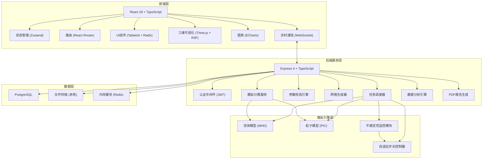
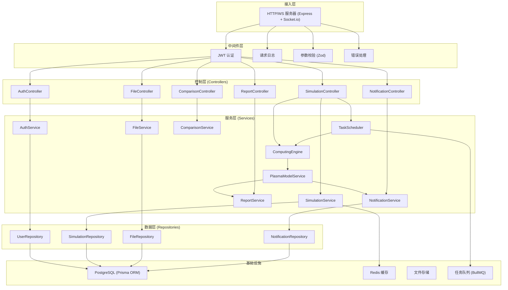
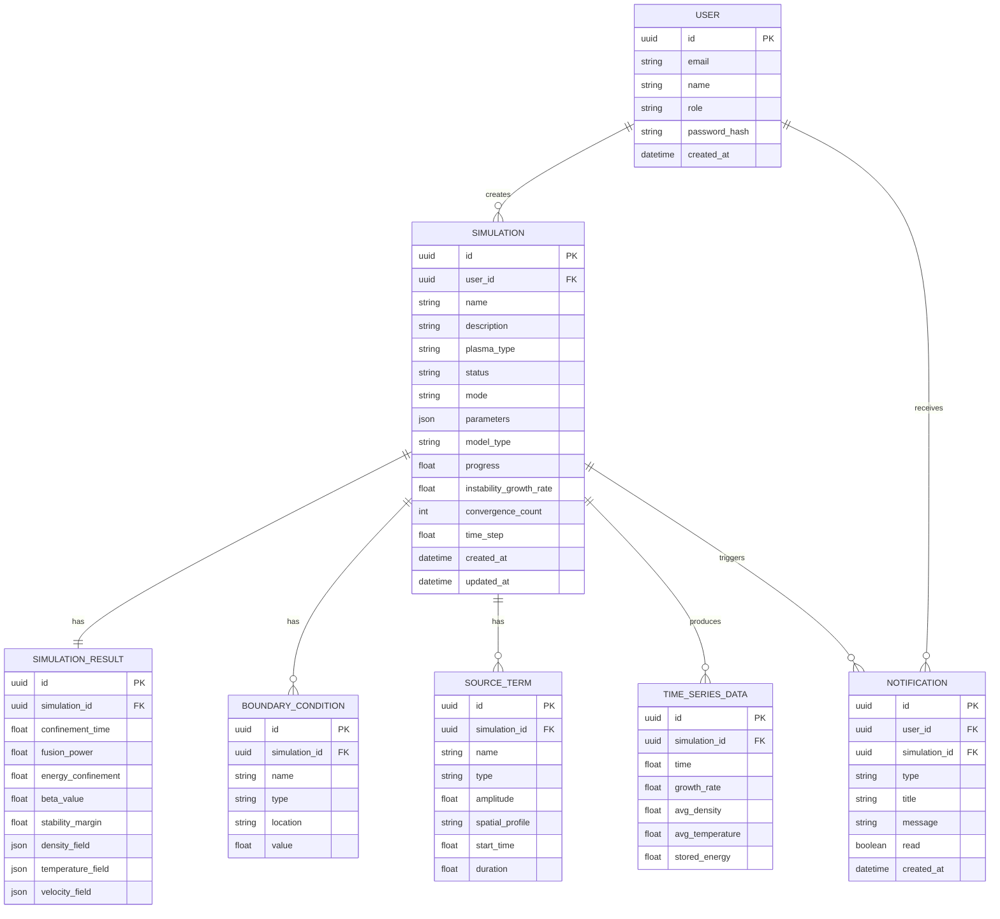

## 1. 架构设计

平台采用前后端分离架构，前端基于 React 18 实现丰富的交互界面和三维可视化，后端使用 Express 提供 RESTful API 和模拟计算调度服务，模拟引擎封装了多种等离子体物理模型，支持流体模拟和粒子模拟双模式。



## 2. 技术描述

- **前端**：React@18 + TypeScript@5 + Vite@5 + TailwindCSS@3 + Zustand@4
- **三维可视化**：three@0.160 + @react-three/fiber@8 + @react-three/drei@9 + @react-three/postprocessing@2
- **图表**：echarts@5 + echarts-for-react@3
- **路由**：react-router-dom@6
- **UI组件**：radix-ui/react-* + lucide-react@0.300
- **后端**：Express@4 + TypeScript@5
- **实时通信**：socket.io@4 + socket.io-client@4
- **PDF生成**：jspdf@2 + html2canvas@1
- **数据库**：PostgreSQL@15 + prisma@5
- **缓存**：redis@4
- **初始化工具**：vite-init
- **开发语言**：TypeScript (全栈)
- **项目模板**：react-express-ts (前后端一体化)

## 3. 路由定义

| 路由 | 页面 | 说明 |
|------|------|------|
| /login | 登录页 | 用户身份认证 |
| /dashboard | 仪表盘 | 任务概览和系统通知 |
| /simulations | 模拟任务列表 | 所有任务的管理入口 |
| /simulations/new | 新建任务 | 参数配置和模型选择 |
| /simulations/:id | 模拟详情 | 实时监控和状态流转 |
| /simulations/:id/visualization | 结果可视化 | 三维切片图展示 |
| /simulations/:id/diagnosis | 性能诊断 | 关键参数计算分析 |
| /compare | 多工况对比 | 雷达图和优化建议 |
| /notifications | 通知中心 | 消息管理 |
| /reports | 查询与报告 | 条件查询和PDF导出 |

## 4. API 定义

### 4.1 核心类型定义
```typescript
// 等离子体类型
type PlasmaType = 'TOKAMAK' | 'STELLARATOR' | 'INERTIAL' | 'MAGNETIC_MIRROR' | 'OTHER';

// 任务状态
type SimulationStatus = 'PENDING' | 'PARAM_VALIDATION' | 'GRID_GENERATION' | 'COMPUTING' | 'DATA_DIAGNOSIS' | 'COMPLETED' | 'PAUSED' | 'FAILED';

// 模拟模式
type SimulationMode = 'FLUID_MHD' | 'PARTICLE_PIC' | 'HYBRID';

// 边界条件类型
type BoundaryType = 'DIRICHLET' | 'NEUMANN' | 'PERIODIC' | 'ABSORBING';

// 源项类型
type SourceType = 'HEATING' | 'CURRENT_DRIVE' | 'FUELING' | 'IMPURITY';

// 等离子体参数
interface PlasmaParameters {
  densityProfile: number[][];      // 密度分布 [r, n(r)]
  temperatureProfile: number[][];  // 温度分布 [r, T(r)]
  magneticField: number;           // 磁场强度 (T)
  majorRadius: number;             // 大半径 (m)
  minorRadius: number;             // 小半径 (m)
  plasmaCurrent: number;           // 等离子体电流 (MA)
}

// 边界条件
interface BoundaryCondition {
  id: string;
  name: string;
  type: BoundaryType;
  location: 'INNER' | 'OUTER' | 'TOP' | 'BOTTOM';
  value: number;
}

// 源项
interface SourceTerm {
  id: string;
  name: string;
  type: SourceType;
  amplitude: number;
  spatialProfile: string;
  startTime: number;
  duration: number;
}

// 模拟任务
interface Simulation {
  id: string;
  name: string;
  description: string;
  plasmaType: PlasmaType;
  status: SimulationStatus;
  mode: SimulationMode;
  parameters: PlasmaParameters;
  boundaryConditions: BoundaryCondition[];
  sourceTerms: SourceTerm[];
  modelType: string;
  createdAt: string;
  createdBy: string;
  progress: number;
  instabilityGrowthRate: number;
  convergenceCount: number;
  timeStep: number;
  result?: SimulationResult;
}

// 模拟结果
interface SimulationResult {
  finalDensity: number[][][];      // 三维密度场
  finalTemperature: number[][][];  // 三维温度场
  velocityField: number[][][][];   // 三维速度场
  confinementTime: number;         // 约束时间 (s)
  fusionPower: number;             // 聚变功率 (MW)
  energyConfinement: number;       // 能量约束 (MJ)
  betaValue: number;               // β值
  stabilityMargin: number;         // 稳定裕度
  timeSeriesData: TimeSeriesData[];
}

// 时间序列数据
interface TimeSeriesData {
  time: number;
  growthRate: number;
  averageDensity: number;
  averageTemperature: number;
  storedEnergy: number;
}

// 工况对比
interface ComparisonResult {
  simulationIds: string[];
  parameters: string[];
  radarData: RadarDataPoint[];
  underperformingIds: string[];
  suggestions: OptimizationSuggestion[];
}

// 优化建议
interface OptimizationSuggestion {
  id: string;
  type: 'BOUNDARY' | 'SOURCE' | 'PARAMETER' | 'MODEL';
  priority: 'HIGH' | 'MEDIUM' | 'LOW';
  title: string;
  description: string;
  expectedImprovement: string;
}

// 通知
interface Notification {
  id: string;
  type: 'PERFORMANCE_ALERT' | 'CONVERGENCE_ISSUE' | 'SIMULATION_COMPLETE' | 'SUGGESTION';
  title: string;
  message: string;
  simulationId?: string;
  read: boolean;
  createdAt: string;
  recipientIds: string[];
}
```

### 4.2 REST API 接口
```typescript
// 认证
POST /api/auth/login - 用户登录
POST /api/auth/logout - 用户登出
GET  /api/auth/me - 获取当前用户

// 模拟任务
GET    /api/simulations - 获取任务列表（支持筛选）
POST   /api/simulations - 创建新任务
GET    /api/simulations/:id - 获取任务详情
PUT    /api/simulations/:id - 更新任务配置
POST   /api/simulations/:id/start - 开始模拟
POST   /api/simulations/:id/pause - 暂停模拟
POST   /api/simulations/:id/resume - 恢复模拟
DELETE /api/simulations/:id - 删除任务
GET    /api/simulations/:id/result - 获取模拟结果

// 参数文件
POST /api/upload - 上传参数文件
GET  /api/files/:id/download - 下载文件

// 工况对比
POST /api/compare - 多工况对比
GET  /api/compare/:simulationIds - 获取对比结果

// 通知
GET    /api/notifications - 获取通知列表
PUT    /api/notifications/:id/read - 标记已读
PUT    /api/notifications/read-all - 全部已读

// 报告
POST /api/reports/query - 条件查询
POST /api/reports/export - 导出PDF报告
```

### 4.3 WebSocket 事件
```typescript
// 服务端推送
'simulation:status' - 状态更新
'simulation:progress' - 进度更新
'simulation:instability' - 不稳定性告警
'simulation:step-changed' - 步长调整
'simulation:mode-changed' - 模式切换
'simulation:paused' - 任务暂停
'notification:new' - 新通知

// 客户端发送
'simulation:subscribe' - 订阅任务更新
'simulation:unsubscribe' - 取消订阅
```

## 5. 服务端架构



## 6. 数据模型

### 6.1 ER 图


### 6.2 DDL 语句
```sql
-- 用户表
CREATE TABLE users (
    id UUID PRIMARY KEY DEFAULT gen_random_uuid(),
    email VARCHAR(255) UNIQUE NOT NULL,
    name VARCHAR(255) NOT NULL,
    role VARCHAR(50) NOT NULL DEFAULT 'MEMBER',
    password_hash VARCHAR(255) NOT NULL,
    created_at TIMESTAMP NOT NULL DEFAULT CURRENT_TIMESTAMP,
    updated_at TIMESTAMP NOT NULL DEFAULT CURRENT_TIMESTAMP
);

-- 模拟任务表
CREATE TABLE simulations (
    id UUID PRIMARY KEY DEFAULT gen_random_uuid(),
    user_id UUID NOT NULL REFERENCES users(id) ON DELETE CASCADE,
    name VARCHAR(255) NOT NULL,
    description TEXT,
    plasma_type VARCHAR(50) NOT NULL,
    status VARCHAR(50) NOT NULL DEFAULT 'PENDING',
    mode VARCHAR(50) NOT NULL DEFAULT 'FLUID_MHD',
    parameters JSONB NOT NULL,
    model_type VARCHAR(100),
    progress FLOAT NOT NULL DEFAULT 0,
    instability_growth_rate FLOAT,
    convergence_count INT NOT NULL DEFAULT 0,
    time_step FLOAT NOT NULL DEFAULT 1e-6,
    created_at TIMESTAMP NOT NULL DEFAULT CURRENT_TIMESTAMP,
    updated_at TIMESTAMP NOT NULL DEFAULT CURRENT_TIMESTAMP,
    INDEX idx_status (status),
    INDEX idx_user_id (user_id),
    INDEX idx_created_at (created_at)
);

-- 边界条件表
CREATE TABLE boundary_conditions (
    id UUID PRIMARY KEY DEFAULT gen_random_uuid(),
    simulation_id UUID NOT NULL REFERENCES simulations(id) ON DELETE CASCADE,
    name VARCHAR(255) NOT NULL,
    type VARCHAR(50) NOT NULL,
    location VARCHAR(50) NOT NULL,
    value FLOAT NOT NULL,
    created_at TIMESTAMP NOT NULL DEFAULT CURRENT_TIMESTAMP
);

-- 源项表
CREATE TABLE source_terms (
    id UUID PRIMARY KEY DEFAULT gen_random_uuid(),
    simulation_id UUID NOT NULL REFERENCES simulations(id) ON DELETE CASCADE,
    name VARCHAR(255) NOT NULL,
    type VARCHAR(50) NOT NULL,
    amplitude FLOAT NOT NULL,
    spatial_profile VARCHAR(255) NOT NULL,
    start_time FLOAT NOT NULL,
    duration FLOAT NOT NULL,
    created_at TIMESTAMP NOT NULL DEFAULT CURRENT_TIMESTAMP
);

-- 模拟结果表
CREATE TABLE simulation_results (
    id UUID PRIMARY KEY DEFAULT gen_random_uuid(),
    simulation_id UUID NOT NULL REFERENCES simulations(id) ON DELETE CASCADE,
    confinement_time FLOAT,
    fusion_power FLOAT,
    energy_confinement FLOAT,
    beta_value FLOAT,
    stability_margin FLOAT,
    density_field JSONB,
    temperature_field JSONB,
    velocity_field JSONB,
    created_at TIMESTAMP NOT NULL DEFAULT CURRENT_TIMESTAMP
);

-- 时间序列数据表
CREATE TABLE time_series_data (
    id UUID PRIMARY KEY DEFAULT gen_random_uuid(),
    simulation_id UUID NOT NULL REFERENCES simulations(id) ON DELETE CASCADE,
    time FLOAT NOT NULL,
    growth_rate FLOAT,
    avg_density FLOAT,
    avg_temperature FLOAT,
    stored_energy FLOAT,
    created_at TIMESTAMP NOT NULL DEFAULT CURRENT_TIMESTAMP,
    INDEX idx_simulation_time (simulation_id, time)
);

-- 通知表
CREATE TABLE notifications (
    id UUID PRIMARY KEY DEFAULT gen_random_uuid(),
    user_id UUID NOT NULL REFERENCES users(id) ON DELETE CASCADE,
    simulation_id UUID REFERENCES simulations(id) ON DELETE CASCADE,
    type VARCHAR(50) NOT NULL,
    title VARCHAR(255) NOT NULL,
    message TEXT NOT NULL,
    read BOOLEAN NOT NULL DEFAULT FALSE,
    created_at TIMESTAMP NOT NULL DEFAULT CURRENT_TIMESTAMP,
    INDEX idx_user_read (user_id, read)
);

-- 初始化管理员用户
INSERT INTO users (email, name, role, password_hash) VALUES 
('admin@plasma-lab.com', '系统管理员', 'ADMIN', '$2b$10$hashed_password_here');
```

---
*文档生成时间：2026-06-03*
