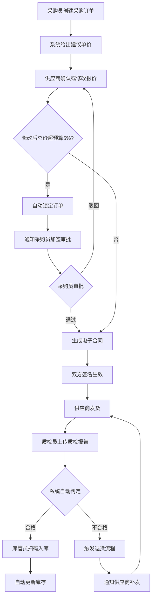

## 1. 产品概述

制造企业原材料采购与质检协同系统，面向制造型企业的采购、供应商、质检、库管多角色协同场景。解决采购定价缺乏数据支撑、供应商沟通低效、质检与退货流程脱节、库存更新滞后等痛点，实现从采购下单到入库全链路数字化协同与智能决策。

- 目标用户：制造企业的采购员、供应商、质检员、库管员
- 核心价值：通过历史数据与市场行情辅助定价、超预算自动拦截、电子合同在线签署、质检自动判定与退货联动、扫码即入库存、供应商绩效可视化、月度自动报表推送

## 2. 核心功能

### 2.1 用户角色

| 角色 | 注册方式 | 核心权限 |
|------|----------|----------|
| 采购员 | 管理员分配账号 | 创建/管理采购订单、查看供应商绩效、审批超预算订单、查看报表 |
| 供应商 | 采购员邀请注册 | 确认/修改报价、签署合同、接收退货通知、补发货物 |
| 质检员 | 管理员分配账号 | 上传质检报告、判定合格与否、触发退货流程 |
| 库管员 | 管理员分配账号 | 扫码入库、更新库存、查看库存明细 |
| 管理员 | 系统预设 | 用户管理、系统配置、数据维护 |

### 2.2 功能模块

1. **工作台首页**：关键指标概览、待办事项、最新消息、快捷入口
2. **采购订单管理**：创建订单、智能建议单价、订单状态流转、历史查询
3. **供应商协同**：报价确认/修改、超预算自动锁定加签、电子合同签署
4. **质检管理**：来料登记、质检报告上传、自动合格判定、不合格触发退货
5. **仓储入库**：扫码入库、库存实时更新、库存查询
6. **供应商绩效**：到货及时率柱状图、合格率柱状图、供应商对比
7. **报表中心**：月度采购总额统计、退货金额分析、趋势图表
8. **消息通知**：订单变更通知、质检判定通知、退货通知、报表推送

### 2.3 页面详情

| 页面名称 | 模块名称 | 功能描述 |
|----------|----------|----------|
| 工作台首页 | 关键指标卡片 | 当月采购额、待审批订单数、不合格批次、库存预警数 |
| 工作台首页 | 待办事项 | 待确认报价、待审批加签、待质检来料、待入库物料 |
| 工作台首页 | 消息列表 | 最新系统消息与业务通知 |
| 采购订单列表 | 筛选与搜索 | 按状态/供应商/日期筛选，关键词搜索 |
| 采购订单列表 | 订单列表 | 展示订单编号、供应商、物料、金额、状态 |
| 采购订单详情 | 基本信息 | 订单编号、创建时间、预算金额、物料清单 |
| 采购订单详情 | 建议单价 | 显示历史均价与市场行情，给出建议单价及依据 |
| 采购订单详情 | 供应商报价 | 供应商确认/修改报价记录，超预算标红提示 |
| 采购订单详情 | 合同签署 | 电子合同预览、双方签名区域 |
| 采购订单详情 | 操作日志 | 订单全生命周期操作记录 |
| 供应商报价页 | 报价确认 | 供应商查看订单详情并确认或修改报价 |
| 供应商报价页 | 超预算提示 | 修改后超预算5%时显示警告并锁定 |
| 质检管理页 | 来料登记 | 扫码/手动输入来料批次信息 |
| 质检管理页 | 报告上传 | 上传质检报告文件、填写检测结果 |
| 质检管理页 | 自动判定 | 系统根据检测标准自动判定合格/不合格 |
| 质检管理页 | 退货触发 | 不合格自动触发退货并通知供应商 |
| 仓储入库页 | 扫码入库 | 扫描物料条码，关联订单自动入库 |
| 仓储入库页 | 库存查询 | 按物料/仓库/日期查询库存明细 |
| 供应商绩效页 | 及时率图表 | 各供应商到货及时率柱状图对比 |
| 供应商绩效页 | 合格率图表 | 各供应商质检合格率柱状图对比 |
| 报表中心页 | 月度统计 | 上月采购总额、退货金额、环比分析 |
| 报表中心页 | 趋势分析 | 采购金额与退货金额月度趋势折线图 |
| 消息中心页 | 消息列表 | 按类型/时间查看所有消息 |
| 消息中心页 | 凭证下载 | 下载合同、质检报告、退货通知等凭证文件 |

## 3. 核心流程

采购员创建采购订单 → 系统根据历史均价和市场行情给出建议单价 → 供应商在线确认或修改报价 → 若修改后总价超预算5%则自动锁定并通知采购员加签 → 采购员审批通过 → 生成电子合同双方签名生效 → 供应商发货 → 质检员来料时上传质检报告 → 系统自动判定合格与否 → 不合格则触发退货并通知供应商补发 → 合格则库管员扫码入库 → 自动更新库存

## 4. 用户界面设计

### 4.1 设计风格

- 主色调：深蓝灰(#1B2A4A)体现专业严谨，辅助色：琥珀橙(#E8913A)用于重要操作和警示
- 按钮风格：圆角微弧(8px)，主操作按钮带微妙阴影，危险操作按钮红色系
- 字体：标题用 Noto Sans SC Bold，正文用 Noto Sans SC Regular，数据用 JetBrains Mono
- 布局风格：左侧固定导航栏 + 顶部面包屑 + 右侧内容区，卡片式内容组织
- 图标风格：线性图标(Lucide)，统一2px描边
- 整体氛围：工业感、专业感、数据驱动，深色侧边栏搭配浅灰白内容区

### 4.2 页面设计概览

| 页面名称 | 模块名称 | UI元素 |
|----------|----------|--------|
| 工作台首页 | 指标卡片 | 深蓝渐变背景、大号数字、趋势箭头、动画计数 |
| 工作台首页 | 待办事项 | 左侧图标+右侧数字、状态色条、hover浮起效果 |
| 采购订单详情 | 建议单价 | 卡片内三列对比(历史均价/市场行情/建议单价)，带涨跌色标 |
| 采购订单详情 | 合同签署 | 合同预览区+底部签名板，签名用Canvas手写 |
| 质检管理页 | 自动判定 | 合格绿色勾/不合格红色叉大图标，带动画弹出效果 |
| 供应商绩效页 | 柱状图 | 彩色柱状图，hover显示详情，带网格线背景 |
| 报表中心页 | 趋势图 | 折线图带渐变填充，数据点hover显示tooltip |

### 4.3 响应式设计

- 桌面优先设计，最小支持1280px宽度
- 侧边栏可折叠，内容区自适应
- 表格在窄屏时支持横向滚动
- 图表自适应容器宽度

### 4.4 3D场景指引

- 不涉及3D场景
