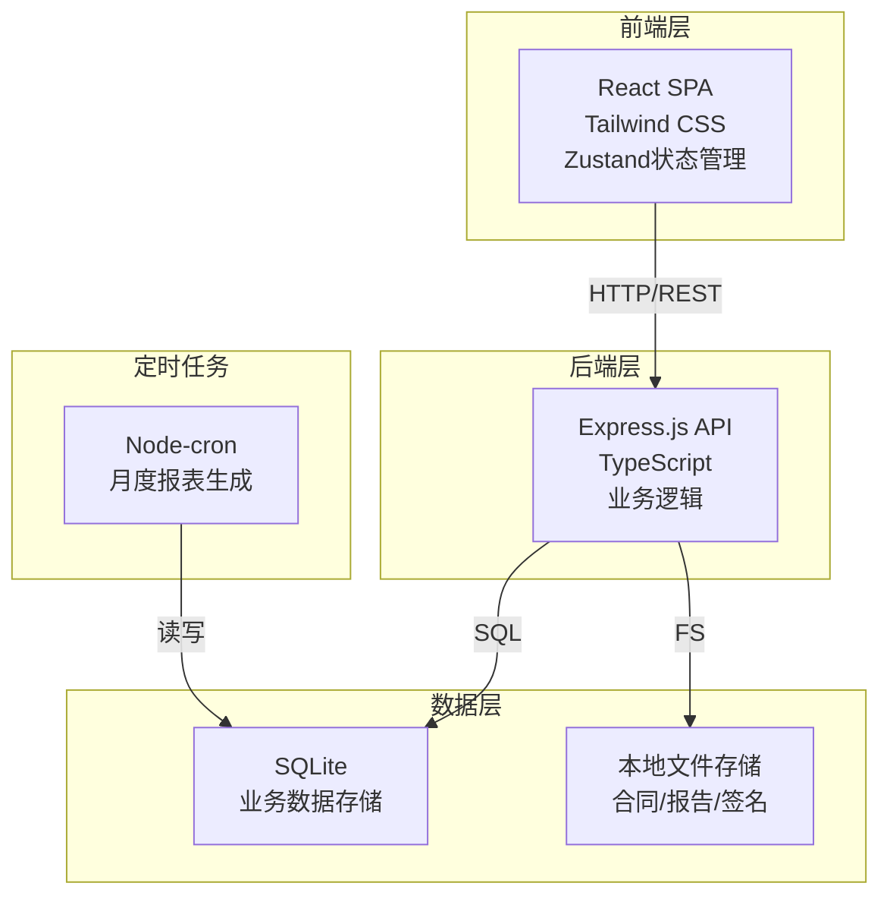
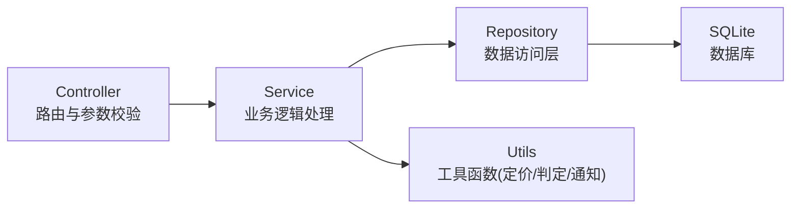
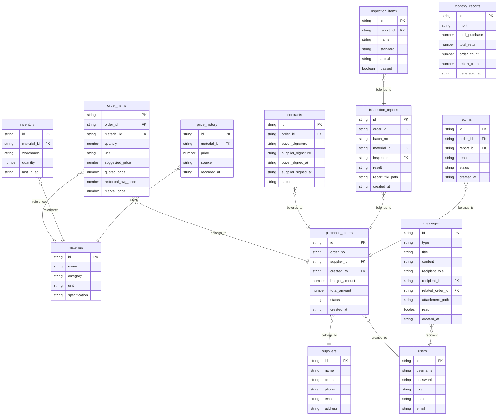

## 1. 架构设计



## 2. 技术说明

- 前端：React@18 + TailwindCSS@3 + Vite + Zustand + Recharts(图表)
- 初始化工具：vite-init
- 后端：Express@4 + TypeScript(ESM)
- 数据库：SQLite(better-sqlite3)，Mock数据初始化
- 文件存储：本地文件系统(uploads目录)
- 定时任务：node-cron(月度报表)
- 签名方案：Canvas手写签名 + 数据存储
- 通知方案：应用内消息(轮询/WebSocket模拟)

## 3. 路由定义

| 路由 | 用途 |
|------|------|
| / | 工作台首页，关键指标与待办 |
| /orders | 采购订单列表 |
| /orders/:id | 采购订单详情(含建议单价、报价、合同) |
| /orders/create | 创建采购订单 |
| /quality | 质检管理，来料登记与报告上传 |
| /warehouse | 仓储入库，扫码入库与库存查询 |
| /suppliers | 供应商绩效，及时率与合格率图表 |
| /reports | 报表中心，月度统计与趋势 |
| /messages | 消息中心，通知与凭证下载 |
| /supplier/quote/:orderId | 供应商报价确认/修改页(独立页面) |

## 4. API定义

### 4.1 采购订单

```typescript
interface PurchaseOrder {
  id: string
  orderNo: string
  supplierId: string
  items: OrderItem[]
  budgetAmount: number
  totalAmount: number
  suggestedPrices: SuggestedPrice[]
  status: 'draft' | 'pending_quote' | 'quoted' | 'locked' | 'approved' | 'contracted' | 'shipping' | 'inspecting' | 'partial_return' | 'completed' | 'rejected'
  createdBy: string
  createdAt: string
  updatedAt: string
}

interface OrderItem {
  id: string
  materialId: string
  materialName: string
  quantity: number
  unit: string
  suggestedUnitPrice: number
  quotedUnitPrice: number
  historicalAvgPrice: number
  marketPrice: number
}

interface SuggestedPrice {
  materialId: string
  historicalAvg: number
  marketPrice: number
  suggestedPrice: number
  reason: string
}
```

### 4.2 供应商报价

```typescript
interface SupplierQuote {
  orderId: string
  supplierId: string
  items: QuoteItem[]
  totalAmount: number
  overBudget: boolean
  overBudgetPercent: number
  status: 'pending' | 'confirmed' | 'modified' | 'locked'
  confirmedAt: string
}

interface QuoteItem {
  materialId: string
  quotedPrice: number
  deliveryDate: string
}
```

### 4.3 电子合同

```typescript
interface Contract {
  id: string
  orderId: string
  buyerSignature: string | null
  supplierSignature: string | null
  buyerSignedAt: string | null
  supplierSignedAt: string | null
  status: 'pending' | 'partial_signed' | 'signed'
  pdfPath: string
}
```

### 4.4 质检报告

```typescript
interface InspectionReport {
  id: string
  orderId: string
  batchNo: string
  materialId: string
  inspector: string
  result: 'pass' | 'fail'
  items: InspectionItem[]
  reportFilePath: string
  createdAt: string
}

interface InspectionItem {
  name: string
  standard: string
  actual: string
  passed: boolean
}
```

### 4.5 库存

```typescript
interface Inventory {
  id: string
  materialId: string
  materialName: string
  warehouse: string
  quantity: number
  unit: string
  lastInAt: string
}
```

### 4.6 供应商绩效

```typescript
interface SupplierPerformance {
  supplierId: string
  supplierName: string
  onTimeRate: number
  passRate: number
  totalOrders: number
  returnOrders: number
}
```

### 4.7 消息通知

```typescript
interface Message {
  id: string
  type: 'order_change' | 'quality_result' | 'return_notice' | 'report_ready' | 'budget_alert'
  title: string
  content: string
  recipientRole: string
  recipientId: string
  relatedOrderId: string | null
  attachmentPath: string | null
  read: boolean
  createdAt: string
}
```

### 4.8 月度报表

```typescript
interface MonthlyReport {
  id: string
  month: string
  totalPurchaseAmount: number
  totalReturnAmount: number
  orderCount: number
  returnCount: number
  returnRate: number
  topSuppliers: SupplierRank[]
  generatedAt: string
}

interface SupplierRank {
  supplierId: string
  supplierName: string
  amount: number
}
```

## 5. 服务器架构图



## 6. 数据模型

### 6.1 数据模型定义



### 6.2 数据定义语言

```sql
CREATE TABLE users (
  id TEXT PRIMARY KEY,
  username TEXT NOT NULL UNIQUE,
  password TEXT NOT NULL,
  role TEXT NOT NULL CHECK(role IN ('admin','purchaser','supplier','inspector','warehouse')),
  name TEXT NOT NULL,
  email TEXT
);

CREATE TABLE suppliers (
  id TEXT PRIMARY KEY,
  name TEXT NOT NULL,
  contact TEXT,
  phone TEXT,
  email TEXT,
  address TEXT
);

CREATE TABLE materials (
  id TEXT PRIMARY KEY,
  name TEXT NOT NULL,
  category TEXT,
  unit TEXT NOT NULL,
  specification TEXT
);

CREATE TABLE purchase_orders (
  id TEXT PRIMARY KEY,
  order_no TEXT NOT NULL UNIQUE,
  supplier_id TEXT NOT NULL REFERENCES suppliers(id),
  created_by TEXT NOT NULL REFERENCES users(id),
  budget_amount REAL NOT NULL,
  total_amount REAL DEFAULT 0,
  status TEXT NOT NULL DEFAULT 'draft',
  created_at TEXT NOT NULL,
  updated_at TEXT NOT NULL
);

CREATE TABLE order_items (
  id TEXT PRIMARY KEY,
  order_id TEXT NOT NULL REFERENCES purchase_orders(id),
  material_id TEXT NOT NULL REFERENCES materials(id),
  quantity REAL NOT NULL,
  unit TEXT NOT NULL,
  suggested_price REAL DEFAULT 0,
  quoted_price REAL DEFAULT 0,
  historical_avg_price REAL DEFAULT 0,
  market_price REAL DEFAULT 0
);

CREATE TABLE contracts (
  id TEXT PRIMARY KEY,
  order_id TEXT NOT NULL REFERENCES purchase_orders(id),
  buyer_signature TEXT,
  supplier_signature TEXT,
  buyer_signed_at TEXT,
  supplier_signed_at TEXT,
  status TEXT NOT NULL DEFAULT 'pending'
);

CREATE TABLE inspection_reports (
  id TEXT PRIMARY KEY,
  order_id TEXT NOT NULL REFERENCES purchase_orders(id),
  batch_no TEXT NOT NULL,
  material_id TEXT NOT NULL REFERENCES materials(id),
  inspector TEXT NOT NULL REFERENCES users(id),
  result TEXT NOT NULL CHECK(result IN ('pass','fail')),
  report_file_path TEXT,
  created_at TEXT NOT NULL
);

CREATE TABLE inspection_items (
  id TEXT PRIMARY KEY,
  report_id TEXT NOT NULL REFERENCES inspection_reports(id),
  name TEXT NOT NULL,
  standard TEXT NOT NULL,
  actual TEXT NOT NULL,
  passed INTEGER NOT NULL
);

CREATE TABLE inventory (
  id TEXT PRIMARY KEY,
  material_id TEXT NOT NULL REFERENCES materials(id),
  warehouse TEXT NOT NULL,
  quantity REAL NOT NULL DEFAULT 0,
  last_in_at TEXT
);

CREATE TABLE returns (
  id TEXT PRIMARY KEY,
  order_id TEXT NOT NULL REFERENCES purchase_orders(id),
  report_id TEXT NOT NULL REFERENCES inspection_reports(id),
  reason TEXT,
  status TEXT NOT NULL DEFAULT 'pending',
  created_at TEXT NOT NULL
);

CREATE TABLE messages (
  id TEXT PRIMARY KEY,
  type TEXT NOT NULL,
  title TEXT NOT NULL,
  content TEXT NOT NULL,
  recipient_role TEXT NOT NULL,
  recipient_id TEXT REFERENCES users(id),
  related_order_id TEXT REFERENCES purchase_orders(id),
  attachment_path TEXT,
  read INTEGER NOT NULL DEFAULT 0,
  created_at TEXT NOT NULL
);

CREATE TABLE monthly_reports (
  id TEXT PRIMARY KEY,
  month TEXT NOT NULL UNIQUE,
  total_purchase REAL NOT NULL DEFAULT 0,
  total_return REAL NOT NULL DEFAULT 0,
  order_count INTEGER NOT NULL DEFAULT 0,
  return_count INTEGER NOT NULL DEFAULT 0,
  generated_at TEXT NOT NULL
);

CREATE TABLE price_history (
  id TEXT PRIMARY KEY,
  material_id TEXT NOT NULL REFERENCES materials(id),
  price REAL NOT NULL,
  source TEXT NOT NULL,
  recorded_at TEXT NOT NULL
);

CREATE INDEX idx_orders_status ON purchase_orders(status);
CREATE INDEX idx_orders_supplier ON purchase_orders(supplier_id);
CREATE INDEX idx_messages_recipient ON messages(recipient_id, read);
CREATE INDEX idx_price_history_material ON price_history(material_id, recorded_at);
CREATE INDEX idx_inventory_material ON inventory(material_id);
```
