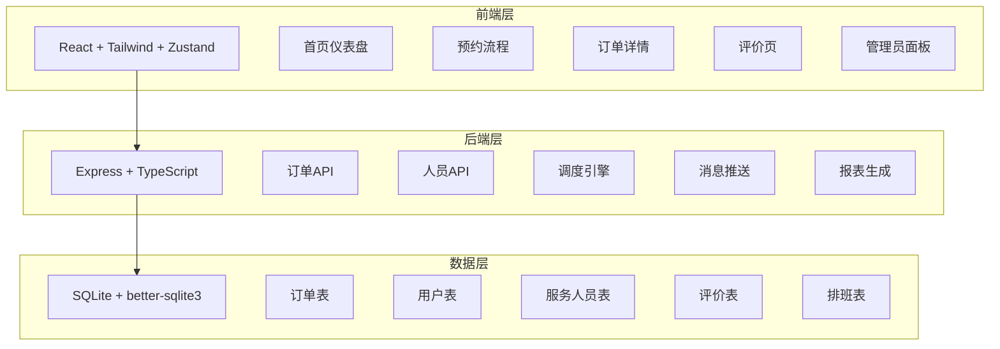
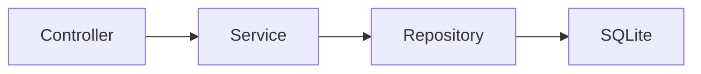
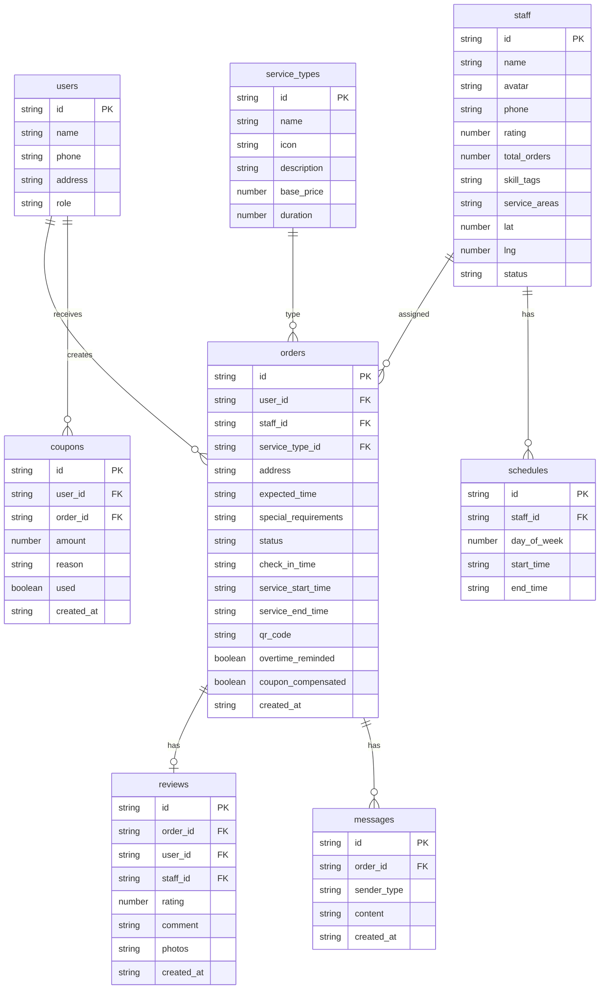

## 1. 架构设计



## 2. 技术说明

- 前端：React@18 + TailwindCSS@3 + Vite + Zustand
- 初始化工具：vite-init
- 后端：Express@4 + TypeScript（ESM格式）
- 数据库：SQLite（better-sqlite3），使用 Mock 数据初始化
- 图表：recharts（报表可视化）
- 二维码：qrcode.react
- 图标：lucide-react

## 3. 路由定义

| 路由 | 用途 |
|------|------|
| / | 首页仪表盘，展示待接单数和服务中订单实时状态 |
| /booking | 服务预约页面，选择服务类型、填写信息、推荐人员 |
| /order/:id | 订单详情页，二维码、计时、位置、消息 |
| /review/:id | 评价页面，评分、上传照片、文字评价 |
| /admin/staff | 管理员-人员管理，技能标签、服务区域、排班 |
| /admin/orders | 管理员-订单查询，多条件组合筛选 |
| /admin/reports | 管理员-报表导出，月度分析和明细 |

## 4. API 定义

### 4.1 服务类型

```typescript
interface ServiceType {
  id: string;
  name: string;
  icon: string;
  description: string;
  basePrice: number;
  duration: number;
}
```

### 4.2 服务人员

```typescript
interface Staff {
  id: string;
  name: string;
  avatar: string;
  phone: string;
  rating: number;
  totalOrders: number;
  skillTags: string[];
  serviceAreas: string[];
  currentLocation: { lat: number; lng: number };
  status: "idle" | "busy" | "off";
  schedule: ScheduleRule[];
}

interface ScheduleRule {
  dayOfWeek: number;
  startTime: string;
  endTime: string;
}
```

### 4.3 订单

```typescript
interface Order {
  id: string;
  userId: string;
  staffId: string | null;
  serviceType: string;
  address: string;
  expectedTime: string;
  specialRequirements: string;
  status: "pending" | "assigned" | "checked_in" | "in_service" | "completed" | "cancelled";
  checkInTime: string | null;
  serviceStartTime: string | null;
  serviceEndTime: string | null;
  qrCode: string;
  overtimeReminded: boolean;
  couponCompensated: boolean;
  createdAt: string;
}
```

### 4.4 评价

```typescript
interface Review {
  id: string;
  orderId: string;
  userId: string;
  staffId: string;
  rating: number;
  comment: string;
  photos: string[];
  createdAt: string;
}
```

### 4.5 API 端点

| 方法 | 路径 | 说明 |
|------|------|------|
| GET | /api/dashboard/stats | 获取仪表盘统计数据 |
| GET | /api/dashboard/active-orders | 获取服务中订单列表 |
| GET | /api/service-types | 获取服务类型列表 |
| POST | /api/orders | 创建预约订单 |
| GET | /api/orders/:id | 获取订单详情 |
| PUT | /api/orders/:id/checkin | 服务人员扫码签到 |
| PUT | /api/orders/:id/start | 开始服务 |
| PUT | /api/orders/:id/complete | 完成服务 |
| GET | /api/orders/:id/location | 获取服务人员实时位置 |
| POST | /api/orders/:id/messages | 发送临时需求消息 |
| GET | /api/orders/:id/messages | 获取消息列表 |
| POST | /api/reviews | 提交评价 |
| GET | /api/staff/recommend | 获取推荐服务人员 |
| GET | /api/staff | 获取服务人员列表 |
| PUT | /api/staff/:id | 更新服务人员信息 |
| GET | /api/admin/orders | 管理员查询订单（支持筛选） |
| GET | /api/admin/reports/monthly | 月度质量分析报表 |
| GET | /api/admin/reports/staff/:id | 个人服务记录明细 |
| GET | /api/admin/reports/export | 一键导出报表 |

## 5. 服务器架构图



- Controller：处理 HTTP 请求/响应，参数校验
- Service：业务逻辑，调度算法，超时检测
- Repository：数据访问层，SQL 操作

## 6. 数据模型

### 6.1 数据模型定义



### 6.2 数据定义语言

```sql
CREATE TABLE users (
  id TEXT PRIMARY KEY,
  name TEXT NOT NULL,
  phone TEXT NOT NULL UNIQUE,
  address TEXT,
  role TEXT NOT NULL DEFAULT 'user' CHECK(role IN ('user', 'staff', 'admin'))
);

CREATE TABLE service_types (
  id TEXT PRIMARY KEY,
  name TEXT NOT NULL,
  icon TEXT NOT NULL,
  description TEXT,
  base_price REAL NOT NULL,
  duration INTEGER NOT NULL
);

CREATE TABLE staff (
  id TEXT PRIMARY KEY,
  name TEXT NOT NULL,
  avatar TEXT,
  phone TEXT NOT NULL UNIQUE,
  rating REAL NOT NULL DEFAULT 5.0,
  total_orders INTEGER NOT NULL DEFAULT 0,
  skill_tags TEXT NOT NULL DEFAULT '[]',
  service_areas TEXT NOT NULL DEFAULT '[]',
  lat REAL DEFAULT 0,
  lng REAL DEFAULT 0,
  status TEXT NOT NULL DEFAULT 'idle' CHECK(status IN ('idle', 'busy', 'off'))
);

CREATE TABLE orders (
  id TEXT PRIMARY KEY,
  user_id TEXT NOT NULL REFERENCES users(id),
  staff_id TEXT REFERENCES staff(id),
  service_type_id TEXT NOT NULL REFERENCES service_types(id),
  address TEXT NOT NULL,
  expected_time TEXT NOT NULL,
  special_requirements TEXT,
  status TEXT NOT NULL DEFAULT 'pending' CHECK(status IN ('pending', 'assigned', 'checked_in', 'in_service', 'completed', 'cancelled')),
  check_in_time TEXT,
  service_start_time TEXT,
  service_end_time TEXT,
  qr_code TEXT,
  overtime_reminded INTEGER NOT NULL DEFAULT 0,
  coupon_compensated INTEGER NOT NULL DEFAULT 0,
  created_at TEXT NOT NULL DEFAULT (datetime('now'))
);

CREATE TABLE reviews (
  id TEXT PRIMARY KEY,
  order_id TEXT NOT NULL UNIQUE REFERENCES orders(id),
  user_id TEXT NOT NULL REFERENCES users(id),
  staff_id TEXT NOT NULL REFERENCES staff(id),
  rating INTEGER NOT NULL CHECK(rating >= 1 AND rating <= 5),
  comment TEXT,
  photos TEXT NOT NULL DEFAULT '[]',
  created_at TEXT NOT NULL DEFAULT (datetime('now'))
);

CREATE TABLE schedules (
  id TEXT PRIMARY KEY,
  staff_id TEXT NOT NULL REFERENCES staff(id),
  day_of_week INTEGER NOT NULL CHECK(day_of_week >= 0 AND day_of_week <= 6),
  start_time TEXT NOT NULL,
  end_time TEXT NOT NULL
);

CREATE TABLE messages (
  id TEXT PRIMARY KEY,
  order_id TEXT NOT NULL REFERENCES orders(id),
  sender_type TEXT NOT NULL CHECK(sender_type IN ('user', 'staff')),
  content TEXT NOT NULL,
  created_at TEXT NOT NULL DEFAULT (datetime('now'))
);

CREATE TABLE coupons (
  id TEXT PRIMARY KEY,
  user_id TEXT NOT NULL REFERENCES users(id),
  order_id TEXT REFERENCES orders(id),
  amount REAL NOT NULL,
  reason TEXT,
  used INTEGER NOT NULL DEFAULT 0,
  created_at TEXT NOT NULL DEFAULT (datetime('now'))
);

CREATE INDEX idx_orders_user ON orders(user_id);
CREATE INDEX idx_orders_staff ON orders(staff_id);
CREATE INDEX idx_orders_status ON orders(status);
CREATE INDEX idx_orders_created ON orders(created_at);
CREATE INDEX idx_reviews_staff ON reviews(staff_id);
CREATE INDEX idx_schedules_staff ON schedules(staff_id);
CREATE INDEX idx_messages_order ON messages(order_id);
CREATE INDEX idx_coupons_user ON coupons(user_id);
```
