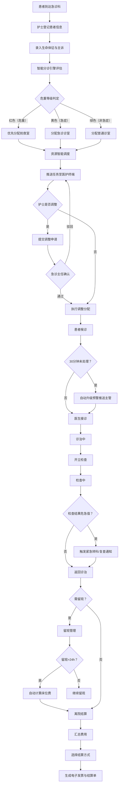

## 1. 产品概述

大型综合医院急诊科分诊与资源智能调度桌面系统，旨在实现急诊患者从入院登记、智能分诊、资源调度、诊治跟踪到费用结算的全流程数字化管理，通过数据驱动的决策引擎优化急诊资源利用率，缩短患者候诊时间，提升危重患者救治效率。

- 目标用户：急诊科护士、医生、急诊主任、收费员、医院管理层
- 核心价值：降低分诊误差率、缩短平均候诊时间、提高危重患者识别准确率、实现急诊资源可视化调度

## 2. 核心功能

### 2.1 用户角色

| 角色 | 登录方式 | 核心权限 |
|------|----------|----------|
| 分诊护士 | 工号+密码 | 患者登记、分诊评估、状态更新、任务调整 |
| 诊治医生 | 工号+密码 | 接诊、开立检查、诊断记录、开具处方 |
| 急诊主任 | 工号+密码 | 审批调整、预警处理、统计查看、月报导出 |
| 收费员 | 工号+密码 | 费用结算、发票打印、医保对接 |
| 系统管理员 | 工号+密码 | 系统配置、科室管理、人员管理 |

### 2.2 功能模块

1. **分诊工作台**：患者信息登记、智能危重等级判定、诊室与医生自动分配、任务推送与调整审批
2. **实时监控面板**：诊室热力图、候诊队列、资源状态看板、超时预警
3. **诊治管理**：接诊记录、检查开立与结果回传、危急值自动处理、留观管理
4. **费用结算中心**：费用自动汇总、多种结算方式、电子发票与结算单生成
5. **统计分析与报表**：多维度统计、急诊质量月报PDF导出、数据可视化

### 2.3 页面详情

| 页面名称 | 模块名称 | 功能描述 |
|----------|----------|----------|
| 登录页 | 身份验证 | 工号密码登录，角色识别，登录后跳转对应工作台 |
| 分诊工作台 | 患者登记表单 | 输入姓名、身份证号、主诉、生命体征（体温/脉搏/呼吸/血压/血氧）、过敏史 |
| 分诊工作台 | 智能分诊引擎 | 根据生命体征异常阈值、主诉关键词匹配、历史数据自动计算危重等级（红/黄/绿） |
| 分诊工作台 | 资源智能分配 | 综合诊室负载、医生资质匹配、设备空闲、留观床位占用推荐最优诊室与医生 |
| 分诊工作台 | 分诊结果确认 | 展示分诊结果，支持护士手动调整（需急诊主任确认），推送任务至医护终端 |
| 实时监控面板 | 诊室热力图 | 诊室布局图上以颜色热度显示各诊室忙闲状态与候诊排队长度 |
| 实时监控面板 | 候诊队列 | 按危重等级排序的候诊列表，实时倒计时，超30分钟未处理红色高亮并升级预警 |
| 实时监控面板 | 资源状态看板 | 医生在岗/忙碌状态、检查设备空闲率、留观床位占用率实时展示 |
| 诊治管理 | 接诊面板 | 患者基本信息与生命体征展示、诊断记录录入、检查开立 |
| 诊治管理 | 检查结果回传 | 检验/影像结果自动接收，危急值对比触发复查或紧急转科通知 |
| 诊治管理 | 状态流转 | 候诊→诊治中→检查中→留观→转院/离院状态切换，时间戳自动记录 |
| 诊治管理 | 留观管理 | 留观患者列表、留观时长监控、超24小时自动计算床位费 |
| 费用结算中心 | 费用汇总 | 药品费、检查费、留观床位费自动汇总，明细展示 |
| 费用结算中心 | 结算处理 | 支持现金、医保、信用卡三种结算方式，生成电子发票和结算单 |
| 统计分析 | 数据统计 | 按时间段/科室/病种统计接诊量、平均停留时长、危重占比、死亡率 |
| 统计分析 | 月报导出 | 生成急诊质量月报PDF，含图表和关键指标 |

## 3. 核心流程

患者到达急诊科后，分诊护士在系统登记患者基本信息和生命体征。系统智能分诊引擎根据生命体征指标（体温>39℃或<35℃、收缩压<90或>180、心率>120或<50、血氧<90%等）、主诉关键词（胸痛、呼吸困难、意识障碍等归为红色；骨折、剧烈疼痛等归为黄色；轻微外伤、普通感冒等归为绿色）及历史接诊数据自动计算危重等级。同时资源调度引擎综合各诊室当前接诊数与容量比、在岗医生资质与患者需求匹配度、检查设备当前空闲窗口、留观床位占用率，自动推荐最优诊室与医生。分诊结果推送至医护终端，护士可调整分配但需急诊主任确认。患者进入候诊后系统实时监控，超30分钟未处理自动升级预警推送主管。检查结果返回后系统自动对比危急值标准，触发复查或紧急转科通知。留观超24小时自动计算床位费。离院时汇总所有费用，支持多种结算方式并生成电子发票。

## 4. 用户界面设计

### 4.1 设计风格

- **主色调**：医疗蓝（#1B6FA8）作为主色，搭配急诊红（#E53935）、预警黄（#FB8C00）、安全绿（#43A047）构成三色分诊色系
- **辅助色**：深灰（#263238）用于背景面板，浅灰（#ECEFF1）用于内容区，白色用于卡片
- **按钮风格**：圆角矩形（8px），主操作按钮实色填充，次要操作描边样式
- **字体**：标题使用 Noto Sans SC Bold，正文使用 Noto Sans SC Regular，数字使用 JetBrains Mono
- **布局风格**：左侧导航栏 + 顶部工具条 + 主内容区的经典管理系统布局，卡片化信息展示
- **图标风格**：线性图标（Lucide Icons），2px描边

### 4.2 页面设计概览

| 页面名称 | 模块名称 | UI元素 |
|----------|----------|--------|
| 登录页 | 身份验证 | 居中卡片式登录框，医疗蓝渐变背景，医院LOGO，工号/密码输入框，登录按钮 |
| 分诊工作台 | 患者登记表单 | 左侧表单区（分步骤表单：基本信息→生命体征→过敏史→主诉），右侧实时分诊建议面板 |
| 分诊工作台 | 分诊结果 | 三色卡片展示（红/黄/绿），推荐诊室与医生信息，确认/调整按钮，调整弹窗含审批流程 |
| 实时监控面板 | 诊室热力图 | 中央区域为诊室平面布局图，各诊室以色温表示忙闲（绿色空闲→黄色忙碌→红色满载），标注排队人数 |
| 实时监控面板 | 候诊队列 | 按危重等级分组的列表，红色置顶，每条显示患者姓名、等待时长、倒计时，超时项闪烁 |
| 实时监控面板 | 资源看板 | 顶部统计卡片（医生在岗/总数、设备空闲率、床位占用率），下方医生列表含状态标签 |
| 诊治管理 | 接诊面板 | 左侧患者信息卡，中间诊断记录区，右侧快捷操作栏（开检查、开处方、转留观、转科） |
| 诊治管理 | 检查结果 | 检查项列表，结果值高亮异常，危急值红色弹窗提示，一键复查/转科按钮 |
| 诊治管理 | 留观管理 | 留观患者表格，列含床位号、入观时间、已留观时长、费用累计，超24h行标黄 |
| 费用结算中心 | 费用汇总 | 费用明细表格（药品/检查/留观分类），底部合计金额，右侧结算操作区 |
| 费用结算中心 | 结算处理 | 结算弹窗，三种支付方式选项卡，医保自动计算报销金额，确认后生成发票预览 |
| 统计分析 | 数据统计 | 顶部筛选器（时间段/科室/病种），图表区（柱状图/折线图/饼图），数据表格 |
| 统计分析 | 月报导出 | 月报预览页面，含封面、目录、各指标图表及分析文字，导出PDF按钮 |

### 4.3 响应式设计

- 桌面端优先设计，最低支持1366×768分辨率
- 主内容区支持弹性布局，窗口缩小时侧边栏可折叠
- 热力图与图表区域自适应容器宽度

## 5. 智能分诊规则

### 5.1 危重等级判定规则

| 等级 | 颜色 | 生命体征标准 | 主诉关键词 | 建议处置 |
|------|------|-------------|-----------|----------|
| Ⅰ级 | 红色 | 体温>39.5℃或<35℃；收缩压<90mmHg或>180mmHg；心率>130或<45；呼吸>30或<10；血氧<88% | 心脏骤停、呼吸困难、意识障碍、大出血、严重创伤、休克 | 立即抢救室 |
| Ⅱ级 | 黄色 | 体温38.5-39.5℃；收缩压90-100或160-180；心率110-130；呼吸24-30；血氧88-92% | 胸痛、骨折、剧烈腹痛、高热、中度烧伤 | 30分钟内诊治 |
| Ⅲ级 | 绿色 | 生命体征基本正常 | 普通感冒、轻微外伤、皮疹、慢性病复诊 | 常规排队 |

### 5.2 资源调度规则

- 优先分配空闲且资质匹配的诊室
- 危重等级越高分配优先级越高
- 负载超过80%的诊室不再分配新患者
- 医生资质需匹配患者病种需求
- 留观床位占用超过90%时触发扩容预警
