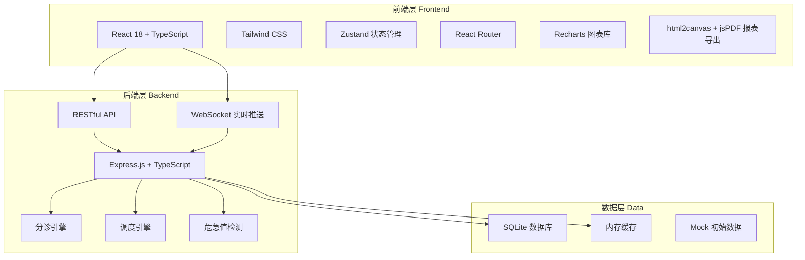
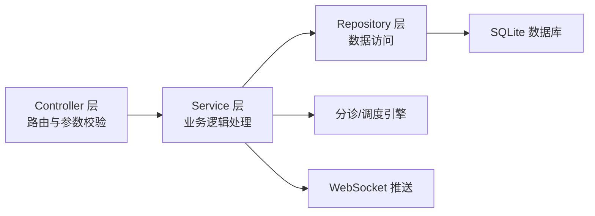
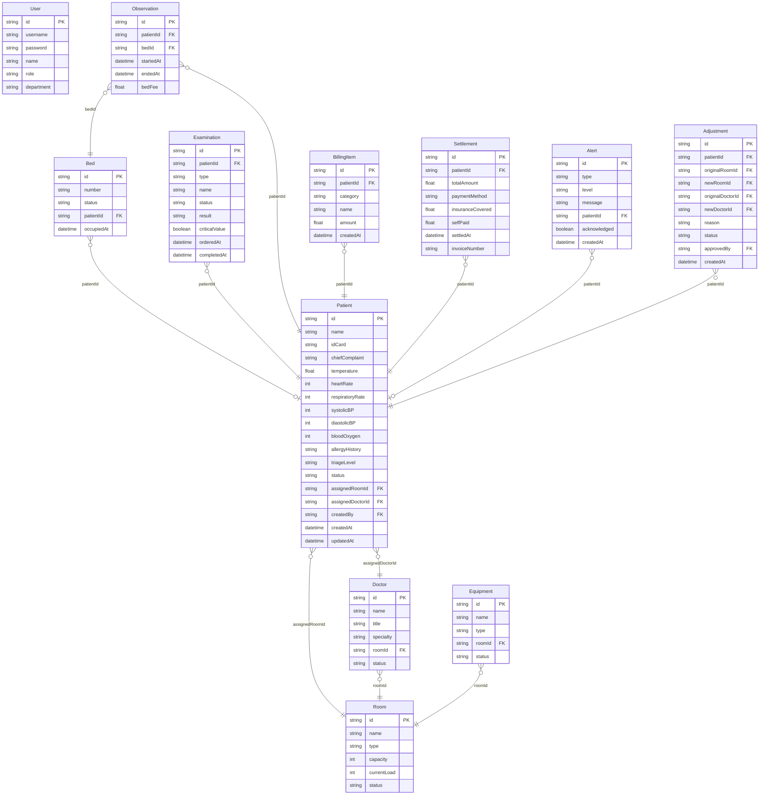

## 1. 架构设计



## 2. 技术说明

- **前端**：React@18 + TailwindCSS@3 + Vite
- **初始化工具**：vite-init（react-express-ts 模板）
- **后端**：Express@4 + TypeScript（ESM格式）
- **数据库**：SQLite（better-sqlite3），内嵌式无需额外安装
- **状态管理**：Zustand
- **图表**：Recharts
- **PDF导出**：jsPDF + html2canvas
- **实时通信**：WebSocket（ws库）
- **路由**：React Router DOM v6

## 3. 路由定义

| 路由 | 用途 |
|------|------|
| /login | 登录页面，身份验证 |
| /triage | 分诊工作台，患者登记与智能分诊 |
| /monitor | 实时监控面板，热力图与资源看板 |
| /treatment | 诊治管理，接诊与检查 |
| /observation | 留观管理，留观患者列表与费用 |
| /billing | 费用结算中心，结算与发票 |
| /statistics | 统计分析，数据图表与月报导出 |

## 4. API 定义

### 4.1 认证相关

```typescript
POST   /api/auth/login          { username: string; password: string } => { token: string; user: User }
POST   /api/auth/logout         {} => { success: boolean }
GET    /api/auth/me             {} => { user: User }
```

### 4.2 患者与分诊

```typescript
GET    /api/patients            { page?: number; status?: string; level?: string } => { data: Patient[]; total: number }
GET    /api/patients/:id        {} => Patient
POST   /api/patients            CreatePatientDTO => Patient & { triageResult: TriageResult }
PUT    /api/patients/:id        UpdatePatientDTO => Patient
PUT    /api/patients/:id/status { status: PatientStatus } => Patient
POST   /api/patients/:id/triage TriageDTO => TriageResult
POST   /api/patients/:id/adjust { roomId: string; doctorId: string; reason: string } => AdjustmentResult
POST   /api/patients/:id/approve { adjustmentId: string; approved: boolean } => ApprovalResult
```

### 4.3 诊室与资源

```typescript
GET    /api/rooms               {} => Room[]
GET    /api/rooms/:id/status    {} => RoomStatus
GET    /api/doctors             {} => Doctor[]
GET    /api/doctors/:id/status  {} => DoctorStatus
GET    /api/equipment           {} => Equipment[]
GET    /api/beds                {} => Bed[]
GET    /api/resources/overview  {} => ResourceOverview
```

### 4.4 检查与危急值

```typescript
GET    /api/examinations        { patientId?: string } => Examination[]
POST   /api/examinations        CreateExaminationDTO => Examination
PUT    /api/examinations/:id/result { result: ExaminationResult } => Examination
GET    /api/critical-values     {} => CriticalValueRule[]
POST   /api/critical-values/check { examinationId: string } => CriticalValueCheckResult
```

### 4.5 留观与费用

```typescript
GET    /api/observations        {} => Observation[]
POST   /api/observations        { patientId: string; bedId: string } => Observation
PUT    /api/observations/:id    UpdateObservationDTO => Observation
GET    /api/billing/:patientId  {} => BillingSummary
POST   /api/billing/:patientId/settle SettleDTO => SettlementResult
GET    /api/billing/:patientId/invoice {} => Invoice
```

### 4.6 统计与报表

```typescript
GET    /api/statistics/overview  { startDate: string; endDate: string } => StatisticsOverview
GET    /api/statistics/by-department { startDate: string; endDate: string } => DepartmentStats[]
GET    /api/statistics/by-diagnosis  { startDate: string; endDate: string } => DiagnosisStats[]
GET    /api/statistics/monthly-report { year: number; month: number } => MonthlyReportData
POST   /api/statistics/export-pdf    { year: number; month: number } => PDFBuffer
```

### 4.7 预警

```typescript
GET    /api/alerts              {} => Alert[]
PUT    /api/alerts/:id/acknowledge {} => Alert
GET    /api/alerts/timeout-check  {} => { newAlerts: number }
```

## 5. 服务器架构图



## 6. 数据模型

### 6.1 数据模型定义



### 6.2 数据定义语言

```sql
CREATE TABLE users (
    id TEXT PRIMARY KEY,
    username TEXT NOT NULL UNIQUE,
    password TEXT NOT NULL,
    name TEXT NOT NULL,
    role TEXT NOT NULL CHECK(role IN ('nurse','doctor','director','cashier','admin')),
    department TEXT
);

CREATE TABLE rooms (
    id TEXT PRIMARY KEY,
    name TEXT NOT NULL,
    type TEXT NOT NULL CHECK(type IN ('rescue','emergency','general')),
    capacity INTEGER NOT NULL DEFAULT 1,
    current_load INTEGER NOT NULL DEFAULT 0,
    status TEXT NOT NULL DEFAULT 'available' CHECK(status IN ('available','busy','full','maintenance'))
);

CREATE TABLE doctors (
    id TEXT PRIMARY KEY,
    name TEXT NOT NULL,
    title TEXT NOT NULL,
    specialty TEXT NOT NULL,
    room_id TEXT REFERENCES rooms(id),
    status TEXT NOT NULL DEFAULT 'available' CHECK(status IN ('available','busy','off'))
);

CREATE TABLE equipment (
    id TEXT PRIMARY KEY,
    name TEXT NOT NULL,
    type TEXT NOT NULL CHECK(type IN ('lab','imaging','other')),
    room_id TEXT REFERENCES rooms(id),
    status TEXT NOT NULL DEFAULT 'idle' CHECK(status IN ('idle','in_use','maintenance'))
);

CREATE TABLE beds (
    id TEXT PRIMARY KEY,
    number TEXT NOT NULL UNIQUE,
    status TEXT NOT NULL DEFAULT 'empty' CHECK(status IN ('empty','occupied')),
    patient_id TEXT REFERENCES patients(id),
    occupied_at DATETIME
);

CREATE TABLE patients (
    id TEXT PRIMARY KEY,
    name TEXT NOT NULL,
    id_card TEXT NOT NULL,
    chief_complaint TEXT NOT NULL,
    temperature REAL,
    heart_rate INTEGER,
    respiratory_rate INTEGER,
    systolic_bp INTEGER,
    diastolic_bp INTEGER,
    blood_oxygen INTEGER,
    allergy_history TEXT,
    triage_level TEXT CHECK(triage_level IN ('red','yellow','green')),
    status TEXT NOT NULL DEFAULT 'waiting' CHECK(status IN ('waiting','treating','examining','observation','transfer','discharged')),
    assigned_room_id TEXT REFERENCES rooms(id),
    assigned_doctor_id TEXT REFERENCES doctors(id),
    created_by TEXT REFERENCES users(id),
    created_at DATETIME NOT NULL DEFAULT CURRENT_TIMESTAMP,
    updated_at DATETIME NOT NULL DEFAULT CURRENT_TIMESTAMP
);

CREATE TABLE examinations (
    id TEXT PRIMARY KEY,
    patient_id TEXT NOT NULL REFERENCES patients(id),
    type TEXT NOT NULL CHECK(type IN ('lab','imaging')),
    name TEXT NOT NULL,
    status TEXT NOT NULL DEFAULT 'ordered' CHECK(status IN ('ordered','in_progress','completed')),
    result TEXT,
    result_value REAL,
    critical_value INTEGER NOT NULL DEFAULT 0,
    ordered_at DATETIME NOT NULL DEFAULT CURRENT_TIMESTAMP,
    completed_at DATETIME
);

CREATE TABLE observations (
    id TEXT PRIMARY KEY,
    patient_id TEXT NOT NULL REFERENCES patients(id),
    bed_id TEXT NOT NULL REFERENCES beds(id),
    started_at DATETIME NOT NULL DEFAULT CURRENT_TIMESTAMP,
    ended_at DATETIME,
    bed_fee REAL NOT NULL DEFAULT 0
);

CREATE TABLE billing_items (
    id TEXT PRIMARY KEY,
    patient_id TEXT NOT NULL REFERENCES patients(id),
    category TEXT NOT NULL CHECK(category IN ('drug','examination','observation','other')),
    name TEXT NOT NULL,
    amount REAL NOT NULL,
    created_at DATETIME NOT NULL DEFAULT CURRENT_TIMESTAMP
);

CREATE TABLE settlements (
    id TEXT PRIMARY KEY,
    patient_id TEXT NOT NULL REFERENCES patients(id),
    total_amount REAL NOT NULL,
    payment_method TEXT NOT NULL CHECK(payment_method IN ('cash','insurance','credit_card')),
    insurance_covered REAL NOT NULL DEFAULT 0,
    self_paid REAL NOT NULL,
    settled_at DATETIME NOT NULL DEFAULT CURRENT_TIMESTAMP,
    invoice_number TEXT NOT NULL UNIQUE
);

CREATE TABLE alerts (
    id TEXT PRIMARY KEY,
    type TEXT NOT NULL CHECK(type IN ('timeout','critical_value','bed_capacity','adjustment')),
    level TEXT NOT NULL CHECK(level IN ('warning','urgent','critical')),
    message TEXT NOT NULL,
    patient_id TEXT REFERENCES patients(id),
    acknowledged INTEGER NOT NULL DEFAULT 0,
    created_at DATETIME NOT NULL DEFAULT CURRENT_TIMESTAMP
);

CREATE TABLE adjustments (
    id TEXT PRIMARY KEY,
    patient_id TEXT NOT NULL REFERENCES patients(id),
    original_room_id TEXT REFERENCES rooms(id),
    new_room_id TEXT REFERENCES rooms(id),
    original_doctor_id TEXT REFERENCES doctors(id),
    new_doctor_id TEXT REFERENCES doctors(id),
    reason TEXT NOT NULL,
    status TEXT NOT NULL DEFAULT 'pending' CHECK(status IN ('pending','approved','rejected')),
    approved_by TEXT REFERENCES users(id),
    created_at DATETIME NOT NULL DEFAULT CURRENT_TIMESTAMP
);

CREATE INDEX idx_patients_status ON patients(status);
CREATE INDEX idx_patients_triage_level ON patients(triage_level);
CREATE INDEX idx_patients_created_at ON patients(created_at);
CREATE INDEX idx_examinations_patient ON examinations(patient_id);
CREATE INDEX idx_alerts_acknowledged ON alerts(acknowledged);
CREATE INDEX idx_billing_patient ON billing_items(patient_id);
```
