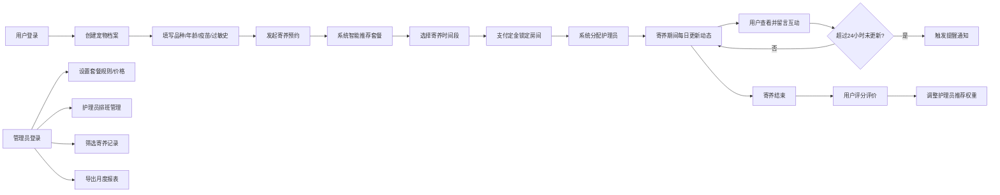

## 1. 产品概述

宠物健康管理与寄养预约系统是一个一站式宠物服务平台，解决宠物主人在出行期间的宠物寄养需求，同时提供专业的健康档案管理。目标用户为养宠家庭和专业宠物寄养机构，通过智能推荐、实时互动和数据化管理，提升寄养服务体验和运营效率。

## 2. 核心功能

### 2.1 用户角色

| 角色 | 注册方式 | 核心权限 |
|------|----------|----------|
| 普通用户 | 手机号/邮箱注册 | 宠物档案管理、寄养预约、互动留言、评价护理员 |
| 护理员 | 管理员邀请 | 查看分配任务、上传宠物动态、回复用户留言 |
| 管理员 | 后台账号登录 | 套餐管理、护理员排班、数据统计、报表导出 |

### 2.2 功能模块

1. **首页看板**：房间状态实时展示、入住率统计、待处理提醒、10秒自动刷新
2. **宠物档案**：宠物信息录入（品种、年龄、体重）、疫苗记录、过敏史管理
3. **寄养预约**：智能套餐推荐、房间选择、时间段选择、定金支付、房间锁定、护理员分配
4. **寄养互动**：每日动态上传、照片/短视频展示、留言互动、24小时未更新提醒
5. **评价系统**：护理员评分、文字评价、推荐权重动态调整
6. **管理后台**：套餐规则设置、价格管理、护理员排班、寄养记录筛选、报表导出

### 2.3 页面详情

| 页面名称 | 模块名称 | 功能描述 |
|----------|----------|----------|
| 首页看板 | 实时数据面板 | 房间占用状态热力图、今日入住率、待处理提醒数量、10秒自动刷新 |
| 首页看板 | 快捷入口 | 快速预约、宠物档案、我的寄养、管理后台入口 |
| 宠物档案列表 | 档案卡片 | 展示宠物头像、基本信息、健康状态标签 |
| 宠物档案编辑 | 信息表单 | 品种、年龄、体重、疫苗接种记录、过敏史录入与编辑 |
| 寄养预约 | 套餐推荐 | 根据宠物特征和空位自动推荐经济型/豪华型套餐，显示价格和房间 |
| 寄养预约 | 时间选择 | 日期范围选择器、冲突检测、定金计算 |
| 寄养预约 | 护理员展示 | 智能分配的护理员信息、历史评分、宠物照片 |
| 寄养详情 | 动态时间线 | 每日上传的照片/视频、时间戳、护理员备注 |
| 寄养详情 | 留言互动 | 用户留言、护理员回复、实时更新 |
| 评价页面 | 评分组件 | 星级评分、文字评价、提交确认 |
| 管理后台 | 套餐管理 | 增删改查寄养套餐、价格设置、规则配置 |
| 管理后台 | 排班管理 | 护理员排班表、班次调整、请假处理 |
| 管理后台 | 记录筛选 | 按时间段/护理员/套餐类型筛选寄养记录 |
| 管理后台 | 报表导出 | 月度营收报表、护理员服务明细报表一键导出 |

## 3. 核心流程

用户创建宠物档案后发起寄养预约，系统根据宠物特征和当前空位智能推荐套餐，用户选择时间段并支付定金后，系统自动锁定房间并分配护理员。寄养期间护理员每日上传动态，用户可查看互动，超过24小时未更新自动提醒。寄养结束后用户评价，系统动态调整护理员推荐权重。管理员可进行套餐、排班管理及报表导出。

## 4. 界面设计

### 4.1 设计风格

- **主色调**：温暖的橙色系 (#FF7A45)，传达关爱与活力
- **辅助色**：薄荷绿 (#4ECDC4) 表示健康状态，暖黄色 (#FFE66D) 用于提醒
- **中性色**：深灰 (#2C3E50) 正文，浅灰 (#F8F9FA) 背景
- **按钮风格**：圆润边角 (12px)、柔和阴影、悬停微放大效果
- **字体**：标题使用 'Noto Sans SC' 700，正文使用 'Noto Sans SC' 400
- **布局风格**：卡片式布局，柔和阴影，圆角设计，充足留白
- **图标风格**：线性图标搭配彩色填充，统一圆角风格

### 4.2 页面设计概览

| 页面名称 | 模块名称 | UI元素 |
|----------|----------|--------|
| 首页看板 | 数据面板 | 渐变色卡片、实时数字跳动动画、房间状态网格、脉冲提醒标记 |
| 宠物档案 | 档案卡片 | 宠物圆形头像、健康标签徽章、疫苗进度条、过敏警示图标 |
| 寄养预约 | 套餐推荐 | 卡片对比布局、价格高亮、推荐标签动画、房间状态图例 |
| 寄养互动 | 时间线 | 垂直时间轴、照片网格、消息气泡、未读红点标记 |
| 管理后台 | 数据表格 | 斑马纹表格、操作按钮组、筛选标签、导出按钮悬浮效果 |
| 管理后台 | 报表中心 | 图表占位区、下载动画、时间范围选择器 |

### 4.3 响应式设计

- 采用桌面优先设计，适配 1440px 及以上屏幕
- 平板端 (768px)：侧边栏收起为图标菜单，卡片单列布局
- 移动端 (375px)：底部导航栏，全屏模态表单，单列瀑布流
- 所有交互元素最小触摸区域 44x44px

### 4.4 交互动效

- 页面加载：元素从上到下渐入，stagger 延迟 100ms
- 数据刷新：数字滚动动画，进度条平滑过渡
- 卡片悬停：上移 4px，阴影加深，背景微亮
- 按钮点击：缩放 0.95，快速回弹
- 提醒通知：从顶部滑入，轻微震动动画
- 时间线更新：新内容从底部滑入，高亮闪烁 2 秒
