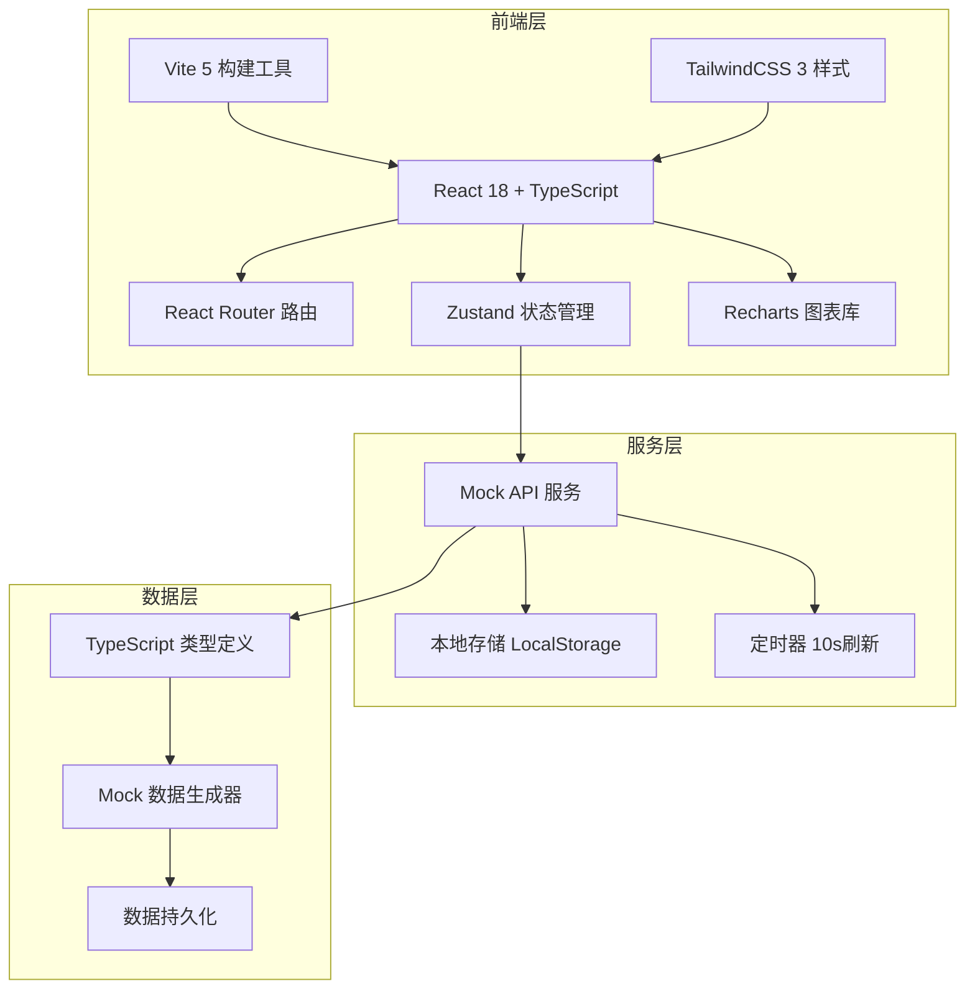
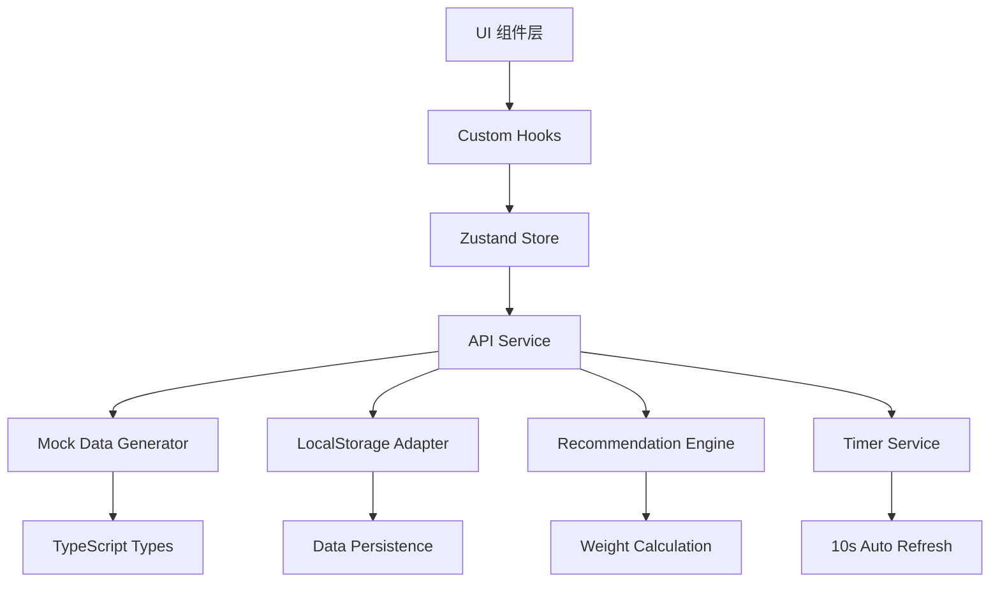
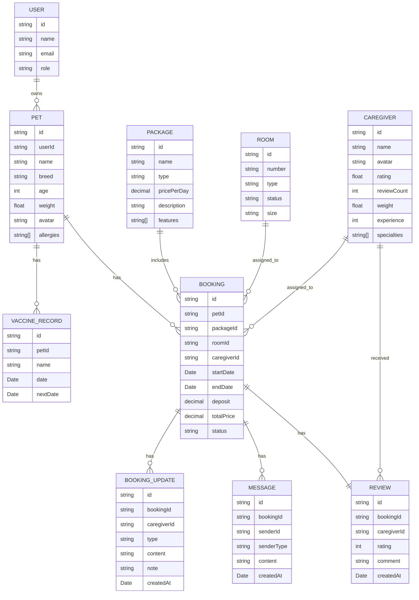

## 1. 架构设计



## 2. 技术描述

- **前端框架**：React@18 + TypeScript@5，类型安全的组件开发
- **构建工具**：Vite@5，快速热更新和构建
- **样式方案**：TailwindCSS@3 + CSS Variables，主题化定制
- **路由管理**：React Router DOM@6，嵌套路由和懒加载
- **状态管理**：Zustand@4，轻量级状态管理
- **图表组件**：Recharts@2，数据可视化
- **图标库**：Lucide React，线性图标
- **日期处理**：date-fns，日期格式化和计算
- **后端**：无，使用 Mock API + LocalStorage 模拟后端
- **数据库**：LocalStorage 持久化存储

## 3. 路由定义

| 路由路径 | 页面/组件 | 权限 | 说明 |
|----------|----------|------|------|
| `/` | Dashboard 首页看板 | 公开 | 实时数据展示、快捷入口 |
| `/pets` | PetList 宠物档案列表 | 用户 | 宠物档案卡片列表 |
| `/pets/new` | PetForm 新建宠物档案 | 用户 | 宠物信息表单 |
| `/pets/:id/edit` | PetForm 编辑宠物档案 | 用户 | 编辑已存在的宠物信息 |
| `/booking` | BookingPage 寄养预约 | 用户 | 套餐推荐、时间选择、护理员展示 |
| `/booking/:id` | BookingDetail 寄养详情 | 用户 | 动态时间线、留言互动 |
| `/booking/:id/review` | ReviewPage 评价页面 | 用户 | 护理员评分和文字评价 |
| `/admin` | AdminDashboard 管理后台首页 | 管理员 | 数据概览、快捷操作 |
| `/admin/packages` | PackageManager 套餐管理 | 管理员 | 寄养套餐增删改查 |
| `/admin/schedule` | ScheduleManager 排班管理 | 管理员 | 护理员排班表 |
| `/admin/records` | RecordList 寄养记录 | 管理员 | 寄养记录筛选和查看 |
| `/admin/reports` | ReportCenter 报表中心 | 管理员 | 报表导出功能 |
| `/login` | LoginPage 登录页 | 公开 | 角色选择登录 |

## 4. API 定义

```typescript
// 宠物档案
interface Pet {
  id: string;
  name: string;
  breed: string;
  age: number;
  weight: number;
  avatar: string;
  vaccineRecords: VaccineRecord[];
  allergies: string[];
  createdAt: Date;
  updatedAt: Date;
}

interface VaccineRecord {
  id: string;
  name: string;
  date: Date;
  nextDate: Date;
}

// 寄养套餐
interface Package {
  id: string;
  name: string;
  type: 'economy' | 'luxury';
  pricePerDay: number;
  description: string;
  features: string[];
  roomIds: string[];
}

// 房间
interface Room {
  id: string;
  number: string;
  type: 'economy' | 'luxury';
  status: 'available' | 'occupied' | 'locked' | 'maintenance';
  size: string;
  image: string;
}

// 护理员
interface Caregiver {
  id: string;
  name: string;
  avatar: string;
  rating: number;
  reviewCount: number;
  weight: number;
  specialties: string[];
  experience: number;
  petPhotos: string[];
}

// 寄养预约
interface Booking {
  id: string;
  petId: string;
  packageId: string;
  roomId: string;
  caregiverId: string;
  startDate: Date;
  endDate: Date;
  deposit: number;
  totalPrice: number;
  status: 'pending' | 'confirmed' | 'in-progress' | 'completed' | 'cancelled';
  updates: BookingUpdate[];
  messages: Message[];
  review: Review | null;
  createdAt: Date;
}

interface BookingUpdate {
  id: string;
  bookingId: string;
  caregiverId: string;
  type: 'photo' | 'video';
  content: string;
  note: string;
  createdAt: Date;
}

interface Message {
  id: string;
  senderId: string;
  senderType: 'user' | 'caregiver';
  content: string;
  createdAt: Date;
}

interface Review {
  id: string;
  bookingId: string;
  caregiverId: string;
  rating: number;
  comment: string;
  createdAt: Date;
}

// API 接口类型
interface ApiResponse<T> {
  data: T;
  success: boolean;
  message: string;
}

interface DashboardStats {
  occupiedRooms: number;
  totalRooms: number;
  occupancyRate: number;
  pendingReminders: number;
  todayCheckIns: number;
  todayCheckOuts: number;
}
```

## 5. 服务层架构



服务层采用分层架构：
- **Custom Hooks**：封装业务逻辑，如 useDashboard、useBooking
- **Zustand Store**：全局状态管理，存储用户、宠物、预约等数据
- **API Service**：统一的 API 调用层，模拟后端接口
- **Mock Data Generator**：生成逼真的模拟数据
- **LocalStorage Adapter**：数据持久化适配器
- **Recommendation Engine**：智能推荐引擎，根据宠物特征推荐套餐和分配护理员
- **Timer Service**：定时器服务，处理10秒自动刷新和24小时提醒

## 6. 数据模型

### 6.1 ER 图



### 6.2 数据初始化

```typescript
// 初始化 Mock 数据
const initializeMockData = () => {
  // 初始化房间数据 - 12间房间
  const rooms: Room[] = [
    { id: 'r1', number: '101', type: 'economy', status: 'available', size: '8㎡', image: 'room1.jpg' },
    { id: 'r2', number: '102', type: 'economy', status: 'occupied', size: '8㎡', image: 'room2.jpg' },
    { id: 'r3', number: '103', type: 'economy', status: 'available', size: '8㎡', image: 'room3.jpg' },
    { id: 'r4', number: '104', type: 'economy', status: 'locked', size: '8㎡', image: 'room4.jpg' },
    { id: 'r5', number: '105', type: 'economy', status: 'maintenance', size: '8㎡', image: 'room5.jpg' },
    { id: 'r6', number: '106', type: 'economy', status: 'available', size: '8㎡', image: 'room6.jpg' },
    { id: 'r7', number: '201', type: 'luxury', status: 'occupied', size: '15㎡', image: 'room7.jpg' },
    { id: 'r8', number: '202', type: 'luxury', status: 'available', size: '15㎡', image: 'room8.jpg' },
    { id: 'r9', number: '203', type: 'luxury', status: 'occupied', size: '15㎡', image: 'room9.jpg' },
    { id: 'r10', number: '204', type: 'luxury', status: 'available', size: '15㎡', image: 'room10.jpg' },
    { id: 'r11', number: '205', type: 'luxury', status: 'available', size: '15㎡', image: 'room11.jpg' },
    { id: 'r12', number: '206', type: 'luxury', status: 'locked', size: '15㎡', image: 'room12.jpg' },
  ];

  // 初始化套餐数据
  const packages: Package[] = [
    {
      id: 'p1',
      name: '经济型套餐',
      type: 'economy',
      pricePerDay: 88,
      description: '基础寄养服务，适合健康活泼的宠物',
      features: ['独立笼舍', '每日两餐', '定时遛弯', '基础健康检查'],
      roomIds: ['r1', 'r2', 'r3', 'r4', 'r5', 'r6'],
    },
    {
      id: 'p2',
      name: '豪华型套餐',
      type: 'luxury',
      pricePerDay: 188,
      description: '尊享寄养服务，独立大空间，专人护理',
      features: ['豪华套房', '定制饮食', '专人陪伴', '每日视频', '美容护理', '健康监测'],
      roomIds: ['r7', 'r8', 'r9', 'r10', 'r11', 'r12'],
    },
  ];

  // 初始化护理员数据
  const caregivers: Caregiver[] = [
    {
      id: 'c1',
      name: '张小花',
      avatar: 'caregiver1.jpg',
      rating: 4.9,
      reviewCount: 128,
      weight: 95,
      specialties: ['狗狗', '猫咪', '老年宠物'],
      experience: 5,
      petPhotos: ['pet1.jpg', 'pet2.jpg', 'pet3.jpg'],
    },
    {
      id: 'c2',
      name: '李大明',
      avatar: 'caregiver2.jpg',
      rating: 4.7,
      reviewCount: 95,
      weight: 85,
      specialties: ['大型犬', '训练'],
      experience: 3,
      petPhotos: ['pet4.jpg', 'pet5.jpg'],
    },
    {
      id: 'c3',
      name: '王萌萌',
      avatar: 'caregiver3.jpg',
      rating: 4.8,
      reviewCount: 156,
      weight: 90,
      specialties: ['猫咪', '幼宠', '特殊需求'],
      experience: 4,
      petPhotos: ['pet6.jpg', 'pet7.jpg', 'pet8.jpg'],
    },
  ];

  // 保存到 LocalStorage
  localStorage.setItem('rooms', JSON.stringify(rooms));
  localStorage.setItem('packages', JSON.stringify(packages));
  localStorage.setItem('caregivers', JSON.stringify(caregivers));
};
```
