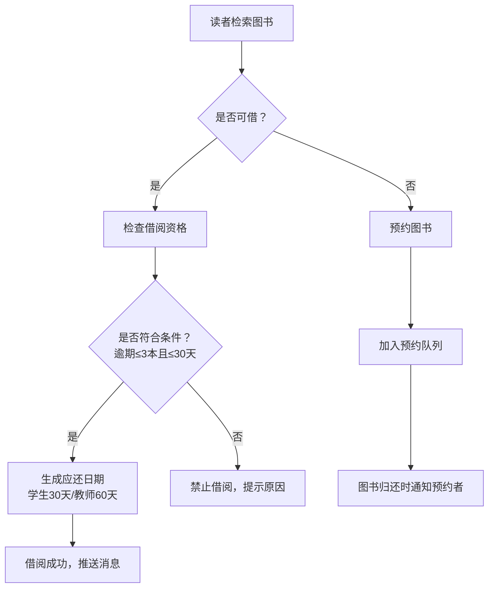

## 1. 产品概述
高校图书馆图书借阅与智能管理系统，为读者提供在线检索、借阅、续借、预约等服务，为管理员提供图书管理、统计报表等功能，实现图书馆业务的数字化、智能化管理。

## 2. 核心功能

### 2.1 用户角色
| 角色 | 登录方式 | 核心权限 |
|------|----------|----------|
| 学生/教师读者 | 账号密码登录 | 图书检索、借阅、续借、预约、查看个人借阅记录、支付罚款 |
| 管理员 | 账号密码登录 | 图书管理、借还书操作、Excel批量导入导出、查看统计报表、系统设置 |

### 2.2 功能模块
1. **登录页**：角色选择、账号登录
2. **读者首页**：图书检索、热门图书、借阅提醒
3. **图书详情页**：图书信息、馆藏状态、借阅/预约操作
4. **个人中心**：借阅记录、预约记录、罚款记录、消息中心
5. **管理员首页**：数据概览、快捷操作入口
6. **图书管理页**：图书列表、新增/编辑图书、Excel批量导入
7. **借还管理页**：借书、还书、损坏检查、罚款计算
8. **统计报表页**：热门图书排行、借阅量对比、逾期率统计、报表导出

### 2.3 页面详情
| 页面名称 | 模块名称 | 功能描述 |
|----------|----------|----------|
| 登录页 | 角色选择模块 | 切换读者/管理员角色 |
| 登录页 | 登录表单 | 账号密码输入、登录验证 |
| 读者首页 | 搜索栏 | 图书关键词搜索、分类筛选 |
| 读者首页 | 热门图书 | 展示热门图书排行榜 |
| 读者首页 | 借阅提醒 | 到期提醒、逾期提醒 |
| 图书详情页 | 图书信息 | 书名、作者、ISBN、简介等 |
| 图书详情页 | 馆藏状态 | 可借数量、已借出数量、馆藏位置 |
| 图书详情页 | 操作区 | 借阅、预约按钮及状态判断 |
| 个人中心 | 借阅记录 | 当前借阅、历史记录、续借操作 |
| 个人中心 | 预约记录 | 预约状态、取书提醒 |
| 个人中心 | 罚款记录 | 罚款明细、在线支付 |
| 个人中心 | 消息中心 | 系统消息、借阅提醒、预约通知 |
| 管理员首页 | 数据概览 | 今日借阅量、在借图书数、逾期数 |
| 图书管理页 | 图书列表 | 分页展示、搜索筛选 |
| 图书管理页 | 批量操作 | Excel导入导出 |
| 借还管理页 | 借书操作 | 读者验证、借阅规则检查 |
| 借还管理页 | 还书操作 | 损坏程度选择、赔偿计算 |
| 统计报表页 | 数据可视化 | 图表展示各类统计数据 |

## 3. 核心流程

### 3.1 图书借阅流程
读者检索图书 → 选择可借图书 → 系统检查借阅资格（逾期数量≤3本且逾期天数≤30天）→ 校验通过 → 根据读者身份生成应还日期（学生30天/教师60天）→ 借阅成功 → 推送消息提醒

### 3.2 图书续借流程
读者在个人中心查看借阅记录 → 点击续借按钮 → 检查是否已续借过 → 续借成功延长15天 → 更新应还日期 → 推送消息提醒

### 3.3 图书预约流程
读者检索到已借出图书 → 点击预约 → 预约成功加入等待队列 → 图书归还时 → 系统自动通知预约者 → 保留24小时取书时间

### 3.4 还书与赔偿流程
管理员扫描图书 → 检查损坏程度 → 系统计算赔偿金额（无损坏/轻微/中度/严重）→ 生成罚款单 → 读者支付 → 更新状态 → 推送消息提醒

## 4. 用户界面设计

### 4.1 设计风格
- 主色调：深蓝色 (#165DFF) 代表学术、专业、可信赖
- 辅助色：金黄色 (#FFAA00) 用于提醒、警告
- 成功色：翠绿色 (#00B42A)
- 错误色：珊瑚红 (#F53F3F)
- 按钮风格：圆角 8px，悬停有微动画效果
- 字体：使用思源宋体（标题）+ 思源黑体（正文），体现学术氛围
- 布局风格：卡片式布局，顶部导航 + 侧边栏（管理员）
- 图标风格：线性图标，简洁专业

### 4.2 页面设计概述
| 页面名称 | 模块名称 | UI 元素 |
|----------|----------|---------|
| 登录页 | 登录区域 | 居中卡片、渐变背景、角色切换Tab、输入框动画 |
| 读者首页 | 搜索区 | 大搜索框、分类标签、搜索建议下拉 |
| 读者首页 | 热门排行 | 排行榜卡片、排名序号样式、hover动效 |
| 图书详情页 | 信息展示 | 图书封面、信息网格、状态标签 |
| 个人中心 | 侧边导航 | 菜单项、激活状态指示 |
| 管理员首页 | 数据卡片 | 数字动画、趋势指标、图标 |
| 统计报表页 | 图表区 | ECharts图表、数据筛选器、导出按钮 |

### 4.3 响应式
- 桌面端（≥1280px）：完整布局，侧边栏展开
- 平板端（768px-1279px）：侧边栏可折叠，网格自适应
- 移动端（<768px）：顶部导航转为汉堡菜单，卡片单列布局

## 5. 系统特色功能

### 5.1 智能借阅规则
- 自动检查逾期数量和逾期天数
- 超出限制自动禁止借阅并提示原因

### 5.2 消息推送系统
- 到期前3天推送还书提醒
- 借阅/续借/预约/罚款实时消息推送
- 图书归还时自动通知预约者

### 5.3 自动化统计
- 每月1号自动生成月度统计
- 热门图书排行榜
- 各类型读者借阅量对比
- 逾期率统计分析
- 推送到管理员端

### 5.4 批量操作
- Excel批量导入图书信息
- 导出月度统计报表
