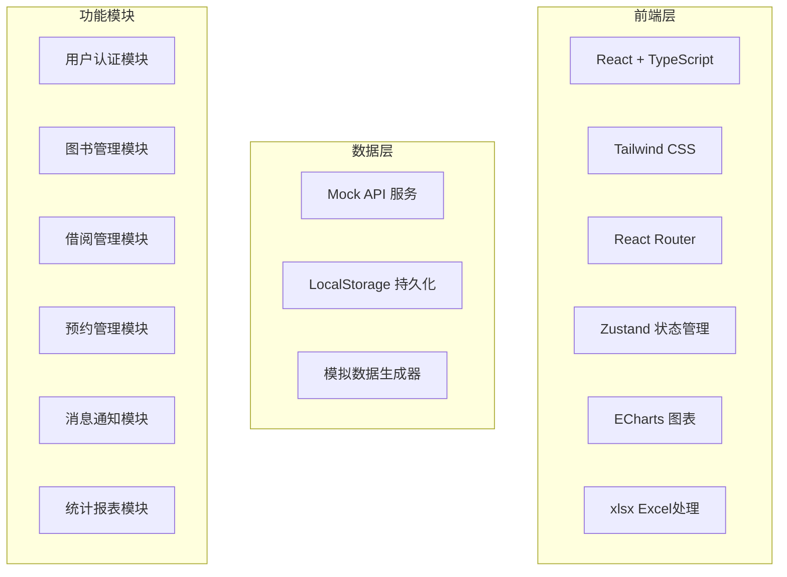
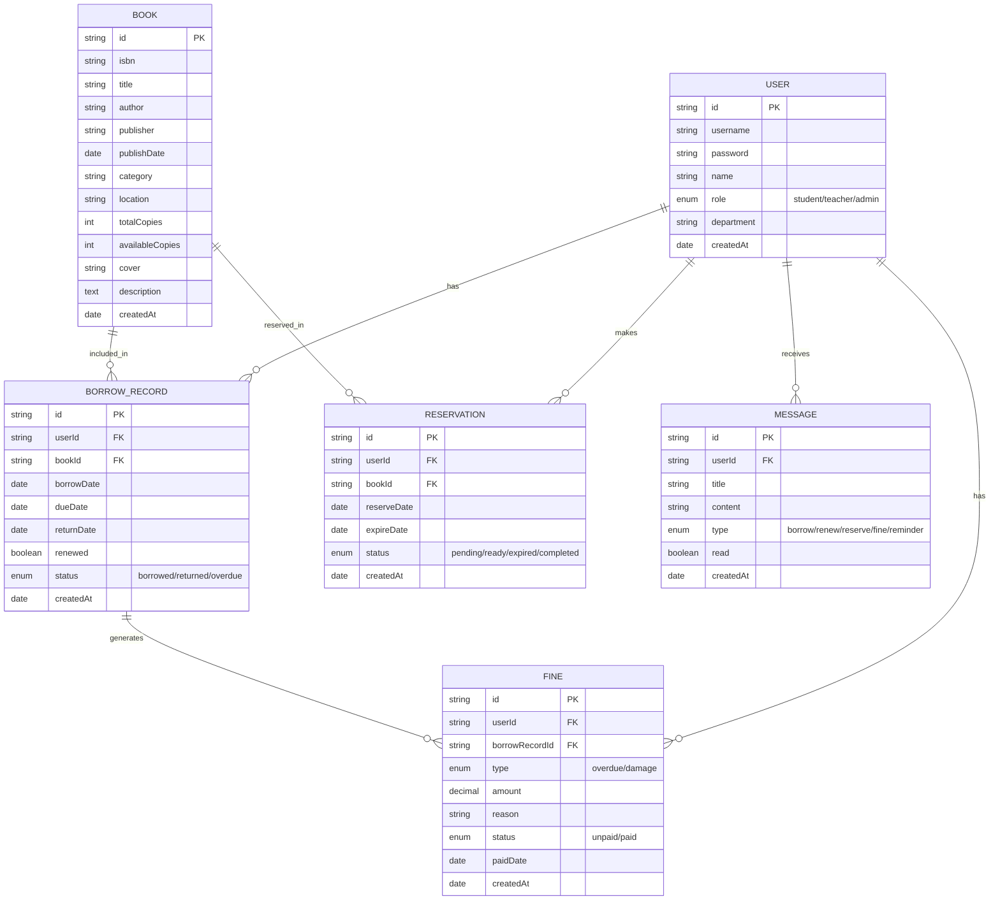

## 1. 架构设计



## 2. 技术描述

- **前端框架**: React@18 + TypeScript
- **构建工具**: Vite@5
- **样式方案**: Tailwind CSS@3 + PostCSS
- **路由管理**: React Router@6
- **状态管理**: Zustand@4
- **UI组件**: Ant Design@5
- **图表库**: ECharts@5
- **Excel处理**: xlsx
- **图标库**: @ant-design/icons
- **日期处理**: dayjs

## 3. 路由定义

| 路由 | 页面 | 角色 | 功能 |
|------|------|------|------|
| /login | 登录页 | 所有 | 角色选择、用户登录 |
| /reader | 读者首页 | 读者 | 图书搜索、热门图书、借阅提醒 |
| /reader/search | 图书搜索 | 读者 | 关键词搜索、分类筛选 |
| /reader/book/:id | 图书详情 | 读者 | 查看详情、借阅、预约 |
| /reader/profile | 个人中心 | 读者 | 借阅/预约/罚款记录、消息中心 |
| /admin | 管理员首页 | 管理员 | 数据概览、快捷入口 |
| /admin/books | 图书管理 | 管理员 | 图书CRUD、Excel导入导出 |
| /admin/borrow | 借还管理 | 管理员 | 借书、还书、损坏检查 |
| /admin/statistics | 统计报表 | 管理员 | 数据可视化、报表导出 |

## 4. 数据模型

### 4.1 ER 图



### 4.2 核心类型定义

```typescript
// 用户类型
type UserRole = 'student' | 'teacher' | 'admin';

interface User {
  id: string;
  username: string;
  name: string;
  role: UserRole;
  department: string;
  createdAt: string;
}

// 图书类型
interface Book {
  id: string;
  isbn: string;
  title: string;
  author: string;
  publisher: string;
  publishDate: string;
  category: string;
  location: string;
  totalCopies: number;
  availableCopies: number;
  cover: string;
  description: string;
  borrowCount: number;
  createdAt: string;
}

// 借阅记录类型
type BorrowStatus = 'borrowed' | 'returned' | 'overdue';

interface BorrowRecord {
  id: string;
  userId: string;
  bookId: string;
  book: Book;
  borrowDate: string;
  dueDate: string;
  returnDate?: string;
  renewed: boolean;
  status: BorrowStatus;
  createdAt: string;
}

// 预约记录类型
type ReservationStatus = 'pending' | 'ready' | 'expired' | 'completed';

interface Reservation {
  id: string;
  userId: string;
  bookId: string;
  book: Book;
  reserveDate: string;
  expireDate: string;
  status: ReservationStatus;
  createdAt: string;
}

// 罚款类型
type FineType = 'overdue' | 'damage';
type FineStatus = 'unpaid' | 'paid';

interface Fine {
  id: string;
  userId: string;
  borrowRecordId: string;
  bookTitle: string;
  type: FineType;
  amount: number;
  reason: string;
  status: FineStatus;
  paidDate?: string;
  createdAt: string;
}

// 消息类型
type MessageType = 'borrow' | 'renew' | 'reserve' | 'fine' | 'reminder' | 'system';

interface Message {
  id: string;
  userId: string;
  title: string;
  content: string;
  type: MessageType;
  read: boolean;
  createdAt: string;
}
```

## 5. Store 设计

### 5.1 Auth Store
- user: 当前登录用户
- login(username, password, role): 登录
- logout(): 登出
- checkBorrowEligibility(): 检查借阅资格

### 5.2 Book Store
- books: 图书列表
- loading: 加载状态
- fetchBooks(params): 获取图书列表
- searchBooks(keyword, category): 搜索图书
- getBookById(id): 获取图书详情
- importBooks(file): Excel批量导入
- exportBooks(): Excel导出

### 5.3 Borrow Store
- borrowRecords: 借阅记录
- borrowBook(bookId): 借阅图书
- returnBook(recordId, damageLevel): 归还图书
- renewBook(recordId): 续借图书
- getUserBorrows(userId): 获取用户借阅记录

### 5.4 Reservation Store
- reservations: 预约记录
- reserveBook(bookId): 预约图书
- cancelReservation(id): 取消预约
- checkReservationExpiry(): 检查预约过期
- notifyReserversOnReturn(bookId): 归还时通知预约者

### 5.5 Message Store
- messages: 消息列表
- unreadCount: 未读数量
- sendMessage(userId, title, content, type): 发送消息
- markAsRead(id): 标记已读
- markAllAsRead(): 全部已读

### 5.6 Statistics Store
- monthlyStats: 月度统计
- popularBooks: 热门图书排行
- readerTypeStats: 读者类型借阅统计
- overdueRate: 逾期率统计
- generateMonthlyReport(): 生成月度报表
- exportReport(): 导出报表

## 6. 业务规则实现

### 6.1 借阅规则
```typescript
// 检查借阅资格
function checkBorrowEligibility(userId: string): { eligible: boolean; reason?: string } {
  const overdueRecords = getOverdueRecords(userId);
  const overdueCount = overdueRecords.length;
  const maxOverdueDays = Math.max(...overdueRecords.map(r => getOverdueDays(r)));
  
  if (overdueCount > 3) {
    return { eligible: false, reason: `逾期图书超过3本（当前${overdueCount}本），请先归还后再借阅` };
  }
  if (maxOverdueDays > 30) {
    return { eligible: false, reason: `有图书逾期超过30天（最长${maxOverdueDays}天），请先归还后再借阅` };
  }
  return { eligible: true };
}

// 计算应还日期
function calculateDueDate(role: UserRole): Date {
  const days = role === 'teacher' ? 60 : 30;
  return dayjs().add(days, 'day').toDate();
}
```

### 6.2 损坏赔偿规则
```typescript
// 根据损坏程度计算赔偿金额
function calculateDamageFee(damageLevel: 'none' | 'minor' | 'moderate' | 'severe', bookPrice: number): number {
  switch (damageLevel) {
    case 'none': return 0;
    case 'minor': return Math.round(bookPrice * 0.3); // 轻微损坏：书价30%
    case 'moderate': return Math.round(bookPrice * 0.6); // 中度损坏：书价60%
    case 'severe': return bookPrice; // 严重损坏：全额赔偿
  }
}
```

### 6.3 消息推送规则
- 借阅成功：立即推送
- 续借成功：立即推送
- 预约成功：立即推送
- 预约图书可领取：图书归还时推送
- 还书提醒：到期前3天
- 罚款通知：罚款生成时推送
- 逾期通知：逾期第一天开始推送

## 7. 目录结构

```
src/
├── assets/          # 静态资源
├── components/      # 公共组件
│   ├── layout/      # 布局组件
│   ├── common/      # 通用组件
│   └── charts/      # 图表组件
├── pages/           # 页面组件
│   ├── Login/
│   ├── Reader/
│   └── Admin/
├── store/           # Zustand stores
├── types/           # TypeScript 类型定义
├── utils/           # 工具函数
│   ├── mock.ts      # 模拟数据
│   ├── date.ts      # 日期处理
│   └── excel.ts     # Excel处理
├── hooks/           # 自定义Hooks
├── App.tsx
├── main.tsx
└── index.css
```
