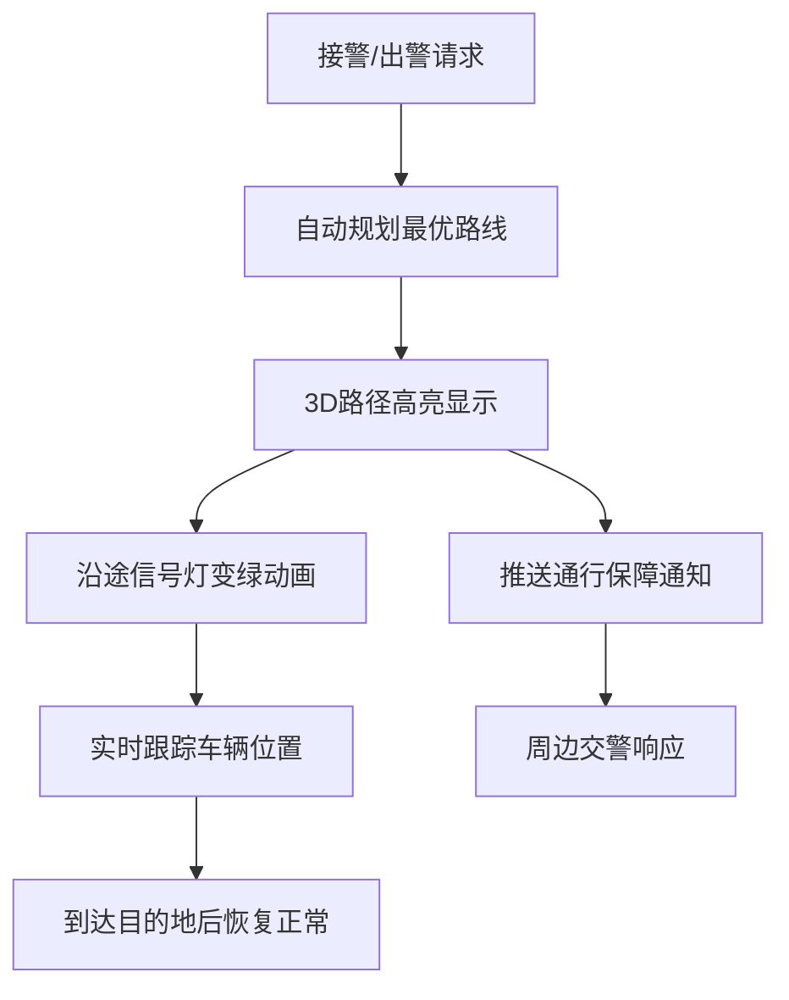
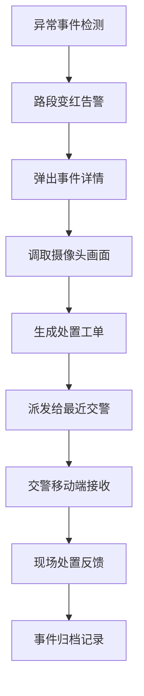
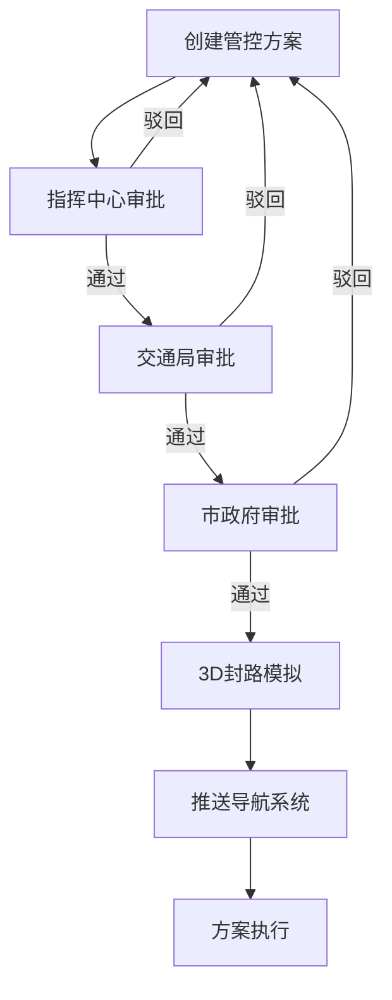

## 1. 产品概述
本平台是基于3D可视化技术的智慧城市地面交通信号协调与应急调度系统，面向城市交通管理部门，实现交通状态实时感知、智能信号控制、应急响应调度和数据决策支持。
- 解决城市交通拥堵、应急响应迟缓、信号配时不合理等核心问题，提升交通管理效率和城市运行韧性
- 目标用户：一线交警、指挥中心主任、市交通局管理人员

## 2. 核心 Features

### 2.1 用户角色
| 角色 | 注册方式 | 核心权限 |
|------|---------|---------|
| 一线交警 | 人脸登录 | 查看实时路况、接收事件工单、上报现场情况 |
| 指挥中心主任 | 人脸登录 | 信号配时调整、应急调度指挥、审批管控方案、查看操作日志 |
| 市交通局 | 人脸登录 | 审批管控方案、查看全局数据报表、制定交通政策 |

### 2.2 Feature Module
1. **3D交通可视化主界面**：城市道路模型、路口信号灯、车辆动态、拥堵热力图、实时数据面板
2. **智能信号配时系统**：实时流量采集、AI最优配时计算、信号灯动态控制、配时方案报表
3. **公交优先系统**：公交实时定位、绿灯自动延长、优先通道可视化
4. **特种车辆应急调度**：出警路径规划、沿途绿波控制、通行保障通知
5. **事件检测与处置**：异常事件自动识别、摄像头画面调取、工单自动派发
6. **拥堵预测与分流**：1小时拥堵趋势预测、热力图展示、自动分流建议
7. **权限与审批系统**：三级权限管理、人脸登录、操作审计、管控方案逐级审批
8. **数据报表系统**：交通日报生成、Excel导出、多维度统计分析

### 2.3 页面详情
| 页面名称 | 模块名称 | Feature description |
|---------|---------|---------------------|
| 登录页 | 人脸登录模块 | 摄像头人脸采集、身份验证、登录日志记录 |
| 3D主控制台 | 3D场景渲染 | 城市道路模型、车辆动态仿真、交互控制（缩放/旋转/平移） |
| 3D主控制台 | 实时数据面板 | 各路口流量统计、拥堵指数、信号灯状态、平均车速 |
| 3D主控制台 | 拥堵热力图层 | 基于预测数据的路段拥堵热力图、时间轴滑块 |
| 信号配时面板 | 配时控制 | 手动/自动切换、各方向配时参数调整、配时方案报表预览 |
| 应急调度面板 | 特种车辆管理 | 车辆状态监控、一键派警、路径规划、绿波控制 |
| 事件处置面板 | 事件管理 | 事件列表、详情弹窗、摄像头画面、工单派发跟踪 |
| 审批中心 | 方案审批 | 管控方案列表、逐级审批流程、审批意见填写 |
| 报表中心 | 数据报表 | 日报/周报/月报生成、多维度图表、Excel一键导出 |

## 3. 核心流程

### 3.1 智能配时流程
系统实时采集各方向车流量数据，通过AI算法计算最优红绿灯时长，自动调整信号灯配时，并生成配时方案报表供管理人员审核。

### 3.2 应急调度流程
当消防车/救护车出警时，系统自动规划最优路径，沿途信号灯同步变绿，推送通行保障通知给周边交警，确保应急车辆快速通行。

### 3.3 事件处置流程
系统检测到车速异常或异常停车时，自动标记路段并弹出详情，调取附近摄像头画面，生成处置工单派发给最近的巡逻交警。

### 3.4 管控方案审批流程
交通管控方案需经过指挥中心→交通局→市政府逐级审批，通过后进行3D模拟封路动画并推送至导航系统。

## 4. 用户界面设计

### 4.1 设计风格
- **主色调**：科技蓝（#0A2463）、警示红（#D62828）、通行绿（#2E933C）、预警橙（#F77F00）
- **辅助色**：深灰背景（#0D1117）、数据紫（#7B2CBF）
- **设计风格**：赛博朋克+科技感，深色主题，霓虹光效，半透明玻璃质感面板
- **字体**：标题使用 Orbitron，正文使用 JetBrains Mono
- **按钮风格**：圆角矩形，带发光边框和悬停动效，按功能使用不同主色调
- **布局风格**：中央3D场景为主，四周悬浮半透明控制面板，信息密度高但层次分明
- **图标风格**：线性描边图标，带发光效果，支持状态色切换

### 4.2 3D场景设计
- **环境**：夜景城市，霓虹灯光效果，HDRI环境贴图，动态天空
- **光照**：方向光模拟月光，点光源模拟路灯，区域光模拟建筑发光
- **摄像机**：透视相机，支持轨道控制，默认俯视45度角，可切换多个预设视角
- **道路模型**：沥青材质，带车道线、斑马线、导流岛，道路边缘发光灯带
- **车辆模型**：低多边形风格，不同类型车辆使用不同颜色（私家车-银灰、公交-蓝色、消防车-红色、救护车-白色带红条）
- **信号灯模型**：立方体发光体，红黄绿三色动态切换，带光晕效果
- **特效**：路径流光、光晕、粒子效果、后处理Bloom和SSAO
- **性能**：使用实例化渲染批量绘制车辆，动态LOD，目标帧率60fps

### 4.3 页面设计概览
| 页面名称 | 模块名称 | UI Elements |
|---------|---------|-------------|
| 登录页 | 人脸登录 | 全屏深色背景，中央摄像头采集框，人脸识别动画，登录按钮带脉冲光效 |
| 3D主控制台 | 3D场景 | 占满屏幕中央，鼠标交互控制，左上角系统标题和时间，右下角状态指示 |
| 3D主控制台 | 左侧面板 | 路口列表，搜索框，每个路口显示流量、拥堵指数、信号灯状态，可点击定位 |
| 3D主控制台 | 右侧面板 | Tab切换：配时控制/应急调度/事件处置/审批中心/报表中心 |
| 3D主控制台 | 底部面板 | 时间轴滑块，播放/暂停控制，速度调节，拥堵热力图开关 |
| 信号配时面板 | 配时控制 | 四象限方向配时图，实时流量柱状图，手动/自动切换按钮，配时参数滑块 |
| 应急调度面板 | 车辆管理 | 特种车辆列表，状态标签，一键派警按钮，路径规划参数设置 |
| 事件处置面板 | 事件列表 | 事件卡片，等级色标，摄像头画面弹窗，工单状态流转按钮 |
| 审批中心 | 审批流程 | 时间线式审批流程，当前节点高亮，审批意见输入框，通过/驳回按钮 |
| 报表中心 | 数据报表 | 多标签页切换，ECharts图表，数据表格，导出按钮 |

### 4.4 响应式设计
- 桌面端优先设计，主显示区域≥1920×1080
- 支持多屏扩展，3D场景和控制面板可分离到不同显示器
- 触控操作支持（平板端），优化手势交互
- 交警移动端适配：简化界面，突出工单和事件信息

