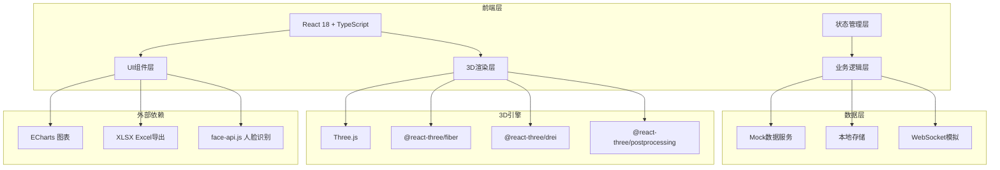
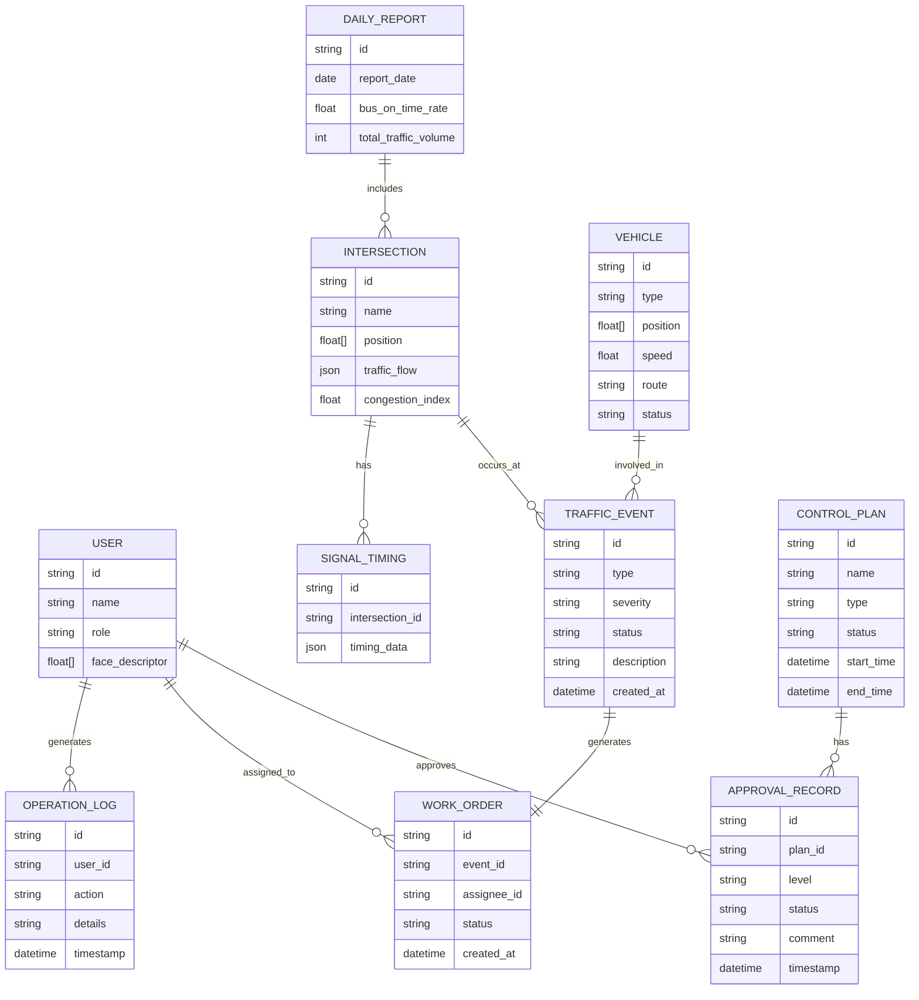

## 1. 架构设计



## 2. 技术描述

- **前端框架**: React@18 + TypeScript@5
- **构建工具**: Vite@5
- **UI框架**: TailwindCSS@3
- **状态管理**: Zustand@4
- **路由**: React Router@6
- **3D引擎**: three@0.160 + @react-three/fiber@8 + @react-three/drei@9 + @react-three/postprocessing@2
- **图表库**: echarts@5
- **Excel导出**: xlsx@0.18
- **人脸识别**: face-api.js@0.22
- **UI组件**: 自定义赛博朋克风格组件，部分使用 lucide-react 图标

### 目录结构
```
src/
├── components/          # UI组件
│   ├── ui/        # 基础UI组件
│   ├── panels/    # 控制面板
│   ├── three/     # 3D场景组件
│   └── charts/    # 图表组件
├── store/           # Zustand状态管理
├── hooks/           # 自定义Hooks
├── utils/           # 工具函数
├── types/           # TypeScript类型定义
├── data/            # Mock数据
├── assets/          # 静态资源
└── pages/           # 页面组件
```

## 3. 路由定义

| Route | Purpose |
|-------|---------|
| /login | 登录页 - 人脸登录界面 |
| /dashboard | 3D主控制台 - 核心操作界面 |
| /dashboard/traffic-signal | 信号配时 - 智能配时控制 |
| /dashboard/emergency | 应急调度 - 特种车辆管理 |
| /dashboard/events | 事件处置 - 事件列表和工单 |
| /dashboard/approval | 审批中心 - 管控方案审批 |
| /dashboard/reports | 报表中心 - 数据报表和导出 |

## 4. 核心状态定义

```typescript
// 交通相关类型
interface Intersection {
  id: string;
  name: string;
  position: [number, number, number];
  trafficFlow: {
    north: number;
    south: number;
    east: number;
    west: number;
  };
  congestionIndex: number;
  signalTiming: SignalTiming;
}

interface SignalTiming {
  north: { green: number; yellow: number; red: number };
  south: { green: number; yellow: number; red: number };
  east: { green: number; yellow: number; red: number };
  west: { green: number; yellow: number; red: number };
  currentPhase: string;
  remainingTime: number;
}

interface Vehicle {
  id: string;
  type: 'car' | 'bus' | 'fire' | 'ambulance';
  position: [number, number, number];
  speed: number;
  route: string;
  status: 'normal' | 'priority' | 'emergency';
}

interface TrafficEvent {
  id: string;
  type: 'congestion' | 'accident' | 'abnormal_parking';
  location: [number, number, number];
  roadId: string;
  severity: 'low' | 'medium' | 'high';
  description: string;
  status: 'detected' | 'dispatched' | 'processing' | 'resolved';
  cameraFeed?: string;
  workOrder?: WorkOrder;
  createdAt: Date;
}

interface WorkOrder {
  id: string;
  eventId: string;
  assignee: string;
  status: 'pending' | 'accepted' | 'completed';
  createdAt: Date;
}

interface ControlPlan {
  id: string;
  name: string;
  description: string;
  type: 'road_closure' | 'diversion' | 'signal_adjustment';
  status: 'draft' | 'pending_approval' | 'approved' | 'rejected' | 'executed';
  approvalHistory: ApprovalRecord[];
  affectedAreas: string[];
  startTime: Date;
  endTime: Date;
}

interface ApprovalRecord {
  level: 'command_center' | 'transport_bureau' | 'city_hall';
  approver: string;
  status: 'pending' | 'approved' | 'rejected';
  comment: string;
  timestamp: Date;
}

interface User {
  id: string;
  name: string;
  role: 'traffic_police' | 'command_director' | 'transport_bureau';
  faceDescriptor?: number[];
}

interface OperationLog {
  id: string;
  userId: string;
  action: string;
  details: string;
  timestamp: Date;
}

interface DailyReport {
  date: string;
  intersections: {
    id: string;
    name: string;
    avgDelay: number;
    accidents: number;
  }[];
  busOnTimeRate: number;
  totalTrafficVolume: number;
}
```

## 5. 数据模型ER图



## 6. 3D场景技术方案

### 6.1 场景组件结构
```
<Canvas>
  <ambientLight />
  <directionalLight />
  <pointLight />
  <OrbitControls />
  <RoadNetwork />
  <Intersections />
  <TrafficLights />
  <Vehicles />
  <EmergencyPath />
  <BusPriority />
  <HeatmapLayer />
  <PostProcessing />
</Canvas>
```

### 6.2 性能优化
- 使用 InstancedMesh 批量渲染车辆
- 动态LOD（细节层次）
- 视锥体剔除
- 按需渲染（On-demand rendering）
- 后处理效果按需启用

### 6.3 动画系统
- 车辆路径动画：使用 lerp 插值
- 信号灯动画：自定义 ShaderMaterial 实现发光效果
- 路径高亮：使用 Line2 实现流动光效
- 事件告警：使用闪烁材质 + 粒子效果

## 7. 算法模块

### 7.1 智能配时算法
```typescript
function calculateOptimalTiming(flowData, historicalData) {
  // 基于流量权重计算
  // 考虑排队长度预测
  // 生成最优绿信比
  // 输出各方向配时方案
}
```

### 7.2 路径规划算法
```typescript
function findOptimalRoute(start, end, realtimeData) {
  // A*算法 + 实时交通权重
  // 避开拥堵路段
  // 计算绿波带
}
```

### 7.3 拥堵预测算法
```typescript
function predictCongestion(currentData, historicalData) {
  // 时间序列预测
  // 输出未来1小时各路段拥堵指数
}
```
