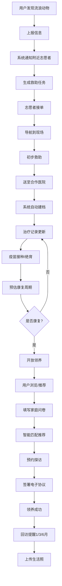

## 1. 产品概述

流浪动物救助与领养平台是一个连接发现者、志愿者、合作医院和领养人的全链路救助系统。用户可上报流浪动物信息，系统智能分配救助任务，志愿者完成现场救助后送医治疗，康复后通过智能匹配推荐领养，形成完整的"发现→救助→治疗→领养→回访"闭环，同时整合捐赠与绝育筹款模块保障资金来源，管理员看板提供全局数据洞察。

- 目标用户：关心流浪动物的普通市民、志愿者、合作医院、动保组织及平台管理员
- 市场价值：减少流浪动物数量、提高救助效率、提升领养匹配质量、透明化捐赠资金流向

## 2. 核心功能

### 2.1 用户角色

| 角色 | 注册方式 | 核心权限 |
|------|----------|----------|
| 普通用户 | 手机号/邮箱注册 | 上报流浪动物、浏览领养、捐赠、发起筹款 |
| 志愿者 | 注册后申请认证 | 接单救助、导航到现场、更新救助状态 |
| 合作医院 | 管理员审核入驻 | 查看送医动物、更新治疗记录、接收拨款 |
| 领养人 | 注册后填写问卷 | 浏览可领养动物、预约探访、签署协议、上传回访 |
| 管理员 | 后台授权 | 数据看板、任务调度、用户管理、报表导出 |

### 2.2 功能模块

1. **首页**：救助动态流、紧急任务提示、领养推荐、捐赠入口、数据概览
2. **上报页面**：照片上传、地图选点、状况描述表单、紧急程度选择
3. **救助任务中心**：任务列表、地图视图、接单操作、导航跳转、状态流转
4. **动物档案页**：基本信息、治疗时间线、疫苗/绝育记录、康复预估
5. **领养中心**：可领养动物列表、智能匹配推荐、筛选搜索、动物详情卡
6. **领养问卷页**：家庭环境评估、生活方式匹配、推荐结果展示
7. **预约探访页**：选择时间段、探访确认、探访记录
8. **领养协议页**：电子协议生成、在线签署、协议存档
9. **回访管理页**：回访提醒列表、照片上传、状态更新
10. **捐赠中心**：月度固定捐赠、一次性捐款、捐赠记录、电子证书
11. **绝育筹款页**：发起筹款、筹款进度、自动拨款
12. **个人中心**：我的上报、我的救助、我的领养、我的捐赠、志愿者认证
13. **管理员看板**：实时数据看板、区域热力图、任务管理、报表导出
14. **登录注册页**：手机号/邮箱注册登录、志愿者认证入口

### 2.3 页面详情

| 页面名称 | 模块名称 | 功能描述 |
|----------|----------|----------|
| 首页 | 救助动态流 | 实时展示最新救助事件，含动物照片、位置、状态标签 |
| 首页 | 紧急任务提示 | 轮播展示待处理的紧急救助任务 |
| 首页 | 领养推荐卡片 | 根据用户浏览历史推荐可领养动物 |
| 首页 | 数据概览 | 展示平台累计救助数、领养成功数、志愿者数 |
| 上报页面 | 照片上传 | 支持多张照片上传，带预览和压缩 |
| 上报页面 | 地图选点 | 集成地图组件，支持定位和手动选点 |
| 上报页面 | 状况描述 | 动物类型、体型、毛色、健康状况等结构化描述 |
| 上报页面 | 紧急程度 | 一键标记紧急，优先推送给附近志愿者 |
| 救助任务中心 | 任务列表 | 按距离/紧急度排序的待处理任务列表 |
| 救助任务中心 | 地图视图 | 地图上标注任务位置，聚合显示 |
| 救助任务中心 | 接单操作 | 志愿者一键接单，系统锁定任务防重复 |
| 救助任务中心 | 导航跳转 | 接单后调用地图导航到现场 |
| 救助任务中心 | 状态流转 | 待处理→已接单→救助中→已送医→已完成 |
| 动物档案页 | 基本信息 | 动物名称、类型、品种、年龄、性别、照片 |
| 动物档案页 | 治疗时间线 | 按时间展示每次治疗记录，含诊断、用药、医嘱 |
| 动物档案页 | 疫苗/绝育记录 | 疫苗接种时间表、绝育状态标记 |
| 动物档案页 | 康复预估 | AI预估康复日期和当前康复进度条 |
| 领养中心 | 可领养列表 | 卡片式展示可领养动物，含照片、性格标签、位置 |
| 领养中心 | 智能匹配 | 基于问卷结果推荐匹配度最高的动物 |
| 领养中心 | 筛选搜索 | 按动物类型、年龄、性格、距离筛选 |
| 领养中心 | 动物详情卡 | 大图展示、性格描述、病史摘要、适配建议 |
| 领养问卷页 | 家庭环境评估 | 居住面积、是否有院、家庭成员、其他宠物 |
| 领养问卷页 | 生活方式匹配 | 工作时长、运动习惯、养宠经验 |
| 领养问卷页 | 推荐结果 | 匹配度百分比排序、匹配理由说明 |
| 预约探访页 | 时间选择 | 选择可探访时间段，显示已有预约 |
| 预约探访页 | 探访确认 | 预约成功通知、探访须知 |
| 领养协议页 | 协议生成 | 自动填充双方信息和动物信息 |
| 领养协议页 | 在线签署 | 手写签名或点击确认签署 |
| 领养协议页 | 协议存档 | PDF生成和下载 |
| 回访管理页 | 回访提醒 | 第1/3/6个月自动推送提醒通知 |
| 回访管理页 | 照片上传 | 上传动物生活照，对比成长变化 |
| 回访管理页 | 状态更新 | 更新动物健康状况和生活情况 |
| 捐赠中心 | 月度捐赠 | 选择捐赠金额和扣款周期，支持取消 |
| 捐赠中心 | 一次性捐款 | 自定义金额的一次性捐赠 |
| 捐赠中心 | 捐赠记录 | 历史捐赠列表和累计金额 |
| 捐赠中心 | 电子证书 | 累计捐赠达标后生成电子荣誉证书 |
| 绝育筹款页 | 发起筹款 | 选择目标动物，设置筹款目标和截止日期 |
| 绝育筹款页 | 筹款进度 | 实时进度条、参与人数、剩余时间 |
| 绝育筹款页 | 自动拨款 | 筹满后自动通知合作医院并记录拨款 |
| 个人中心 | 我的上报 | 我上报的流浪动物列表和状态 |
| 个人中心 | 我的救助 | 志愿者的救助历史和统计数据 |
| 个人中心 | 我的领养 | 领养记录和回访状态 |
| 个人中心 | 我的捐赠 | 捐赠历史和证书 |
| 个人中心 | 志愿者认证 | 提交认证资料，审核状态查询 |
| 管理员看板 | 实时数据 | 救助总数、领养成功率、待处理任务、志愿者活跃度 |
| 管理员看板 | 医院动物数 | 各合作医院当前在院动物数量 |
| 管理员看板 | 区域热力图 | 基于救助数据生成的高发区域热力图 |
| 管理员看板 | 筛选功能 | 按城市、时间范围筛选数据 |
| 管理员看板 | 报表导出 | 月度报表含救助量、领养率、志愿者时长、捐赠明细 |
| 登录注册页 | 注册 | 手机号/邮箱注册，验证码验证 |
| 登录注册页 | 登录 | 账号密码登录，支持忘记密码 |
| 登录注册页 | 志愿者入口 | 登录后跳转志愿者认证流程 |

## 3. 核心流程

### 3.1 救助流程
用户发现流浪动物 → 上报信息（照片+位置+描述）→ 系统自动通知附近志愿者 → 生成救助任务 → 志愿者接单 → 导航到现场 → 初步救助 → 送至合作医院 → 系统自动建档 → 治疗记录更新 → 疫苗接种/绝育 → 预估康复周期 → 康复

### 3.2 领养流程
动物康复 → 开放领养状态 → 用户浏览/系统推荐 → 填写家庭问卷 → 智能匹配推荐 → 预约探访 → 探访确认 → 签署电子协议 → 领养成功 → 系统推送回访提醒（1/3/6月）→ 上传生活照

### 3.3 捐赠流程
用户进入捐赠中心 → 选择月度/一次性捐赠 → 选择金额 → 完成支付 → 系统记录 → 累计达标生成证书

### 3.4 绝育筹款流程
用户发起筹款 → 设置目标和截止日期 → 其他用户参与捐赠 → 筹满 → 系统自动拨款给合作医院 → 医院确认执行绝育

## 4. 用户界面设计

### 4.1 设计风格
- 主色调：暖橙色 (#F97316) 象征温暖与救助，搭配深棕 (#44403C) 作为文字色
- 辅助色：柔和绿色 (#22C55E) 表示康复/领养成功，浅蓝 (#38BDF8) 表示信息/导航
- 按钮风格：圆角大按钮 (rounded-xl)，主按钮带轻微阴影和hover缩放效果
- 字体：标题使用 Noto Serif SC 衬线体增加温度感，正文使用 Noto Sans SC 无衬线体保证可读性
- 布局：卡片式布局为主，顶部固定导航栏，侧边栏辅助导航
- 图标风格：使用 Lucide 图标库，线条风格统一
- 整体调性：温暖、可信赖、专业而不冰冷

### 4.2 页面设计概览

| 页面名称 | 模块名称 | UI元素 |
|----------|----------|--------|
| 首页 | 救助动态流 | 卡片列表、动物照片圆角卡片、状态标签徽章、时间戳 |
| 首页 | 紧急任务提示 | 顶部横幅、红色脉冲动画、倒计时 |
| 首页 | 领养推荐 | 水平滑动卡片、匹配度百分比、爱心按钮 |
| 首页 | 数据概览 | 数字计数动画、图标+数值组合、渐变背景卡片 |
| 上报页面 | 照片上传 | 拖拽上传区域、缩略图网格、添加按钮 |
| 上报页面 | 地图选点 | 全宽地图组件、定位标记、搜索框 |
| 上报页面 | 状况描述 | 分步表单、下拉选择器、标签选择 |
| 救助任务中心 | 任务列表 | 卡片式列表、距离标签、紧急度颜色区分 |
| 救助任务中心 | 地图视图 | 全屏地图、聚合标记、信息弹窗 |
| 动物档案页 | 治疗时间线 | 竖直时间线、连接线、状态节点图标 |
| 动物档案页 | 康复预估 | 进度条、预估日期、阶段指示 |
| 领养中心 | 可领养列表 | 瀑布流布局、照片主视觉、性格标签 |
| 领养问卷页 | 问卷表单 | 进度指示器、单选/多选组、滑块选择 |
| 领养协议页 | 协议展示 | 协议文本区域、签名板、印章效果 |
| 回访管理页 | 回访提醒 | 时间轴提醒卡片、上传区域、照片对比 |
| 捐赠中心 | 捐赠选择 | 金额选择卡片、自定义输入、进度展示 |
| 捐赠中心 | 电子证书 | 证书模板、金色边框、生成动画 |
| 绝育筹款页 | 筹款卡片 | 进度环形图、倒计时、参与人数 |
| 管理员看板 | 数据卡片 | 统计数字卡片、趋势迷你图、同比环比 |
| 管理员看板 | 区域热力图 | 地图热力层、图例、时间筛选器 |
| 管理员看板 | 报表导出 | 日期范围选择、导出按钮、预览表格 |

### 4.3 响应式设计
- 桌面端优先设计，移动端自适应
- 导航栏：桌面端侧边栏常驻，移动端底部Tab栏
- 卡片网格：桌面端3-4列，平板2列，手机1列
- 地图组件：全宽自适应
- 表单：桌面端双列布局，移动端单列
- 触摸优化：按钮最小44px触摸区域，手势滑动支持

### 4.4 无3D场景需求
本平台不涉及3D场景渲染
