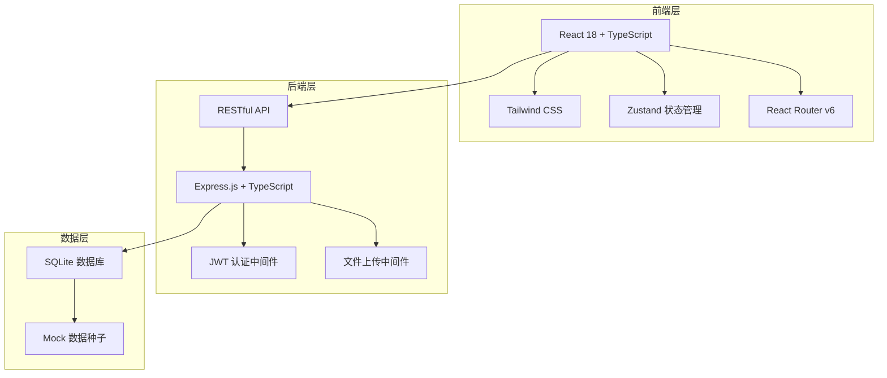
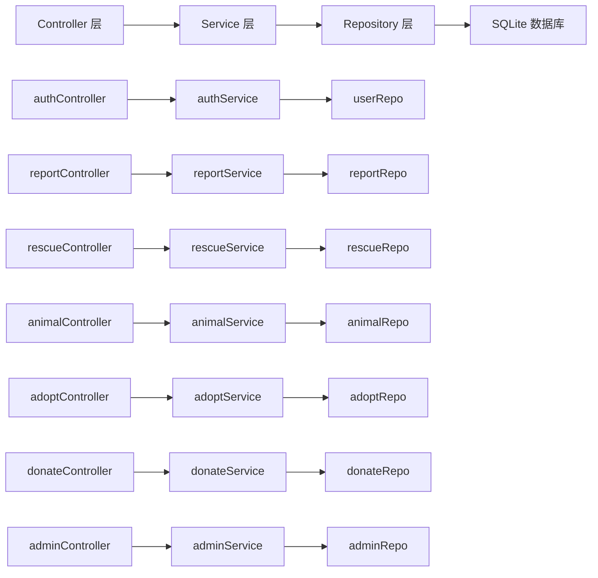
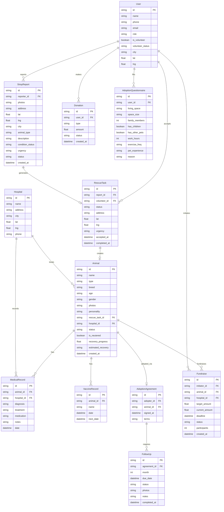

## 1. 架构设计



## 2. 技术说明

- 前端：React@18 + Tailwind CSS@3 + Zustand + React Router v6
- 初始化工具：vite-init
- 后端：Express@4 + TypeScript (ESM)
- 数据库：SQLite（使用 better-sqlite3），含种子数据
- 地图组件：使用 CSS 模拟地图效果（无需外部地图API密钥）
- 图表：使用纯 CSS/SVG 实现图表（无需外部图表库）

## 3. 路由定义

| 路由 | 用途 |
|------|------|
| / | 首页 - 救助动态、紧急任务、领养推荐、数据概览 |
| /login | 登录注册页 |
| /report | 上报流浪动物 |
| /rescue | 救助任务中心 |
| /rescue/:id | 救助任务详情 |
| /animal/:id | 动物档案详情 |
| /adopt | 领养中心 - 可领养动物列表 |
| /adopt/questionnaire | 领养问卷 |
| /adopt/match | 智能匹配结果 |
| /adopt/appointment | 预约探访 |
| /adopt/agreement | 领养协议签署 |
| /followup | 回访管理 |
| /donate | 捐赠中心 |
| /donate/certificate | 电子证书 |
| /fundraise | 绝育筹款 |
| /fundraise/:id | 筹款详情 |
| /profile | 个人中心 |
| /profile/volunteer | 志愿者认证 |
| /admin | 管理员看板 |
| /admin/heatmap | 区域热力图 |
| /admin/reports | 报表导出 |

## 4. API 定义

### 4.1 认证相关
```
POST   /api/auth/register     注册
POST   /api/auth/login        登录
GET    /api/auth/me           获取当前用户
```

### 4.2 流浪动物上报
```
POST   /api/reports           创建上报（含照片上传）
GET    /api/reports           获取上报列表
GET    /api/reports/:id       获取上报详情
```

### 4.3 救助任务
```
GET    /api/rescue-tasks      获取任务列表（支持距离/紧急度排序）
GET    /api/rescue-tasks/:id  获取任务详情
POST   /api/rescue-tasks/:id/accept  志愿者接单
PATCH  /api/rescue-tasks/:id/status  更新任务状态
```

### 4.4 动物档案
```
GET    /api/animals           获取动物列表
GET    /api/animals/:id       获取动物详情（含治疗时间线）
POST   /api/animals/:id/medical  添加医疗记录
PATCH  /api/animals/:id       更新动物信息
```

### 4.5 领养
```
GET    /api/adopt/available   获取可领养动物
POST   /api/adopt/questionnaire  提交领养问卷
GET    /api/adopt/match       获取匹配推荐
POST   /api/adopt/appointment 预约探访
POST   /api/adopt/agreement   签署领养协议
GET    /api/adopt/my          获取我的领养
```

### 4.6 回访
```
GET    /api/followup          获取回访提醒列表
POST   /api/followup/:id      提交回访记录（含照片）
```

### 4.7 捐赠
```
POST   /api/donate            创建捐赠
GET    /api/donate/history    获取捐赠历史
GET    /api/donate/certificate 获取电子证书
```

### 4.8 绝育筹款
```
GET    /api/fundraise         获取筹款列表
POST   /api/fundraise         发起筹款
GET    /api/fundraise/:id     获取筹款详情
POST   /api/fundraise/:id/donate  参与筹款捐赠
```

### 4.9 管理员
```
GET    /api/admin/dashboard   看板数据
GET    /api/admin/heatmap     热力图数据
GET    /api/admin/reports     报表数据
GET    /api/admin/export      导出报表
```

### 4.10 TypeScript 类型定义

```typescript
interface User {
  id: string;
  name: string;
  phone: string;
  email: string;
  role: 'user' | 'volunteer' | 'hospital' | 'admin';
  avatar?: string;
  isVolunteer: boolean;
  volunteerStatus?: 'pending' | 'approved' | 'rejected';
  location?: { city: string; district: string; lat: number; lng: number };
  createdAt: string;
}

interface StrayReport {
  id: string;
  reporterId: string;
  photos: string[];
  location: { address: string; lat: number; lng: number; city: string; district: string };
  animalType: 'dog' | 'cat' | 'other';
  description: string;
  condition: 'healthy' | 'injured' | 'sick' | 'critical';
  urgency: 'low' | 'medium' | 'high' | 'critical';
  status: 'pending' | 'notified' | 'rescuing' | 'rescued';
  createdAt: string;
}

interface RescueTask {
  id: string;
  reportId: string;
  volunteerId?: string;
  status: 'pending' | 'accepted' | 'rescuing' | 'transporting' | 'hospitalized' | 'completed';
  location: { address: string; lat: number; lng: number };
  urgency: 'low' | 'medium' | 'high' | 'critical';
  acceptedAt?: string;
  completedAt?: string;
  notes?: string;
}

interface Animal {
  id: string;
  name: string;
  type: 'dog' | 'cat' | 'other';
  breed?: string;
  age?: string;
  gender: 'male' | 'female' | 'unknown';
  photos: string[];
  personality: string[];
  rescueTaskId: string;
  hospitalId?: string;
  status: 'hospitalized' | 'recovering' | 'recovered' | 'adoptable' | 'adopted';
  medicalRecords: MedicalRecord[];
  vaccines: VaccineRecord[];
  isNeutered: boolean;
  estimatedRecovery?: string;
  recoveryProgress?: number;
  createdAt: string;
}

interface MedicalRecord {
  id: string;
  animalId: string;
  hospitalId: string;
  diagnosis: string;
  treatment: string;
  medication: string;
  notes?: string;
  date: string;
}

interface VaccineRecord {
  id: string;
  animalId: string;
  name: string;
  date: string;
  nextDate?: string;
}

interface AdoptionQuestionnaire {
  id: string;
  userId: string;
  livingSpace: 'apartment' | 'house_with_yard' | 'house_without_yard';
  spaceSize: 'small' | 'medium' | 'large';
  familyMembers: number;
  hasChildren: boolean;
  childrenAges?: number[];
  hasOtherPets: boolean;
  otherPetTypes?: string[];
  workHoursPerDay: number;
  exerciseFrequency: 'rarely' | 'sometimes' | 'often' | 'very_often';
  petExperience: 'none' | 'some' | 'experienced';
  reasonForAdoption: string;
}

interface AdoptionMatch {
  animalId: string;
  matchScore: number;
  matchReasons: string[];
}

interface AdoptionAgreement {
  id: string;
  adopterId: string;
  animalId: string;
  signedAt: string;
  terms: string;
  adopterSignature: string;
}

interface FollowUp {
  id: string;
  adoptionId: string;
  month: 1 | 3 | 6;
  dueDate: string;
  status: 'pending' | 'completed' | 'overdue';
  photos?: string[];
  notes?: string;
  completedAt?: string;
}

interface Donation {
  id: string;
  userId: string;
  type: 'one_time' | 'monthly';
  amount: number;
  status: 'active' | 'completed' | 'cancelled';
  createdAt: string;
}

interface Fundraise {
  id: string;
  initiatorId: string;
  animalId: string;
  targetAmount: number;
  currentAmount: number;
  hospitalId: string;
  deadline: string;
  status: 'active' | 'funded' | 'disbursed' | 'completed';
  participants: number;
  createdAt: string;
}

interface DashboardData {
  totalRescues: number;
  adoptionRate: number;
  pendingTasks: number;
  activeVolunteers: number;
  hospitalAnimals: { hospital: string; count: number }[];
  monthlyTrend: { month: string; rescues: number; adoptions: number }[];
  cityStats: { city: string; rescues: number; adoptions: number; rate: number }[];
}
```

## 5. 服务器架构图



## 6. 数据模型

### 6.1 数据模型定义



### 6.2 数据定义语言

```sql
CREATE TABLE users (
    id TEXT PRIMARY KEY,
    name TEXT NOT NULL,
    phone TEXT UNIQUE NOT NULL,
    email TEXT UNIQUE NOT NULL,
    password_hash TEXT NOT NULL,
    role TEXT NOT NULL DEFAULT 'user',
    avatar TEXT,
    is_volunteer INTEGER NOT NULL DEFAULT 0,
    volunteer_status TEXT,
    city TEXT,
    district TEXT,
    lat REAL,
    lng REAL,
    created_at TEXT NOT NULL DEFAULT (datetime('now'))
);

CREATE TABLE stray_reports (
    id TEXT PRIMARY KEY,
    reporter_id TEXT NOT NULL REFERENCES users(id),
    photos TEXT NOT NULL DEFAULT '[]',
    address TEXT NOT NULL,
    lat REAL NOT NULL,
    lng REAL NOT NULL,
    city TEXT NOT NULL,
    district TEXT,
    animal_type TEXT NOT NULL,
    description TEXT,
    condition_status TEXT NOT NULL DEFAULT 'healthy',
    urgency TEXT NOT NULL DEFAULT 'medium',
    status TEXT NOT NULL DEFAULT 'pending',
    created_at TEXT NOT NULL DEFAULT (datetime('now'))
);

CREATE TABLE rescue_tasks (
    id TEXT PRIMARY KEY,
    report_id TEXT NOT NULL REFERENCES stray_reports(id),
    volunteer_id TEXT REFERENCES users(id),
    status TEXT NOT NULL DEFAULT 'pending',
    address TEXT NOT NULL,
    lat REAL NOT NULL,
    lng REAL NOT NULL,
    urgency TEXT NOT NULL DEFAULT 'medium',
    notes TEXT,
    accepted_at TEXT,
    completed_at TEXT,
    created_at TEXT NOT NULL DEFAULT (datetime('now'))
);

CREATE TABLE hospitals (
    id TEXT PRIMARY KEY,
    name TEXT NOT NULL,
    address TEXT NOT NULL,
    city TEXT NOT NULL,
    district TEXT,
    lat REAL NOT NULL,
    lng REAL NOT NULL,
    phone TEXT
);

CREATE TABLE animals (
    id TEXT PRIMARY KEY,
    name TEXT NOT NULL,
    type TEXT NOT NULL,
    breed TEXT,
    age TEXT,
    gender TEXT NOT NULL DEFAULT 'unknown',
    photos TEXT NOT NULL DEFAULT '[]',
    personality TEXT NOT NULL DEFAULT '[]',
    rescue_task_id TEXT NOT NULL REFERENCES rescue_tasks(id),
    hospital_id TEXT REFERENCES hospitals(id),
    status TEXT NOT NULL DEFAULT 'hospitalized',
    is_neutered INTEGER NOT NULL DEFAULT 0,
    recovery_progress REAL DEFAULT 0,
    estimated_recovery TEXT,
    created_at TEXT NOT NULL DEFAULT (datetime('now'))
);

CREATE TABLE medical_records (
    id TEXT PRIMARY KEY,
    animal_id TEXT NOT NULL REFERENCES animals(id),
    hospital_id TEXT NOT NULL REFERENCES hospitals(id),
    diagnosis TEXT NOT NULL,
    treatment TEXT NOT NULL,
    medication TEXT,
    notes TEXT,
    date TEXT NOT NULL
);

CREATE TABLE vaccine_records (
    id TEXT PRIMARY KEY,
    animal_id TEXT NOT NULL REFERENCES animals(id),
    name TEXT NOT NULL,
    date TEXT NOT NULL,
    next_date TEXT
);

CREATE TABLE adoption_questionnaires (
    id TEXT PRIMARY KEY,
    user_id TEXT NOT NULL REFERENCES users(id),
    living_space TEXT NOT NULL,
    space_size TEXT NOT NULL,
    family_members INTEGER NOT NULL,
    has_children INTEGER NOT NULL DEFAULT 0,
    has_other_pets INTEGER NOT NULL DEFAULT 0,
    other_pet_types TEXT,
    work_hours INTEGER NOT NULL,
    exercise_freq TEXT NOT NULL,
    pet_experience TEXT NOT NULL,
    reason TEXT,
    created_at TEXT NOT NULL DEFAULT (datetime('now'))
);

CREATE TABLE adoption_agreements (
    id TEXT PRIMARY KEY,
    adopter_id TEXT NOT NULL REFERENCES users(id),
    animal_id TEXT NOT NULL REFERENCES animals(id),
    signed_at TEXT NOT NULL,
    terms TEXT NOT NULL
);

CREATE TABLE follow_ups (
    id TEXT PRIMARY KEY,
    agreement_id TEXT NOT NULL REFERENCES adoption_agreements(id),
    month INTEGER NOT NULL,
    due_date TEXT NOT NULL,
    status TEXT NOT NULL DEFAULT 'pending',
    photos TEXT DEFAULT '[]',
    notes TEXT,
    completed_at TEXT
);

CREATE TABLE donations (
    id TEXT PRIMARY KEY,
    user_id TEXT NOT NULL REFERENCES users(id),
    type TEXT NOT NULL,
    amount REAL NOT NULL,
    status TEXT NOT NULL DEFAULT 'active',
    created_at TEXT NOT NULL DEFAULT (datetime('now'))
);

CREATE TABLE fundraises (
    id TEXT PRIMARY KEY,
    initiator_id TEXT NOT NULL REFERENCES users(id),
    animal_id TEXT NOT NULL REFERENCES animals(id),
    hospital_id TEXT NOT NULL REFERENCES hospitals(id),
    target_amount REAL NOT NULL,
    current_amount REAL NOT NULL DEFAULT 0,
    deadline TEXT NOT NULL,
    status TEXT NOT NULL DEFAULT 'active',
    participants INTEGER NOT NULL DEFAULT 0,
    created_at TEXT NOT NULL DEFAULT (datetime('now'))
);

CREATE INDEX idx_stray_reports_city ON stray_reports(city);
CREATE INDEX idx_stray_reports_status ON stray_reports(status);
CREATE INDEX idx_rescue_tasks_status ON rescue_tasks(status);
CREATE INDEX idx_rescue_tasks_urgency ON rescue_tasks(urgency);
CREATE INDEX idx_animals_status ON animals(status);
CREATE INDEX idx_animals_hospital ON animals(hospital_id);
CREATE INDEX idx_donations_user ON donations(user_id);
CREATE INDEX idx_follow_ups_status ON follow_ups(status);
CREATE INDEX idx_fundraises_status ON fundraises(status);
```
