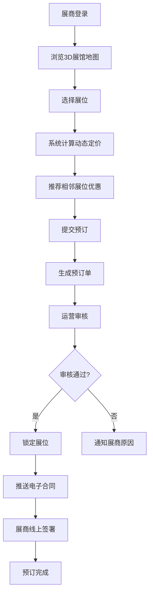
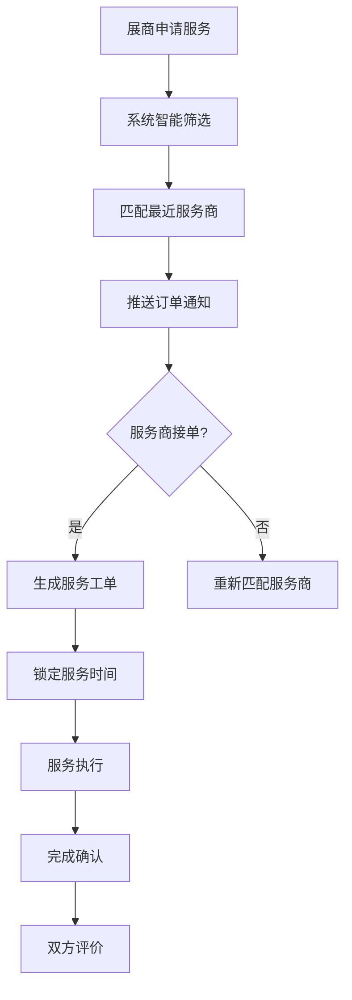
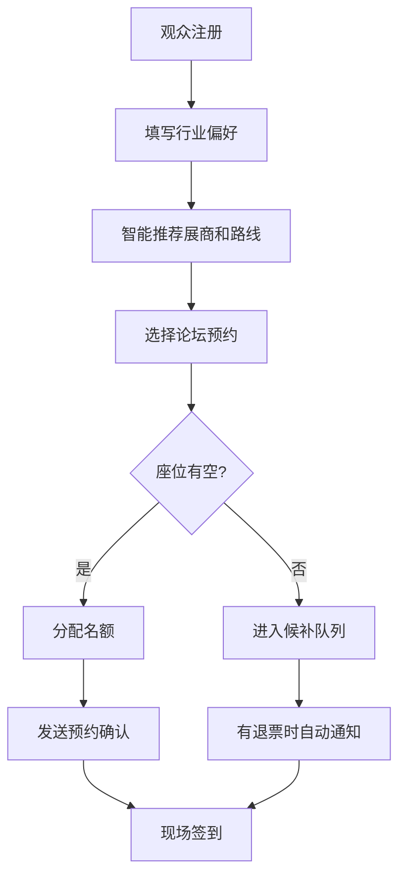
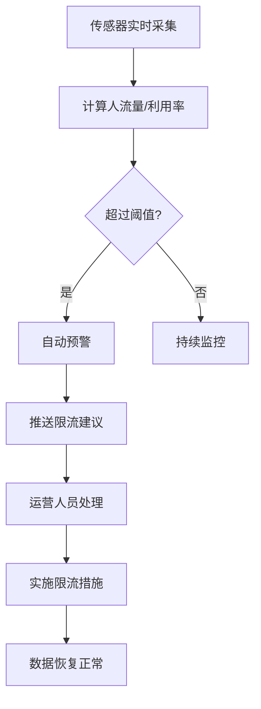
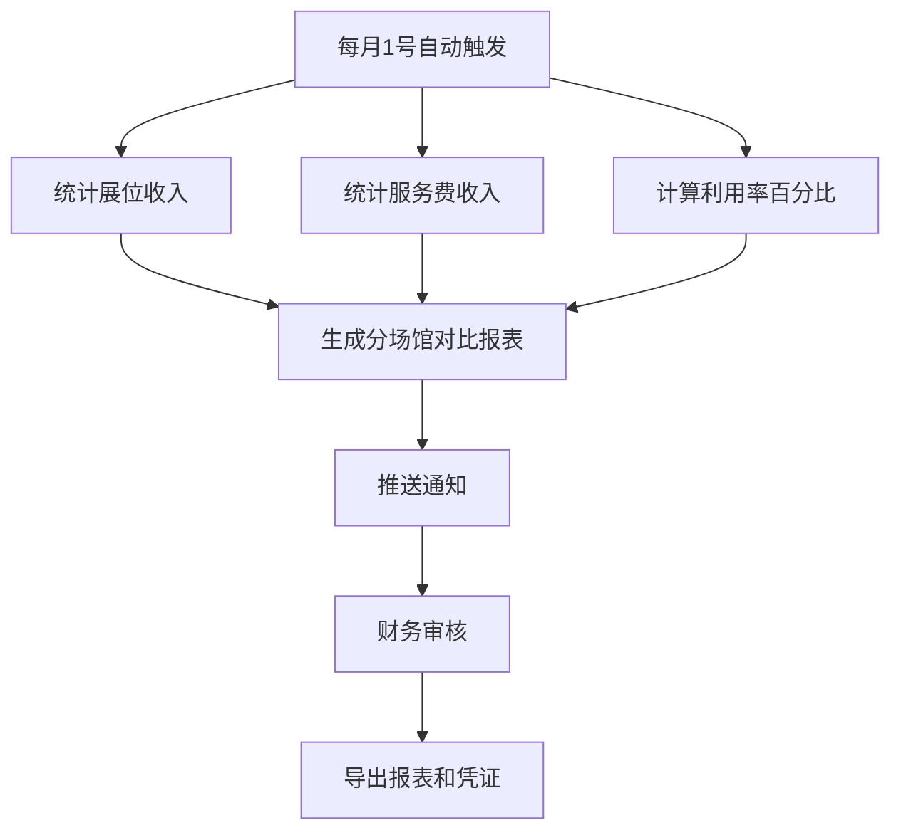

## 1. 产品概述

智慧展位管理与服务调度平台是面向大型国际会展中心的全流程数字化管理系统，整合展位预订、服务调度、观众管理、实时监控和财务统计五大核心功能，为展商、观众、运营方、服务商和财务人员提供一体化智能服务。

- 解决传统会展管理中流程分散、信息不对称、资源调度低效的痛点
- 通过智能算法实现动态定价、自动派单、个性化推荐和实时预警
- 目标是提升会展运营效率30%，展商满意度提升40%，观众参观体验显著优化

## 2. 核心功能

### 2.1 用户角色

| 角色 | 注册方式 | 核心权限 |
|------|----------|----------|
| 展商 | 企业资质审核注册 | 展位预订、服务申请、数据查看、合同签署、客户管理 |
| 观众 | 手机号/邮箱注册 | 参观路线推荐、展商浏览、论坛预约、意向登记 |
| 展馆运营 | 内部账号 | 展位审核、人流监控、预警处理、合同管理、订单管理 |
| 服务商 | 企业资质审核注册 | 服务接单、工单管理、进度上报、评价查看 |
| 财务 | 内部账号 | 收入统计、报表生成、对账管理、凭证下载 |

### 2.2 功能模块

1. **登录与角色选择**：身份认证、角色切换、权限控制
2. **展商工作台**：展位预订、动态定价、服务申请、数据统计、合同管理
3. **观众门户**：展商推荐、路线规划、论坛预约、意向登记
4. **运营监控中心**：实时人流监控、展位审核、预警处理、订单管理
5. **服务商平台**：智能派单、工单处理、进度跟踪
6. **财务中心**：收入统计、分场馆报表、凭证管理
7. **消息通知中心**：实时推送、消息分类、凭证下载

### 2.3 页面详情

| 页面名称 | 模块名称 | 功能描述 |
|----------|----------|----------|
| 登录页 | 身份认证 | 账号密码登录、角色选择、验证码验证 |
| 展商工作台 | 展位预订 | 3D展馆地图、动态定价计算、相邻展位优惠推荐、预订单生成 |
| 展商工作台 | 服务申请 | 搭建/电力/网络等服务选择、信用等级展示、自动派单 |
| 展商工作台 | 数据统计 | 客流量折线图、意向客户统计、参展效果评分 |
| 展商工作台 | 合同管理 | 电子合同预览、线上签署、凭证下载 |
| 观众门户 | 首页推荐 | 行业偏好匹配展商、智能参观路线推荐 |
| 观众门户 | 论坛预约 | 论坛列表、座位容量显示、候补队列管理 |
| 运营监控中心 | 实时监控 | 各馆人流量热力图、展位利用率、安全阈值预警 |
| 运营监控中心 | 审核管理 | 预订审核、展位锁定、合同推送 |
| 运营监控中心 | 预警处理 | 超员预警、限流建议、应急调度 |
| 服务商平台 | 订单大厅 | 智能派单、附近订单推荐、接单/拒单 |
| 服务商平台 | 工单管理 | 工单详情、时间锁定、进度上报 |
| 财务中心 | 收入统计 | 展位收入、服务费收入、利用率百分比 |
| 财务中心 | 报表中心 | 分场馆对比报表、月度自动生成、导出下载 |
| 消息中心 | 通知列表 | 实时推送、分类筛选、详情查看、凭证下载 |

## 3. 核心流程

### 3.1 展位预订流程

展商登录 → 浏览3D展馆地图 → 选择展位 → 系统根据面积/位置/人流热度计算动态定价 → 推荐相邻展位联动优惠 → 提交预订 → 生成预订单 → 运营审核通过 → 锁定展位 → 推送电子合同 → 展商线上签署 → 预订完成

### 3.2 服务派单流程

展商申请服务 → 系统根据服务类型+展商信用等级筛选 → 匹配最近服务商 → 推送订单 → 服务商接单 → 生成服务工单 → 锁定服务时间 → 服务执行 → 完成确认 → 双方评价

### 3.3 观众预约流程

观众注册 → 填写行业偏好 → 系统推荐展商列表和参观路线 → 选择论坛预约 → 检查座位容量 → 有空位则分配名额 → 满额则进入候补队列 → 发送预约确认 → 现场签到

### 3.4 实时监控与预警流程

传感器实时采集数据 → 系统计算人流量和利用率 → 超过安全阈值 → 自动预警 → 推送限流建议 → 运营人员处理 → 措施生效 → 数据恢复正常

### 3.5 财务报表流程

每月1号自动触发 → 统计各展馆展位收入 → 统计服务费收入 → 计算利用率百分比 → 生成分场馆对比报表 → 推送通知 → 财务人员审核 → 导出报表和凭证

## 4. 用户界面设计

### 4.1 设计风格

**设计理念：科技感+专业商务风**
- 主色调：深邃蓝(#165DFF) + 高级灰(#1D2129)
- 辅助色：预警橙(#FF7D00)、成功绿(#00B42A)、警示红(#F53F3F)
- 背景：深色渐变+科技纹理，营造专业监控中心氛围
- 字体：标题使用"Space Grotesk"无衬线字体，正文使用"PingFang SC"
- 按钮：圆角设计(8px)，悬浮有微动画和阴影效果
- 图标：线性风格图标，配合色彩区分功能模块
- 动效：数据加载动画、数字滚动效果、图表渐入动画

### 4.2 页面设计概述

| 页面名称 | 模块名称 | UI元素 |
|----------|----------|--------|
| 登录页 | 身份认证 | 渐变背景、玻璃态卡片、角色选择动效、粒子背景 |
| 展商工作台 | 展位预订 | 3D展馆俯视图、展位色块标注、价格动态计算动画、推荐展位高亮 |
| 展商工作台 | 数据统计 | 折线图动画、数字滚动计数器、热力分布卡片、评分仪表盘 |
| 运营监控中心 | 实时监控 | 大屏布局、实时人流热力图、数据仪表盘、预警弹窗动效 |
| 财务中心 | 报表中心 | 多维度对比图表、数据透视表、导出按钮悬浮效果 |
| 消息中心 | 通知列表 | 消息分类标签、未读红点提醒、滑动删除、凭证下载动画 |

### 4.3 响应式设计

- **桌面优先**：针对1920×1080及以上分辨率优化，支持多屏展示
- **平板适配**：1024px以上保持完整功能，侧边栏可收起
- **移动端**：768px以下简化布局，核心功能优先展示
- **触控优化**：按钮最小尺寸48×48px，支持手势滑动操作

### 4.4 数据可视化设计

- **实时监控大屏**：采用深色背景，数据高亮显示，图表实时刷新
- **折线图**：展示参展效果评分趋势，带有渐变填充区域
- **柱状图**：分场馆收入对比，支持交互式数据提示
- **饼图/环形图**：展示收入构成比例，支持钻取详情
- **热力图**：展馆人流量分布，颜色深浅代表人流密度
- **仪表盘**：展位利用率、安全阈值等关键指标，指针动画
