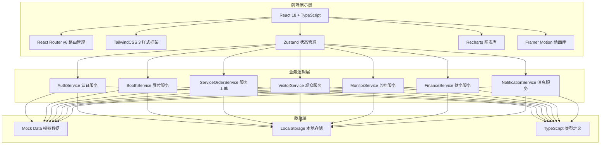
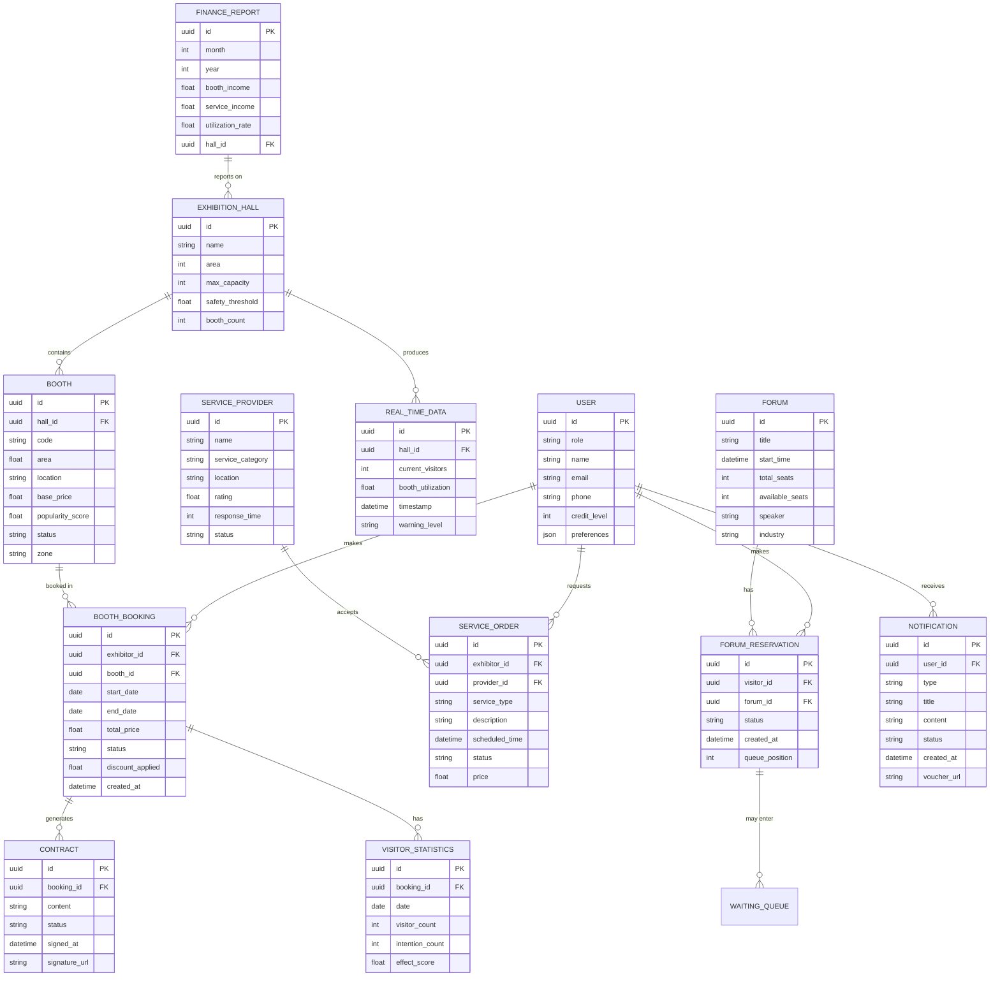

## 1. 架构设计



## 2. 技术描述

- **前端框架**: React 18.2.0 + TypeScript 5.3
- **初始化工具**: Vite 5.0
- **状态管理**: Zustand 4.4
- **路由管理**: React Router v6
- **样式框架**: TailwindCSS 3.4
- **图表可视化**: Recharts 2.10
- **动画库**: Framer Motion 10.16
- **图标库**: Lucide React 0.294
- **日期处理**: date-fns 3.0
- **后端**: 无后端，使用Mock数据
- **数据存储**: LocalStorage模拟持久化

## 3. 路由定义

| 路由路径 | 页面名称 | 访问角色 |
|----------|----------|----------|
| `/login` | 登录页面 | 所有 |
| `/exhibitor` | 展商工作台首页 | 展商 |
| `/exhibitor/booking` | 展位预订 | 展商 |
| `/exhibitor/services` | 服务申请 | 展商 |
| `/exhibitor/statistics` | 数据统计 | 展商 |
| `/exhibitor/contracts` | 合同管理 | 展商 |
| `/visitor` | 观众门户首页 | 观众 |
| `/visitor/exhibitors` | 展商推荐 | 观众 |
| `/visitor/forums` | 论坛预约 | 观众 |
| `/visitor/route` | 参观路线 | 观众 |
| `/operator` | 运营监控中心 | 展馆运营 |
| `/operator/monitor` | 实时监控 | 展馆运营 |
| `/operator/reviews` | 预订审核 | 展馆运营 |
| `/operator/warnings` | 预警处理 | 展馆运营 |
| `/provider` | 服务商平台首页 | 服务商 |
| `/provider/orders` | 订单大厅 | 服务商 |
| `/provider/tickets` | 工单管理 | 服务商 |
| `/finance` | 财务中心首页 | 财务 |
| `/finance/income` | 收入统计 | 财务 |
| `/finance/reports` | 报表中心 | 财务 |
| `/notifications` | 消息中心 | 所有角色 |

## 4. 数据模型

### 4.1 数据模型ER图



### 4.2 核心类型定义

```typescript
// 用户类型
interface User {
  id: string;
  role: 'exhibitor' | 'visitor' | 'operator' | 'provider' | 'finance';
  name: string;
  email: string;
  phone: string;
  creditLevel?: number;
  preferences?: {
    industries?: string[];
    interests?: string[];
  };
}

// 展馆类型
interface ExhibitionHall {
  id: string;
  name: string;
  area: number;
  maxCapacity: number;
  safetyThreshold: number;
  boothCount: number;
}

// 展位类型
interface Booth {
  id: string;
  hallId: string;
  code: string;
  area: number;
  location: { x: number; y: number };
  basePrice: number;
  popularityScore: number;
  status: 'available' | 'reserved' | 'locked' | 'occupied';
  zone: string;
  adjacentBooths: string[];
}

// 展位预订
interface BoothBooking {
  id: string;
  exhibitorId: string;
  boothId: string;
  startDate: string;
  endDate: string;
  totalPrice: number;
  status: 'pending' | 'approved' | 'rejected' | 'completed';
  discountApplied: number;
  recommendedCombo?: string[];
  createdAt: string;
}

// 服务工单
interface ServiceOrder {
  id: string;
  exhibitorId: string;
  providerId: string;
  serviceType: 'construction' | 'electricity' | 'internet' | 'cleaning' | 'security';
  description: string;
  scheduledTime: string;
  status: 'pending' | 'assigned' | 'accepted' | 'in_progress' | 'completed' | 'cancelled';
  price: number;
  exhibitorCreditLevel: number;
}

// 服务商
interface ServiceProvider {
  id: string;
  name: string;
  serviceCategory: string[];
  location: { lat: number; lng: number };
  rating: number;
  responseTime: number;
  status: 'available' | 'busy' | 'offline';
}

// 论坛预约
interface ForumReservation {
  id: string;
  visitorId: string;
  forumId: string;
  status: 'confirmed' | 'waiting' | 'cancelled' | 'checked_in';
  createdAt: string;
  queuePosition?: number;
}

// 实时数据
interface RealtimeData {
  id: string;
  hallId: string;
  currentVisitors: number;
  boothUtilization: number;
  timestamp: string;
  warningLevel: 'normal' | 'caution' | 'warning' | 'danger';
}

// 通知
interface Notification {
  id: string;
  userId: string;
  type: 'booking' | 'service' | 'forum' | 'warning' | 'finance';
  title: string;
  content: string;
  status: 'unread' | 'read';
  createdAt: string;
  voucherUrl?: string;
  relatedId?: string;
}

// 财务报表
interface FinanceReport {
  id: string;
  month: number;
  year: number;
  hallId: string;
  hallName: string;
  boothIncome: number;
  serviceIncome: number;
  utilizationRate: number;
  totalIncome: number;
}
```

### 4.3 动态定价算法

```typescript
// 展位动态定价计算
function calculateDynamicPrice(
  booth: Booth,
  selectedDate: Date,
  currentDemand: number,
  adjacentDiscount: boolean = false
): {
  basePrice: number;
  popularityMultiplier: number;
  dateMultiplier: number;
  demandMultiplier: number;
  discount: number;
  finalPrice: number;
  recommendedAdjacent?: { booth: Booth; combinedPrice: number; saving: number }[];
} {
  const popularityMultiplier = 1 + (booth.popularityScore - 0.5) * 0.3;
  const dayOfWeek = selectedDate.getDay();
  const isPeakDay = dayOfWeek >= 1 && dayOfWeek <= 5;
  const dateMultiplier = isPeakDay ? 1.2 : 0.9;
  const demandMultiplier = 1 + (currentDemand / 100) * 0.4;

  let basePrice = booth.basePrice;
  let priceBeforeDiscount = basePrice * popularityMultiplier * dateMultiplier * demandMultiplier;

  let discount = 0;
  if (adjacentDiscount) {
    discount = priceBeforeDiscount * 0.15;
  }

  const finalPrice = priceBeforeDiscount - discount;

  return {
    basePrice,
    popularityMultiplier,
    dateMultiplier,
    demandMultiplier,
    discount,
    finalPrice: Math.round(finalPrice * 100) / 100
  };
}
```

### 4.4 智能派单算法

```typescript
// 服务智能派单
function autoAssignService(
  serviceOrder: ServiceOrder,
  providers: ServiceProvider[],
  exhibitorLocation: { lat: number; lng: number }
): ServiceProvider[] {
  const eligibleProviders = providers.filter(p =>
    p.status === 'available' &&
    p.serviceCategory.includes(serviceOrder.serviceType) &&
    (serviceOrder.exhibitorCreditLevel >= 3 || p.rating >= 4.0)
  );

  return eligibleProviders
    .map(p => {
      const distance = calculateDistance(p.location, exhibitorLocation);
      const score = (1 / (distance + 1)) * 0.4 + (p.rating / 5) * 0.3 + (1 / p.responseTime) * 0.3;
      return { ...p, distance, score };
    })
    .sort((a, b) => b.score - a.score);
}
```

### 4.5 智能推荐算法

```typescript
// 展商推荐算法
function recommendExhibitors(
  visitor: User,
  allExhibitors: User[],
  booths: Booth[]
): Array<{ exhibitor: User; booth: Booth; matchScore: number }> {
  const preferences = visitor.preferences?.industries || [];

  return allExhibitors
    .filter(e => e.role === 'exhibitor')
    .map(exhibitor => {
      const booth = booths.find(b => b.status === 'occupied' && b.id === exhibitor.id);
      const matchScore = preferences.reduce((score, pref) =>
        score + (exhibitor.preferences?.industries?.includes(pref) ? 20 : 0), 0
      ) + (booth?.popularityScore || 0) * 60;

      return { exhibitor, booth: booth!, matchScore };
    })
    .filter(item => item.booth)
    .sort((a, b) => b.matchScore - a.matchScore)
    .slice(0, 10);
}
```

## 5. 项目目录结构

```
src/
├── assets/                 # 静态资源
│   ├── fonts/             # 字体文件
│   ├── images/            # 图片资源
│   └── styles/            # 全局样式
├── components/            # 公共组件
│   ├── Layout/            # 布局组件
│   ├── Charts/            # 图表组件
│   ├── Cards/             # 卡片组件
│   ├── Forms/             # 表单组件
│   └── ui/                # 基础UI组件
├── pages/                 # 页面组件
│   ├── Login/             # 登录页
│   ├── Exhibitor/         # 展商模块
│   ├── Visitor/           # 观众模块
│   ├── Operator/          # 运营模块
│   ├── Provider/          # 服务商模块
│   ├── Finance/           # 财务模块
│   └── Notifications/     # 消息中心
├── store/                 # 状态管理
│   ├── useAuthStore.ts
│   ├── useBoothStore.ts
│   ├── useServiceStore.ts
│   ├── useVisitorStore.ts
│   ├── useMonitorStore.ts
│   ├── useFinanceStore.ts
│   └── useNotificationStore.ts
├── types/                 # TypeScript类型定义
│   └── index.ts
├── utils/                 # 工具函数
│   ├── pricing.ts         # 定价算法
│   ├── dispatch.ts        # 派单算法
│   ├── recommendation.ts  # 推荐算法
│   ├── mockData.ts        # Mock数据
│   └── helpers.ts         # 通用工具
├── hooks/                 # 自定义Hooks
│   ├── useRealtime.ts
│   └── useNotification.ts
├── App.tsx
├── main.tsx
└── router.tsx
```
