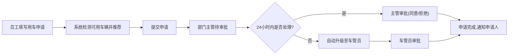
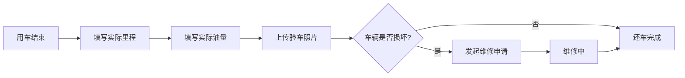

## 1. 产品概述
企业车辆调度与用车管理系统，旨在解决企业车辆使用效率低、调度混乱、审批流程不透明等问题。通过数字化管理实现车辆资源优化配置、审批流程自动化、用车数据可视化。

- 主要功能：车辆信息管理、用车申请与审批、还车验车、维修管理、数据看板、报表导出
- 目标用户：企业普通员工、部门主管、车管员
- 核心价值：提升车辆使用效率、降低管理成本、规范用车流程

## 2. 核心功能

### 2.1 用户角色
| 角色 | 登录方式 | 核心权限 |
|------|----------|----------|
| 普通员工 | 账号密码登录 | 申请用车、查看自己的用车历史、还车登记 |
| 部门主管 | 账号密码登录 | 审批本部门用车申请、查看本部门用车统计 |
| 车管员 | 账号密码登录 | 车辆信息管理、全局数据查看、处理升级审批、维修管理、报表导出 |

### 2.2 功能模块
1. **登录页**：用户身份验证、角色识别
2. **首页看板**：车辆状态实时展示、今日用车统计、违规记录、10秒自动刷新
3. **车辆管理**：车辆信息录入、编辑、禁用、状态查看
4. **用车申请**：填写申请信息、车辆智能推荐、占用日历展示
5. **审批管理**：待审批列表、审批操作、24小时自动升级
6. **还车管理**：还车登记、里程油量录入、验车照片上传、维修申请
7. **历史记录**：多维度筛选、数据查询
8. **报表中心**：月度费用报表、部门使用排行、一键导出

### 2.3 页面详情
| 页面名称 | 模块名称 | 功能描述 |
|----------|----------|----------|
| 登录页 | 登录表单 | 账号密码输入、角色自动识别、登录验证 |
| 首页看板 | 状态概览卡片 | 空闲/使用中/维修车辆数量统计、今日用车次数、违规记录数 |
| 首页看板 | 车辆状态列表 | 各车辆实时状态卡片、状态标识、当前使用人 |
| 首页看板 | 动态刷新 | 每10秒自动刷新数据、刷新动画提示 |
| 车辆管理 | 车辆列表 | 车牌、型号、座位数、状态展示、搜索筛选 |
| 车辆管理 | 车辆操作 | 新增车辆、编辑信息、禁用/启用车辆 |
| 用车申请 | 申请表单 | 事由、人数、预估时间选择、日期选择 |
| 用车申请 | 车辆推荐 | 自动检测可用车辆、按座位数匹配推荐 |
| 用车申请 | 占用日历 | 显示车辆当前及未来占用情况、日历视图 |
| 审批管理 | 待审批列表 | 显示待我审批的申请、申请人、申请时间、事由 |
| 审批管理 | 审批操作 | 同意/拒绝按钮、审批意见输入 |
| 还车管理 | 还车表单 | 实际里程、实际油量、验车照片上传 |
| 还车管理 | 维修申请 | 损坏描述、维修申请发起 |
| 历史记录 | 筛选面板 | 按车辆、部门、日期范围筛选 |
| 历史记录 | 数据列表 | 用车记录详情、状态追踪 |
| 报表中心 | 费用报表 | 月度用车费用统计、图表展示 |
| 报表中心 | 部门排行 | 部门使用次数排行、费用排行 |
| 报表中心 | 导出功能 | 一键导出Excel报表 |

## 3. 核心流程

### 3.1 用车申请审批流程

### 3.2 还车流程

## 4. 用户界面设计

### 4.1 设计风格
- **主色调**：深蓝色(#1e3a5f) 代表专业、稳重、企业级应用
- **辅助色**：
  - 绿色(#10b981) - 空闲状态
  - 橙色(#f59e0b) - 使用中状态
  - 红色(#ef4444) - 维修状态
  - 蓝色(#3b82f6) - 操作按钮
- **按钮风格**：圆角8px、微阴影、悬停上浮效果
- **字体**：
  - 标题："Noto Sans SC" - 700字重
  - 正文："Noto Sans SC" - 400字重
  - 数字："JetBrains Mono" - 等宽字体
- **布局风格**：左侧导航栏 + 右侧内容区、卡片式布局、丰富的数据可视化
- **图标风格**：线性图标、统一24px尺寸、颜色与状态对应

### 4.2 页面设计概述
| 页面名称 | 模块名称 | UI元素 |
|----------|----------|----------|
| 登录页 | 登录表单 | 渐变背景、玻璃拟态表单卡片、浮动标签输入框、登录按钮动效 |
| 首页看板 | 状态概览 | 大数字卡片、渐变背景、状态色标识、计数动画 |
| 首页看板 | 车辆列表 | 网格布局卡片、状态标签、实时状态指示灯、悬停详情 |
| 车辆管理 | 表格列表 | 数据表格、操作列按钮、状态标签、搜索框 |
| 用车申请 | 表单 | 分步表单、日期选择器、时间选择器、下拉选择 |
| 用车申请 | 车辆推荐 | 卡片列表、推荐标识、座位数匹配提示 |
| 用车申请 | 占用日历 | 月视图日历、占用日期高亮、tooltip详情 |
| 审批管理 | 列表 | 卡片列表、申请人头像、审批按钮组、时间轴 |
| 历史记录 | 筛选 | 多条件筛选器、日期范围选择器、重置按钮 |
| 报表中心 | 图表 | 柱状图、折线图、饼图、数据表格 |

### 4.3 响应式设计
- **桌面优先**：1440px及以上为标准设计尺寸
- **平板适配**：1024px - 1440px，调整栅格列数
- **移动端**：768px以下，侧边栏折叠为汉堡菜单，表格转为卡片列表
- **触摸优化**：按钮最小高度44px，输入框足够间距

### 4.4 动效设计
- **页面加载**：元素淡入 + 轻微向上位移、staggered延迟
- **数据刷新**：数字滚动动画、卡片闪烁提示
- **悬停效果**：按钮上浮2px、阴影加深、背景色微变
- **状态变化**：颜色渐变过渡、缩放动效
- **表单交互**：输入框焦点动画、错误提示抖动
