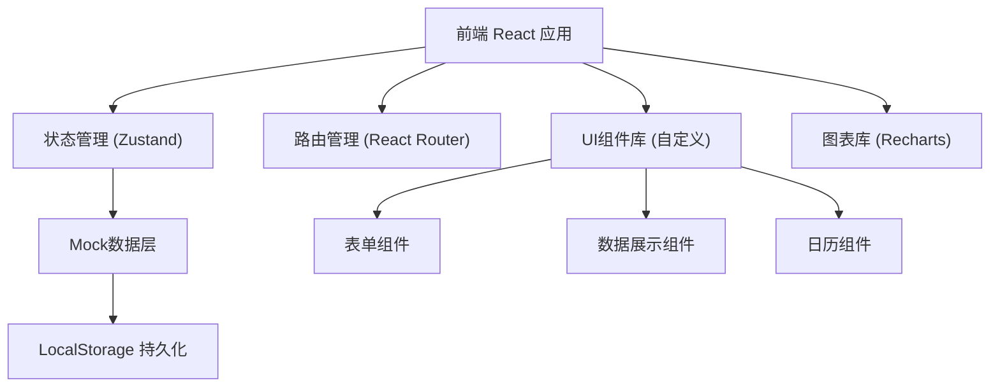
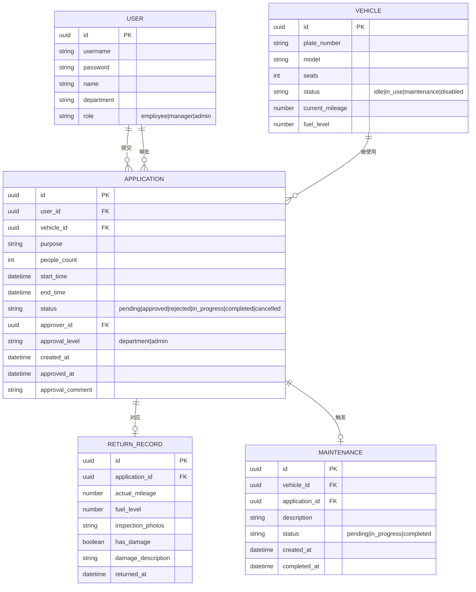

## 1. 架构设计


## 2. 技术描述
- **前端框架**：React@18 + TypeScript
- **构建工具**：Vite@5
- **样式方案**：TailwindCSS@3 + CSS Variables
- **状态管理**：Zustand@4
- **路由管理**：React Router@6
- **图表库**：Recharts@2
- **日期处理**：date-fns@3
- **图标库**：Lucide React
- **数据持久化**：LocalStorage
- **Mock方案**：前端内置Mock数据 + 模拟API延迟

## 3. 路由定义
| 路由 | 页面 | 权限角色 | 说明 |
|------|------|----------|------|
| /login | 登录页 | 公开 | 用户身份验证 |
| /dashboard | 首页看板 | 所有登录用户 | 动态数据看板，10秒刷新 |
| /vehicles | 车辆管理 | 车管员 | 车辆增删改查、禁用启用 |
| /application | 用车申请 | 普通员工、部门主管 | 提交用车申请、车辆推荐 |
| /approval | 审批管理 | 部门主管、车管员 | 待审批列表、审批操作 |
| /return | 还车管理 | 所有登录用户 | 还车登记、维修申请 |
| /history | 历史记录 | 所有登录用户 | 按权限筛选查看 |
| /reports | 报表中心 | 部门主管、车管员 | 报表查看、导出 |
| /maintenance | 维修管理 | 车管员 | 维修申请处理 |

## 4. 数据模型定义

### 4.1 ER图


### 4.2 TypeScript 类型定义
```typescript
// 用户类型
type UserRole = 'employee' | 'manager' | 'admin';
interface User {
  id: string;
  username: string;
  name: string;
  department: string;
  role: UserRole;
}

// 车辆类型
type VehicleStatus = 'idle' | 'in_use' | 'maintenance' | 'disabled';
interface Vehicle {
  id: string;
  plateNumber: string;
  model: string;
  seats: number;
  status: VehicleStatus;
  currentMileage: number;
  fuelLevel: number;
}

// 申请类型
type ApplicationStatus = 'pending' | 'approved' | 'rejected' | 'in_progress' | 'completed' | 'cancelled';
interface Application {
  id: string;
  userId: string;
  userName: string;
  userDepartment: string;
  vehicleId: string;
  vehiclePlate: string;
  vehicleModel: string;
  purpose: string;
  peopleCount: number;
  startTime: Date;
  endTime: Date;
  status: ApplicationStatus;
  approverId?: string;
  approvalLevel: 'department' | 'admin';
  createdAt: Date;
  approvedAt?: Date;
  approvalComment?: string;
  escalated: boolean;
}

// 还车记录
interface ReturnRecord {
  id: string;
  applicationId: string;
  actualMileage: number;
  fuelLevel: number;
  inspectionPhotos: string[];
  hasDamage: boolean;
  damageDescription?: string;
  returnedAt: Date;
}

// 维修记录
type MaintenanceStatus = 'pending' | 'in_progress' | 'completed';
interface Maintenance {
  id: string;
  vehicleId: string;
  applicationId: string;
  description: string;
  status: MaintenanceStatus;
  createdAt: Date;
  completedAt?: Date;
}

// 看板统计
interface DashboardStats {
  idleCount: number;
  inUseCount: number;
  maintenanceCount: number;
  todayUsage: number;
  violationCount: number;
}
```

## 5. 状态管理设计

### 5.1 Store 结构
```typescript
// authStore - 认证状态
interface AuthState {
  user: User | null;
  login: (username: string, password: string) => Promise<boolean>;
  logout: () => void;
}

// vehicleStore - 车辆管理
interface VehicleState {
  vehicles: Vehicle[];
  loading: boolean;
  fetchVehicles: () => Promise<void>;
  addVehicle: (data: Omit<Vehicle, 'id'>) => Promise<void>;
  updateVehicle: (id: string, data: Partial<Vehicle>) => Promise<void>;
  toggleVehicleStatus: (id: string) => Promise<void>;
  getAvailableVehicles: (startTime: Date, endTime: Date, seats: number) => Vehicle[];
}

// applicationStore - 申请管理
interface ApplicationState {
  applications: Application[];
  loading: boolean;
  fetchApplications: () => Promise<void>;
  createApplication: (data: Omit<Application, 'id' | 'createdAt' | 'status'>) => Promise<void>;
  approveApplication: (id: string, comment?: string) => Promise<void>;
  rejectApplication: (id: string, comment?: string) => Promise<void>;
  checkAndEscalatePending: () => void;
}

// dashboardStore - 看板数据
interface DashboardState {
  stats: DashboardStats;
  lastUpdated: Date;
  refreshData: () => Promise<void>;
  startAutoRefresh: () => void;
  stopAutoRefresh: () => void;
}
```

## 6. 目录结构
```
src/
├── assets/              # 静态资源
├── components/          # 公共组件
│   ├── Layout/         # 布局组件
│   ├── ui/             # 基础UI组件
│   ├── charts/         # 图表组件
│   └── forms/          # 表单组件
├── pages/              # 页面组件
│   ├── Login/
│   ├── Dashboard/
│   ├── Vehicles/
│   ├── Application/
│   ├── Approval/
│   ├── Return/
│   ├── History/
│   └── Reports/
├── store/              # Zustand状态管理
├── types/              # TypeScript类型定义
├── utils/              # 工具函数
│   ├── mock.ts         # Mock数据
│   ├── date.ts         # 日期处理
│   ├── export.ts       # 导出功能
│   └── permissions.ts  # 权限判断
├── hooks/              # 自定义Hooks
├── App.tsx
├── main.tsx
└── index.css
```

## 7. 关键技术实现

### 7.1 权限控制
- 路由级权限：通过React Router的loader/guard实现
- 组件级权限：自定义usePermission hook + PermissionWrapper组件
- 数据级权限：根据用户角色过滤返回的数据

### 7.2 24小时自动升级
- 应用启动时启动定时器，每小时检查一次pending状态的申请
- 计算申请创建时间与当前时间差，超过24小时则escalated设为true
- 升级后approvalLevel改为'admin'，通知车管员

### 7.3 车辆占用检测
- 查询指定时间段内已有approved/in_progress状态的申请
- 排除这些车辆，返回空闲车辆
- 按座位数匹配度排序推荐

### 7.4 日历展示
- 使用自定义Calendar组件
- 按月展示，标记占用日期
- hover显示占用详情

### 7.5 报表导出
- 使用xlsx库生成Excel文件
- 支持多sheet导出
- 包含月度费用和部门排行数据
