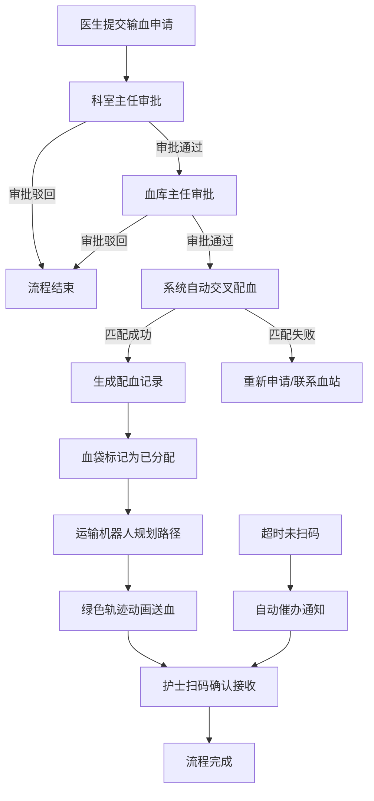
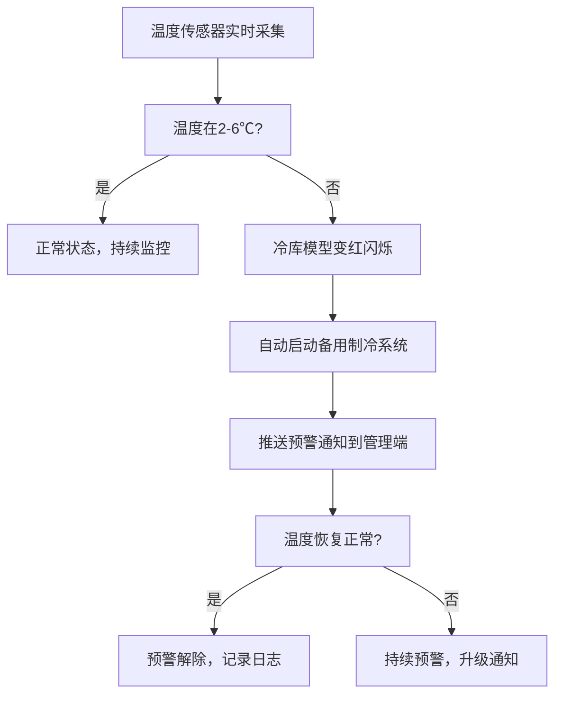
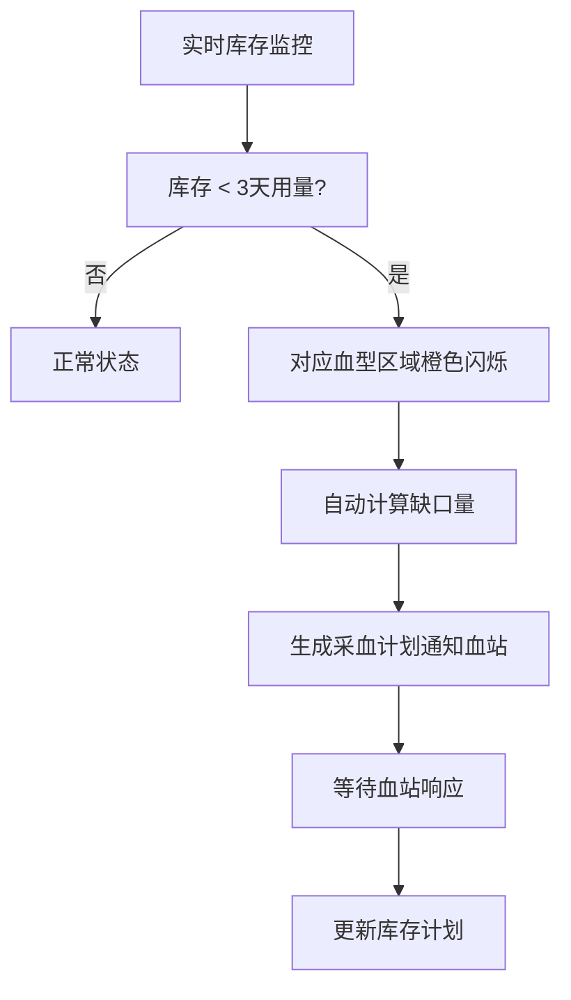

## 1. 产品概述
3D智慧血库管理与配血调度可视化平台，通过三维可视化技术实现血液全生命周期管理，涵盖血库存储、智能配血、运输调度、多级审批等核心业务流程，为医疗机构提供安全、高效、透明的血液管理解决方案。

- 主要目标：提升血液管理效率、保障输血安全、实现全程可追溯、智能化预警调度
- 目标用户：血库管理人员、临床医生、科室主任、护士、血站工作人员
- 核心价值：减少人为差错、优化库存管理、缩短配血时间、确保血液质量

## 2. 核心功能

### 2.1 用户角色
| 角色 | 核心权限 |
|------|----------|
| 临床医生 | 提交输血申请、查看配血结果 |
| 科室主任 | 审批输血申请、查看科室用血统计 |
| 血库主任 | 终审用血申请、查看全站库存、管理采血计划 |
| 血库管理员 | 日常库存管理、配血操作、温度监控 |
| 护士 | 扫码接收血液、确认输血完成 |

### 2.2 功能模块
1. **3D血库可视化场景**：冷库、配血台、运输机器人通道、护士站的三维建模与交互
2. **血袋信息管理**：血袋信息展示、7天检测报告查看、状态追踪
3. **温度监控系统**：冷库实时温度显示、超温预警、备用制冷自动启动
4. **智能配血系统**：血型交叉配血算法、自动匹配、配血记录生成
5. **库存预警系统**：3天用量检测、低库存预警、自动生成采血计划
6. **三级电子审批**：医生申请→科室主任审批→血库主任终审
7. **运输机器人调度**：路径规划、绿色轨迹动画、实时位置追踪
8. **血液签收系统**：护士扫码确认、超时未签收催办
9. **报表导出系统**：日报Excel导出、库存统计、配血符合率分析

### 2.3 页面详情
| 页面名称 | 模块名称 | 功能描述 |
|-----------|-------------|---------------------|
| 主控制面板 | 3D场景视图 | 血库整体3D可视化，支持旋转、缩放、点击交互 |
| 主控制面板 | 实时数据面板 | 显示各血型库存量、今日出入库统计、温度数据 |
| 主控制面板 | 预警通知面板 | 温度预警、库存预警、超时预警的实时展示 |
| 主控制面板 | 审批工作台 | 待审批列表、审批操作、审批历史 |
| 血袋详情弹窗 | 基本信息 | 血型、成分、采血日期、有效期、存储位置 |
| 血袋详情弹窗 | 检测报告 | 近7天各项检测指标曲线图 |
| 配血操作面板 | 输血申请列表 | 患者信息、用血需求、配血状态 |
| 配血操作面板 | 交叉配血结果 | 血型匹配度、配血建议、配血记录 |
| 库存管理面板 | 库存概览 | 各血型各成分库存柱状图、3天用量线 |
| 库存管理面板 | 采血计划 | 自动生成的采血需求、血站通知记录 |
| 运输监控面板 | 机器人调度 | 机器人列表、当前任务、路径动画 |
| 报表导出面板 | 日报生成 | 选择日期、预览数据、导出Excel |

## 3. 核心流程

### 3.1 配血与发血流程

### 3.2 温度监控与预警流程

### 3.3 库存预警流程

## 4. 用户界面设计

### 4.1 设计风格
- **主色调**：医疗蓝(#165DFF)作为主色，代表专业、信任；生命红(#F53F3F)作为警示色；健康绿(#00B42A)作为安全/成功色
- **辅助色**：橙色(#FF7D00)用于库存预警；紫色(#722ED1)用于机器人调度
- **背景**：深色科技感背景(#0E1628)，搭配渐变网格和微光效果
- **按钮风格**：圆角8px，微立体阴影，悬停发光效果
- **字体**：主标题使用Space Grotesk，正文使用Inter，数字使用等宽字体JetBrains Mono
- **图标**：lucide-react线性图标，医疗场景专属图标

### 4.2 页面设计概述
| 页面/模块 | UI元素 | 设计要点 |
|-----------|-------------|-------------|
| 3D主场景 | 血库冷库、血袋货架、配血台、运输通道、护士站、机器人 | 冷色调光照，血袋根据血型显示不同颜色，可点击交互，选中高亮 |
| 顶部状态栏 | Logo、系统时间、温度显示、预警图标、用户信息 | 玻璃拟态效果，毛玻璃背景，实时数据更新动画 |
| 左侧数据面板 | 库存统计卡片、温度监控卡片、今日出入库统计 | 卡片式布局，数据可视化图表，数字跳动动画 |
| 右侧操作面板 | 审批列表、配血操作、运输监控、报表导出 | Tab切换，表单化布局，操作按钮组 |
| 底部预警栏 | 滚动预警通知、紧急预警弹窗 | 红色/橙色背景闪烁，声音提示（可选） |
| 血袋详情弹窗 | 血袋3D预览、基本信息、检测报告图表 | 模态弹窗，分Tab展示，曲线图表动画 |

### 4.3 3D场景指导
- **环境与氛围**：深色医疗科技风，冷蓝色调环境光，冷库区域有冷雾粒子效果
- **光照设置**：主光源从上方45°照射，冷库内有冷蓝色点光源，配血台有暖白色工作灯
- **相机设置**：初始使用透视相机，位置在场景斜上方30°，可通过鼠标拖拽旋转、滚轮缩放
- **构图与焦点**：冷库占据场景左侧，配血台在中央，运输通道从右下延伸到上方护士站
- **交互与动画**：
  - 血袋悬停时上浮+高亮边框
  - 点击血袋弹出详情面板
  - 超温时冷库模型脉动变红
  - 低库存时对应货架橙色闪烁
  - 机器人沿路径移动时尾部有绿色轨迹拖尾
- **后处理效果**：Bloom泛光效果（预警时增强），轻微景深，抗锯齿
- **性能优化**：血袋使用InstancedMesh，机器人路径使用LineSegments，LOD策略

### 4.4 响应式
- 桌面端优先设计，主场景占据60%屏幕宽度
- 左右侧边栏可折叠，折叠后显示图标
- 支持1280px及以上分辨率
- 移动端适配：垂直堆叠布局，3D场景简化显示
