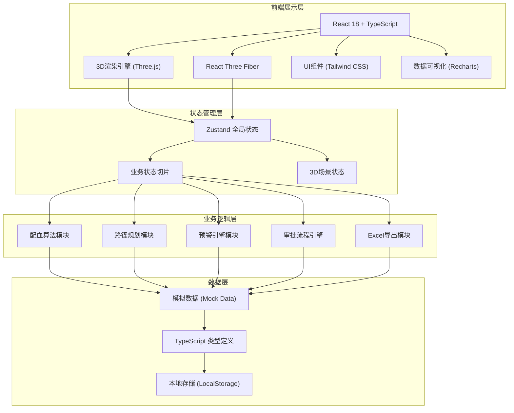
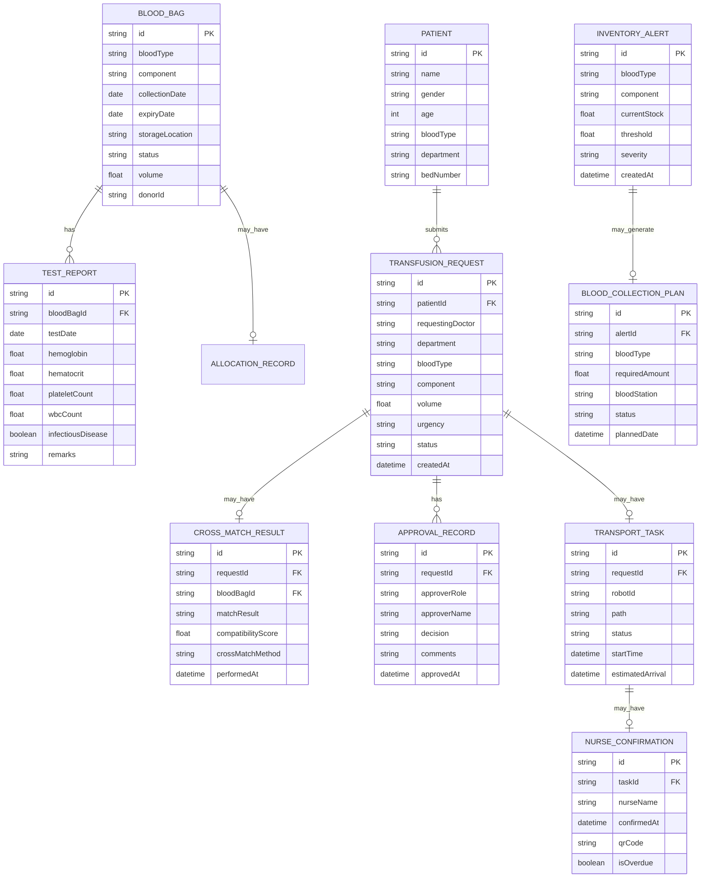

## 1. 架构设计



## 2. 技术描述

- **前端框架**: React 18 + TypeScript 5.x
- **构建工具**: Vite 5.x
- **3D渲染**: Three.js + @react-three/fiber + @react-three/drei + @react-three/postprocessing
- **状态管理**: Zustand 4.x
- **UI框架**: Tailwind CSS 3.x + lucide-react
- **图表可视化**: Recharts 2.x
- **Excel导出**: xlsx (SheetJS)
- **后端**: 无后端，使用前端Mock数据模拟
- **数据持久化**: LocalStorage

## 3. 路由定义

| 路由 | 页面 | 用途 |
|-------|------|------|
| / | 主控台 | 3D血库场景 + 所有控制面板（单页应用） |

本项目为单页应用(SPA)，所有功能模块通过Tab切换和弹窗展示，不使用多路由。

## 4. 数据模型

### 4.1 数据模型定义



### 4.2 TypeScript 类型定义

```typescript
// 血型类型
type BloodType = 'A' | 'B' | 'AB' | 'O';
type BloodComponent = 'whole_blood' | 'plasma' | 'platelet';
type BloodBagStatus = 'available' | 'allocated' | 'used' | 'expired' | 'quarantine';
type RequestStatus = 'pending_dept_head' | 'pending_blood_bank_head' | 'approved' | 'rejected' | 'cross_matching' | 'matched' | 'transporting' | 'delivered' | 'completed';
type ApprovalDecision = 'approved' | 'rejected';
type MatchResult = 'compatible' | 'incompatible' | 'conditional';
type TransportStatus = 'pending' | 'in_progress' | 'delivered' | 'cancelled';
type AlertSeverity = 'low' | 'medium' | 'high' | 'critical';

interface BloodBag {
  id: string;
  bloodType: BloodType;
  component: BloodComponent;
  collectionDate: string;
  expiryDate: string;
  storageLocation: { row: number; col: number; shelf: number };
  status: BloodBagStatus;
  volume: number;
  donorId: string;
  testReports: TestReport[];
}

interface TestReport {
  id: string;
  bloodBagId: string;
  testDate: string;
  hemoglobin: number;
  hematocrit: number;
  plateletCount: number;
  wbcCount: number;
  infectiousDisease: boolean;
  remarks: string;
}

interface Patient {
  id: string;
  name: string;
  gender: 'male' | 'female';
  age: number;
  bloodType: BloodType;
  department: string;
  bedNumber: string;
}

interface TransfusionRequest {
  id: string;
  patientId: string;
  patient?: Patient;
  requestingDoctor: string;
  department: string;
  bloodType: BloodType;
  component: BloodComponent;
  volume: number;
  urgency: 'routine' | 'urgent' | 'emergency';
  status: RequestStatus;
  createdAt: string;
  crossMatchResult?: CrossMatchResult;
  approvalRecords: ApprovalRecord[];
  transportTask?: TransportTask;
}

interface CrossMatchResult {
  id: string;
  requestId: string;
  bloodBagId: string;
  matchResult: MatchResult;
  compatibilityScore: number;
  crossMatchMethod: string;
  performedAt: string;
}

interface ApprovalRecord {
  id: string;
  requestId: string;
  approverRole: 'dept_head' | 'blood_bank_head';
  approverName: string;
  decision: ApprovalDecision;
  comments: string;
  approvedAt: string;
}

interface TransportTask {
  id: string;
  requestId: string;
  robotId: string;
  path: { x: number; z: number }[];
  status: TransportStatus;
  startTime: string;
  estimatedArrival: string;
  currentPosition: { x: number; z: number };
  nurseConfirmation?: NurseConfirmation;
}

interface NurseConfirmation {
  id: string;
  taskId: string;
  nurseName: string;
  confirmedAt: string;
  qrCode: string;
  isOverdue: boolean;
}

interface ColdStorage {
  id: string;
  name: string;
  currentTemperature: number;
  targetTemperature: number;
  minTemperature: number;
  maxTemperature: number;
  backupCoolingActive: boolean;
  lastUpdate: string;
  alertStatus: 'normal' | 'warning' | 'critical';
}

interface InventoryAlert {
  id: string;
  bloodType: BloodType;
  component: BloodComponent;
  currentStock: number;
  threshold: number;
  severity: AlertSeverity;
  createdAt: string;
  acknowledged: boolean;
  collectionPlan?: BloodCollectionPlan;
}

interface BloodCollectionPlan {
  id: string;
  alertId: string;
  bloodType: BloodType;
  component: BloodComponent;
  requiredAmount: number;
  bloodStation: string;
  status: 'pending' | 'confirmed' | 'in_progress' | 'completed';
  plannedDate: string;
  contactPerson: string;
  phone: string;
}

interface DailyReport {
  date: string;
  inventory: {
    bloodType: BloodType;
    component: BloodComponent;
    openingStock: number;
    received: number;
    issued: number;
    closingStock: number;
  }[];
  transfusionRequests: number;
  crossMatchCount: number;
  matchSuccessRate: number;
  approvalCount: number;
  transportCount: number;
  alerts: number;
}
```

## 5. 项目目录结构

```
src/
├── components/
│   ├── 3d/                     # 3D场景组件
│   │   ├── BloodBankScene.tsx  # 主场景
│   │   ├── ColdStorage.tsx     # 冷库模型
│   │   ├── BloodShelf.tsx      # 血袋货架
│   │   ├── BloodBag.tsx        # 血袋模型
│   │   ├── MatchingTable.tsx   # 配血台
│   │   ├── TransportPath.tsx   # 运输通道
│   │   ├── NurseStation.tsx    # 护士站
│   │   ├── Robot.tsx           # 运输机器人
│   │   └── Particles.tsx       # 粒子效果
│   ├── ui/                     # UI组件
│   │   ├── Panel.tsx           # 面板容器
│   │   ├── Card.tsx            # 卡片组件
│   │   ├── Button.tsx          # 按钮组件
│   │   ├── Badge.tsx           # 状态标签
│   │   ├── Modal.tsx           # 弹窗组件
│   │   ├── Tabs.tsx            # 标签页
│   │   ├── Progress.tsx        # 进度条
│   │   └── Alert.tsx           # 预警组件
│   ├── panels/                 # 功能面板
│   │   ├── StatusBar.tsx       # 顶部状态栏
│   │   ├── LeftPanel.tsx       # 左侧数据面板
│   │   ├── RightPanel.tsx      # 右侧操作面板
│   │   ├── InventoryPanel.tsx  # 库存管理面板
│   │   ├── ApprovalPanel.tsx   # 审批面板
│   │   ├── MatchingPanel.tsx   # 配血面板
│   │   ├── TransportPanel.tsx  # 运输监控面板
│   │   └── ReportPanel.tsx     # 报表面板
│   └── modals/                 # 弹窗组件
│       ├── BloodBagDetail.tsx  # 血袋详情弹窗
│       └── TestReportChart.tsx # 检测报告图表
├── store/                      # 状态管理
│   ├── index.ts                # Zustand store
│   ├── bloodBagSlice.ts        # 血袋状态
│   ├── requestSlice.ts         # 申请状态
│   ├── inventorySlice.ts       # 库存状态
│   ├── temperatureSlice.ts     # 温度状态
│   ├── transportSlice.ts       # 运输状态
│   └── alertSlice.ts           # 预警状态
├── hooks/                      # 自定义Hooks
│   ├── useCrossMatch.ts        # 配血算法Hook
│   ├── usePathPlanning.ts      # 路径规划Hook
│   ├── useAlertEngine.ts       # 预警引擎Hook
│   ├── useTemperature.ts       # 温度监控Hook
│   └── useExportExcel.ts       # Excel导出Hook
├── utils/                      # 工具函数
│   ├── bloodTypeUtils.ts       # 血型相关工具
│   ├── dateUtils.ts            # 日期工具
│   ├── mockData.ts             # 模拟数据生成
│   └── excelUtils.ts           # Excel工具
├── types/                      # 类型定义
│   └── index.ts                # 所有类型定义
├── App.tsx                     # 主应用组件
├── main.tsx                    # 入口文件
└── index.css                   # 全局样式
```

## 6. 核心算法说明

### 6.1 交叉配血算法

```typescript
// ABO血型相容规则
const ABOCompatibility: Record<BloodType, BloodType[]> = {
  'A': ['A', 'O'],
  'B': ['B', 'O'],
  'AB': ['A', 'B', 'AB', 'O'],
  'O': ['O']
};

// Rh因子相容（简化处理，默认Rh阳性）
// 紧急情况下可放宽相容规则
function crossMatch(
  patientBloodType: BloodType,
  patientComponent: BloodComponent,
  availableBags: BloodBag[],
  urgency: 'routine' | 'urgent' | 'emergency'
): { bag: BloodBag; score: number } | null {
  const compatibleTypes = ABOCompatibility[patientBloodType];
  
  const candidates = availableBags
    .filter(bag => 
      bag.status === 'available' &&
      bag.component === patientComponent &&
      (urgency === 'emergency' || compatibleTypes.includes(bag.bloodType))
    )
    .map(bag => {
      let score = 100;
      
      // 同血型加分
      if (bag.bloodType === patientBloodType) score += 20;
      
      // 新鲜度加分（距离有效期越远越好）
      const daysToExpiry = Math.floor(
        (new Date(bag.expiryDate).getTime() - new Date().getTime()) / (1000 * 60 * 60 * 24)
      );
      score += Math.min(daysToExpiry, 30);
      
      // 紧急情况优先选同血型
      if (urgency !== 'emergency' && bag.bloodType !== patientBloodType) {
        score -= 30;
      }
      
      return { bag, score };
    })
    .sort((a, b) => b.score - a.score);
  
  return candidates[0] || null;
}
```

### 6.2 路径规划算法

```typescript
// A*寻路算法简化版
function findPath(
  start: { x: number; z: number },
  end: { x: number; z: number },
  obstacles: { x: number; z: number }[]
): { x: number; z: number }[] {
  // 网格大小
  const gridSize = 0.5;
  
  // 简化实现：直接生成路径点
  // 实际场景中使用A*算法
  const path: { x: number; z: number }[] = [];
  
  // 添加拐点以避开障碍物
  const midX = (start.x + end.x) / 2;
  const midZ = (start.z + end.z) / 2;
  
  path.push(start);
  
  // 检查是否需要绕行
  const hasObstacle = obstacles.some(obs => 
    Math.abs(obs.x - midX) < 1 && Math.abs(obs.z - midZ) < 1
  );
  
  if (hasObstacle) {
    path.push({ x: start.x, z: midZ + 2 });
    path.push({ x: end.x, z: midZ + 2 });
  } else {
    path.push({ x: midX, z: midZ });
  }
  
  path.push(end);
  
  return path;
}
```

### 6.3 库存预警算法

```typescript
// 日均用量（单位：袋）
const dailyUsage: Record<BloodType, Record<BloodComponent, number>> = {
  'A': { whole_blood: 15, plasma: 10, platelet: 8 },
  'B': { whole_blood: 12, plasma: 8, platelet: 6 },
  'AB': { whole_blood: 5, plasma: 15, platelet: 4 },
  'O': { whole_blood: 20, plasma: 12, platelet: 10 }
};

function checkInventoryAlert(
  bloodType: BloodType,
  component: BloodComponent,
  currentStock: number
): InventoryAlert | null {
  const usagePerDay = dailyUsage[bloodType][component];
  const daysOfSupply = currentStock / usagePerDay;
  const threshold = usagePerDay * 3; // 3天用量阈值
  
  if (daysOfSupply < 3) {
    let severity: AlertSeverity = 'medium';
    if (daysOfSupply < 1) severity = 'critical';
    else if (daysOfSupply < 2) severity = 'high';
    
    return {
      id: `alert_${Date.now()}`,
      bloodType,
      component,
      currentStock,
      threshold,
      severity,
      createdAt: new Date().toISOString(),
      acknowledged: false
    };
  }
  
  return null;
}
```
