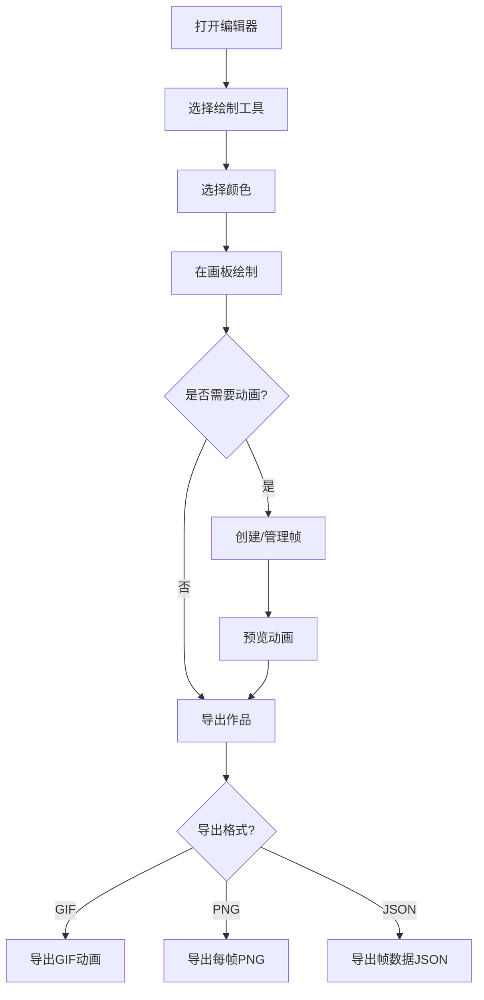

## 1. 产品概述

复古像素画编辑器 —— 一款面向像素艺术爱好者和独立游戏开发者的浏览器端像素画编辑工具，支持逐像素绘制、动画帧管理和多格式导出。
- 32x32画板，提供铅笔/填充桶/取色器/橡皮擦/直线/圆形六种工具，支持动画帧创建与播放、洋葱皮参考、对称绘制和完整的历史撤销/重做
- 目标用户：像素艺术创作者、独立游戏开发者、复古风格爱好者

## 2. 核心功能

### 2.1 功能模块
1. **编辑器主页面**：画板区域、工具栏、调色板、动画帧面板、导出面板

### 2.2 页面详情
| 页面名称 | 模块名称 | 功能描述 |
|----------|----------|----------|
| 编辑器主页面 | 画板区域 | 32x32像素画板，支持鼠标逐像素绘制，显示网格线，缩放显示 |
| 编辑器主页面 | 工具栏 | 铅笔、填充桶、取色器、橡皮擦、直线、圆形六种工具切换 |
| 编辑器主页面 | 调色板面板 | 颜色选择器、预设颜色、自定义调色板管理、保存/加载调色板到localStorage |
| 编辑器主页面 | 动画帧面板 | 帧列表缩略图、添加/删除/复制帧、帧停留时间设置、动画播放/停止、洋葱皮模式开关 |
| 编辑器主页面 | 对称绘制 | 左右对称、上下对称模式开关 |
| 编辑器主页面 | 导出面板 | 导出GIF动画、导出每帧PNG、导出帧数据JSON |
| 编辑器主页面 | 导入底图 | 导入外部图片并缩放到32x32作为参考底图 |
| 编辑器主页面 | 历史记录 | 撤销/重做，最多30步 |

## 3. 核心流程

用户打开编辑器 → 选择工具和颜色 → 在画板上绘制像素 → 创建多个帧并编辑 → 设置帧停留时间 → 开启洋葱皮参考前后帧 → 播放预览动画 → 导出为GIF/PNG/JSON

## 4. 用户界面设计

### 4.1 设计风格
- **主色调**：深色背景 (#1a1a2e, #16213e) 搭配荧光绿 (#0ff0b3) 和像素橙 (#ff6b35) 作为强调色，营造复古CRT显示器质感
- **按钮风格**：像素风格边框，3D凸起效果，按下时内凹，带像素化阴影
- **字体**：像素风字体 "Press Start 2P"（Google Fonts）用于标题，系统等宽字体用于数据
- **布局风格**：左侧工具栏 + 中央画板 + 右侧面板（调色板/帧/导出），经典编辑器三栏布局
- **图标风格**：像素化图标，16x16像素风格，与整体复古主题一致
- **动效**：CRT扫描线动画、工具切换像素闪烁、帧切换过渡效果

### 4.2 页面设计概述
| 页面名称 | 模块名称 | UI元素 |
|----------|----------|--------|
| 编辑器主页面 | 画板区域 | 深色背景画布、绿色网格线、像素化光标、缩放比例指示器 |
| 编辑器主页面 | 工具栏 | 竖向像素图标按钮、活跃工具高亮边框、快捷键提示 |
| 编辑器主页面 | 调色板面板 | HSL颜色轮、预设色板网格、自定义调色板列表、保存/删除按钮 |
| 编辑器主页面 | 动画帧面板 | 帧缩略图列表、播放控制条、帧率滑块、洋葱皮开关 |
| 编辑器主页面 | 对称绘制 | 轴线显示、对称模式切换按钮 |
| 编辑器主页面 | 导出面板 | 格式选择按钮、导出触发按钮、进度提示 |

### 4.3 响应式
- 桌面优先设计，最小宽度1024px
- 画板区域固定尺寸，面板可折叠适配小屏幕

### 4.4 3D场景指导
- 不适用
