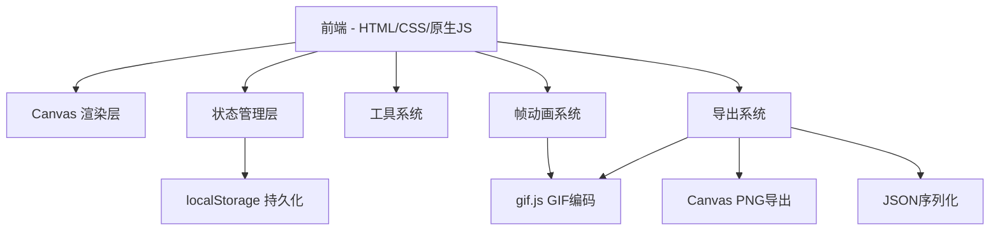

## 1. 架构设计



## 2. 技术说明
- **前端**：纯HTML5 + CSS3 + 原生JavaScript（ES2020），无框架依赖
- **构建工具**：无需构建，浏览器直接运行
- **GIF导出**：gif.js 库（CDN引入），前端Web Worker编码
- **数据持久化**：localStorage 保存自定义调色板
- **无后端**：纯前端应用，所有数据在客户端处理

## 3. 文件结构

| 文件 | 用途 |
|------|------|
| index.html | 主页面结构，工具栏/画板/面板布局 |
| style.css | 复古像素风格样式、CRT效果、响应式布局 |
| app.js | 主入口，初始化编辑器、事件绑定 |
| canvas.js | Canvas画板渲染、像素操作、网格绘制 |
| tools.js | 绘制工具实现（铅笔/填充/取色/橡皮/直线/圆形） |
| animation.js | 帧管理、动画播放、洋葱皮渲染 |
| palette.js | 调色板管理、localStorage读写 |
| history.js | 撤销/重做历史栈管理 |
| export.js | GIF/PNG/JSON导出逻辑 |
| symmetry.js | 对称绘制模式 |

## 4. 数据模型

### 4.1 帧数据结构
```javascript
{
  "width": 32,
  "height": 32,
  "frames": [
    {
      "pixels": [null, "#ff0000", ...],  // 32*32 = 1024个像素值, null表示透明
      "duration": 100                      // 帧停留时间(毫秒)
    }
  ],
  "palettes": {
    "default": ["#000000", "#ffffff", ...],
    "custom": [["paletteName", ["#color1", "#color2", ...]], ...]
  }
}
```

### 4.2 历史记录结构
```javascript
{
  "stack": [frameSnapshot, ...],  // 帧快照数组
  "pointer": 0,                    // 当前指向
  "maxSize": 30                    // 最大步数
}
```

## 5. 核心算法

### 5.1 填充桶算法
- BFS洪水填充，从点击像素出发向四邻域扩展
- 匹配目标颜色替换为当前选中颜色

### 5.2 Bresenham直线算法
- 经典Bresenham算法绘制像素直线

### 5.3 中点圆形算法
- 中点画圆算法绘制像素圆形

### 5.4 洋葱皮混合
- Canvas globalAlpha 半透明绘制前后帧
- 前一帧蓝色调(0.3透明度)、后一帧红色调(0.3透明度)
